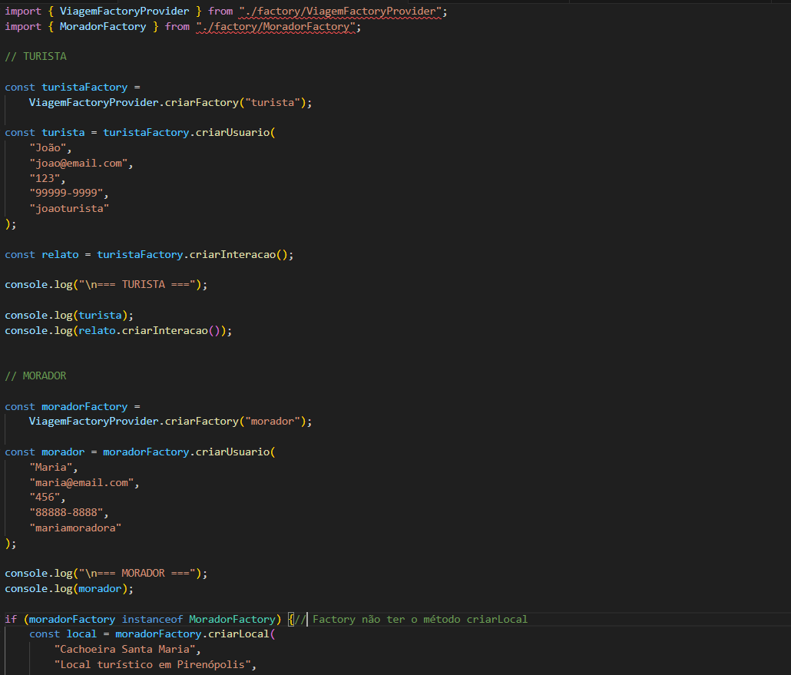
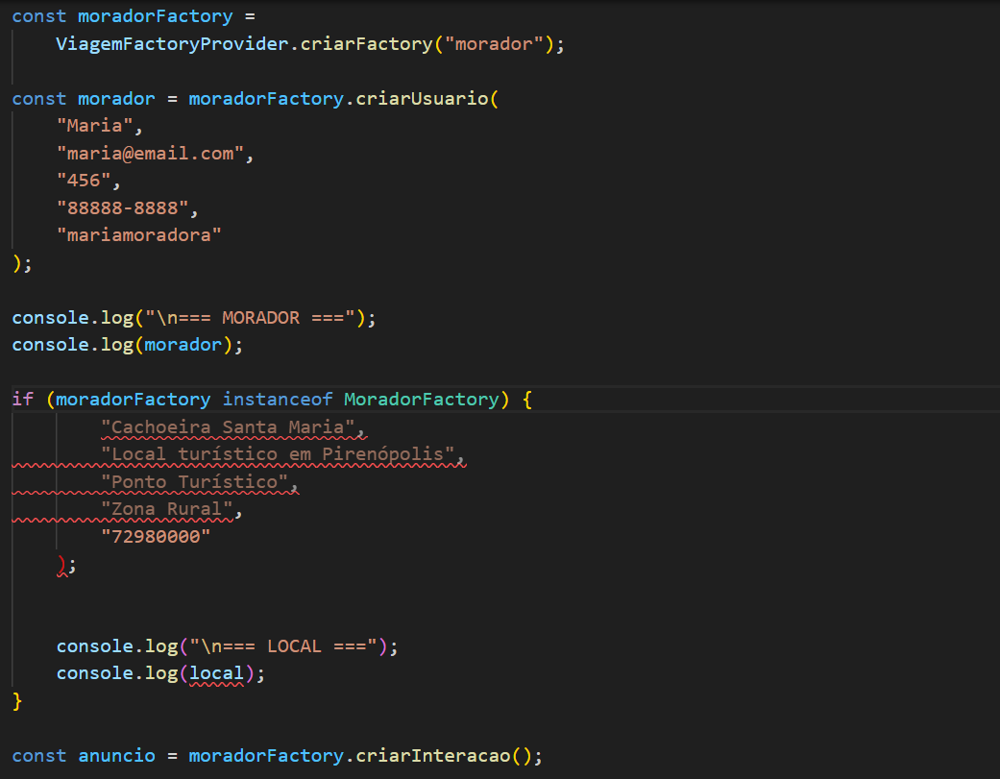
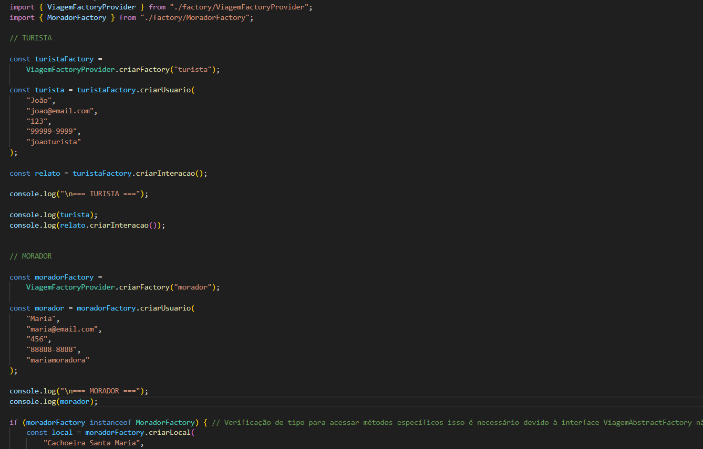
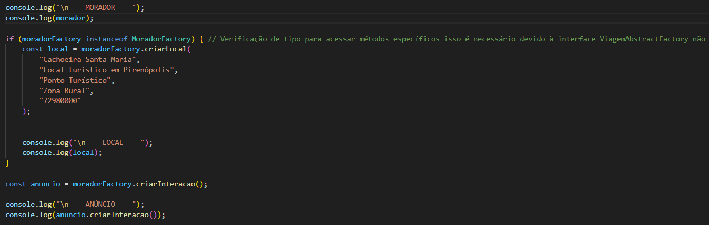
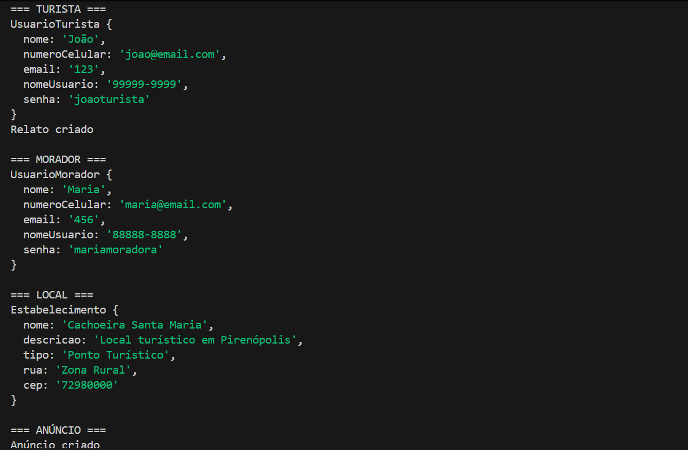
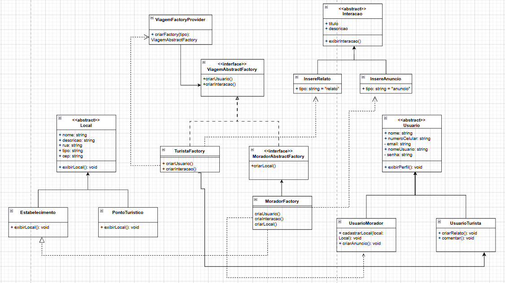

# 3.1.1 Abstract Factory

## Introdução

Abstract Factory é um padrão de projeto que permite criar famílias de objetos associados entre si sem dependência direta de suas classes concretas. Ele funciona em um nível de conceito acima do Factory Method, permitindo retornar um de vários grupos de classe, além disso, dentro desse grupo cada classe pode retornar diversos objetos diferentes sob demanda. O Abstract Factory é um objeto fábrica que gerencia grupos de classes, ainda que possível utilizar uma Simple Factory para decidir qual classe própia retornar de um determinado grupo.

*Fonte: : Adaptado de Cooper (2000, p. 36)*

## Objetivo

O objetivo do Asbtract Factory é permitir a criação de famílias de objetos relacionados ou dependentes por meio de uma única interface e sem que a classe concreta seja detalhada. 
A utilização do Abstract Factory se dá pela necessidade de diferenciar as diversas interfaces de usuários, permitindo que o projeto crie famílias de objetos relacionados através de uma interface única. Com isso, alcançou-se um baixo acoplamento, facilitando a futura expansão do sistema para novos requisitos.

## Metodologia

Para a construção do Padrão de Projeto Criacional Abstract Factory, Mariana e João Victor optaram por utilizar a linguagem TypeScript pela facilidade de implementação.

Nessa reunião discutimos sobre o Padrão de Projeto, Abstract Factory, iniciamos o diagrama e tivemos uma boa evolução do artefato.

**Figura 1: Primeira Reunião em dupla**

*Fonte: Discord*

A partir da finalização dessa parte, pedimos a revisão da Milena e da Letícia. E obtivmeos os seguintes feedacks:

**Figura 2: Feedback Milena**

*Fonte: Discord*

**Figura 3: Feedback Letícia**

*Fonte: Discord*

A partir disso levamos em consideração as sugestões e fizemos as devidas alterações, tornando a parte final do Diagrama e do Código.

### Instruções
**Guia para rodar o Abstract Factory**

**Quando estiver na pasta:**

*2026.01-T02_G5_EuAmoPiri_Entrega_03/GOFs/Criacionais/AbstractFactory/src.*

**Pelo Bash execute o comando:**

*npx ts-node index.ts"*

## Evolução do artefato

### Primeira Versão do index.ts:

**Figura 4: Primeira Versão do Index 1**

*Fonte: VsCode*

### Saída esperada:

**Figura 5: Resultado da Primeira Versão do Index 1**

*Fonte: VsCode*

### Segunda Versão do index.ts

**Figura 6: Resultado da Primeira Versão do Index 2**

*Fonte: VsCode*

### Saída Esperada

**Figura 7: Resultado da Primeira Versão do Index 2**

*Fonte: VsCode*

**Figura 8: Versão Final do Diagrama Abstract Factory**

*Fonte: DrawIo*

## Visão dos contribuidores na concepção do artefato

**Mariana:** para essa entrega parcial, colaborei na elaboração do Abstract Factory desde o início, junto ao João Victor. Estive presente na parte de código, em que fiquei responsável por reorganizar a lógica do código e as pastas do mesmo. Estive presente na contrução do atual documento e na parte de refatoração do Diagrama e do código após as considerações das revisoras: Letícia e Milena. O abstract factory foi muito proveitoso, fui capaz de aprender e absorver bastante sobre o mesmo após assistir a aula gravada da professora, aos slides, leituras extras e nada melhor do que praticar, foi na execução e discussões que aprendemos a melhorar e refinar.

**João Victor:** para essa entrega, ajudei na confecção das versões iniciais do diagrama de Abstract Factory junto a Mariana. Também contribui com a versão inicial da lógica do código das classes e a estrutura das pastas que as organizam. Ao longo do desenvolvimento, colaborei para a revisão do diagrama e realização dos ajustes necessários à estrutura das classes e fábricas com base nas considerações das nossas revisoras: Letícia e Milena. Desenvolver o Abstract Factory foi um tanto trabalhoso, mas sinto que pude absorver bastante por meio da experiência com a aplicação dos conteúdos sobre o tópico, principalmente com as discussões levantadas entre os membros com o objetivo de melhorar a entrega.

## Vídeo de Explicação e Execução do Código

<iframe width="560" height="315" src="https://www.youtube.com/embed/g4BWAyQaPaA?si=zQJB-dxN_LPEJXQq" title="YouTube video player" frameborder="0" allow="accelerometer; autoplay; clipboard-write; encrypted-media; gyroscope; picture-in-picture; web-share" referrerpolicy="strict-origin-when-cross-origin" allowfullscreen></iframe>

## Referências

[1] SERRANO, Milene. Arquitetura e Desenho de Software - Aula GoFs Criacionais. Slides. Universidade de Brasília, 2025.

[2] SHVETS, Alexander. Abstract Factory. Refactoring Guru. Disponível em: https://refactoring.guru/pt-br/design-patterns/abstract-factory
. Acesso em: 6 maio 2026.

[3] COOPER, James W. Java Design Patterns: A Tutorial. Boston: Addison-Wesley, 2000. Disponível em: https://theswissbay.ch/pdf/Gentoomen%20Library/Programming/Java/Addison.Wesley.Java.Design%20Patterns%20A%20tutorial.pdf. Acesso em: 6 maio 2024.

## Histórico do artefato

| Data       | Versão | Descrição                                               | Autor                                                      | Revisores                                                                                                                         |
| ---------- | ------ | ------------------------------------------------------- | ---------------------------------------------------------- | --------------------------------------------------------------------------------------------------------------------------------- |
| 01/05/2026 | 1.0  | Criação Incial do Artefato   | [Mariana](https://github.com/Marianamrts)           e [João Victor](https://github.com/Chaotzuu)     |        [Milena](https://github.com/milenamso) e [Letícia](https://github.com/leticiakrpaiva)| 
| 04/05/2026 | 1.1  | Criação Incial do Código e pastas  | [João Victor](https://github.com/Chaotzuu)     |        [Milena](https://github.com/milenamso) e [Letícia](https://github.com/leticiakrpaiva)|                                                                                                 
| 05/05/2026 | 1.2  | Refatoração do código  | [Mariana](https://github.com/Marianamrts)  |        [Milena](https://github.com/milenamso) e [Letícia](https://github.com/leticiakrpaiva)| 
| 07/05/2026 | 1.3 | Ajustes finais no código de acordo com as Discussões  | [João Victor](https://github.com/Chaotzuu)     |        [Milena](https://github.com/milenamso) e [Letícia](https://github.com/leticiakrpaiva)| 
| 07/05/2026 | 1.4 | Versão Final do Padrão de Projeto  | [Mariana](https://github.com/Marianamrts)           e [João Victor](https://github.com/Chaotzuu)     |        [Milena](https://github.com/milenamso) e [Letícia](https://github.com/leticiakrpaiva)| 

## Histórico do documento

| Data       | Versão | Descrição                                              | Autor                                                   | Revisores                                              |
|------------|--------|-------------------------------------------------------|---------------------------------------------------------|-------------------------------------------------------|
| 07/05/2026 | 1.0    | Criação inicial do documento                          | [Mariana](https://github.com/Marianamrts)           |[João Victor](https://github.com/Chaotzuu)     |
| 07/05/2026 | 1.2    | Inserção da Visão pessoal de contribuição   |[João Victor](https://github.com/Chaotzuu)     | [Mariana](https://github.com/Marianamrts)     |
| 07/05/2026 | 1.2    | Inserção da Metodologia e versão final do documento   | [Mariana](https://github.com/Marianamrts)           |[João Victor](https://github.com/Chaotzuu)     |
