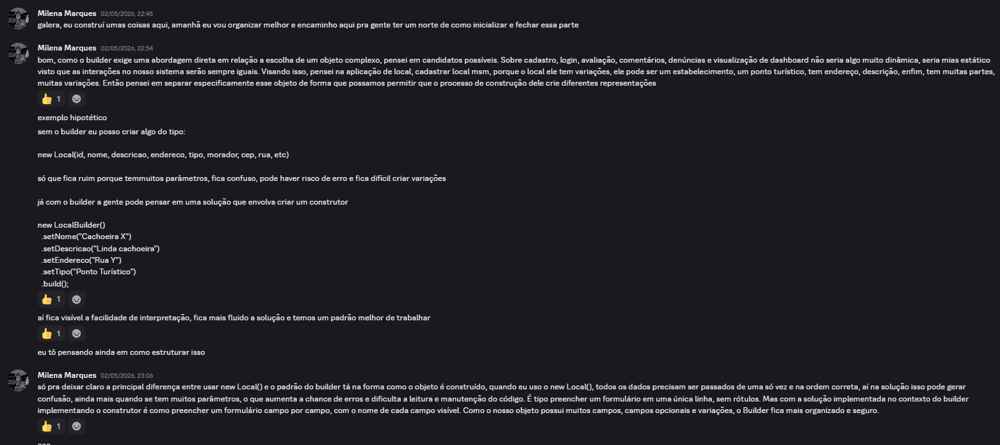
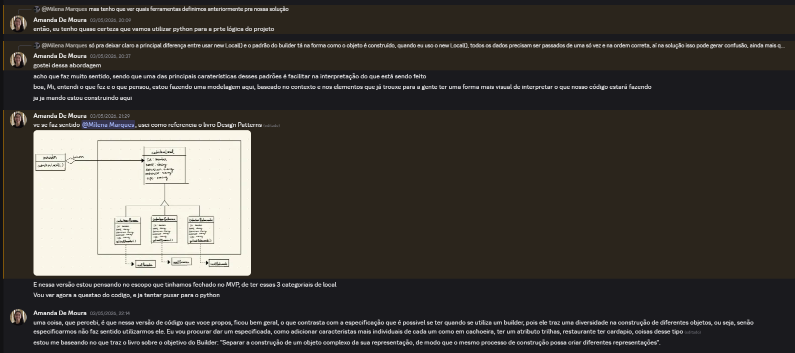
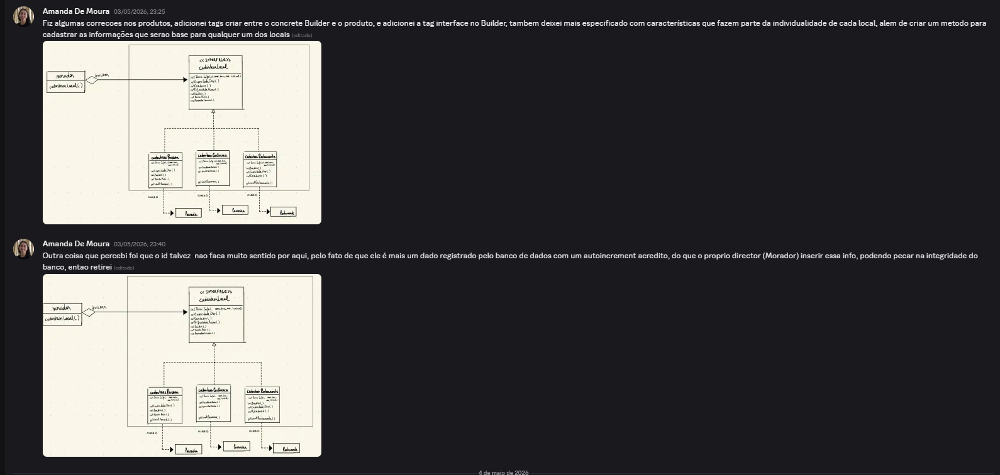
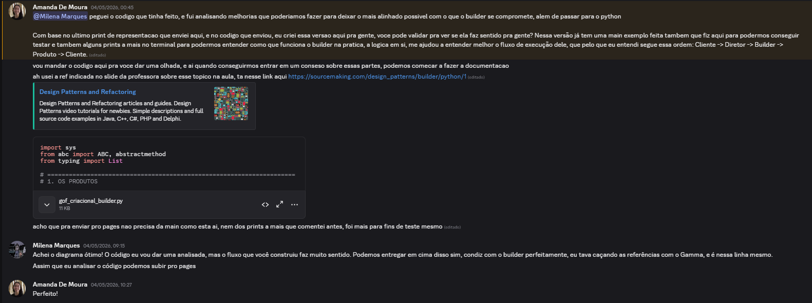
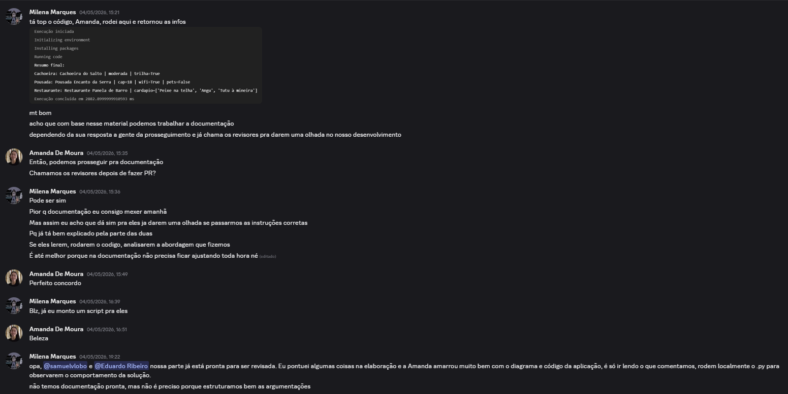
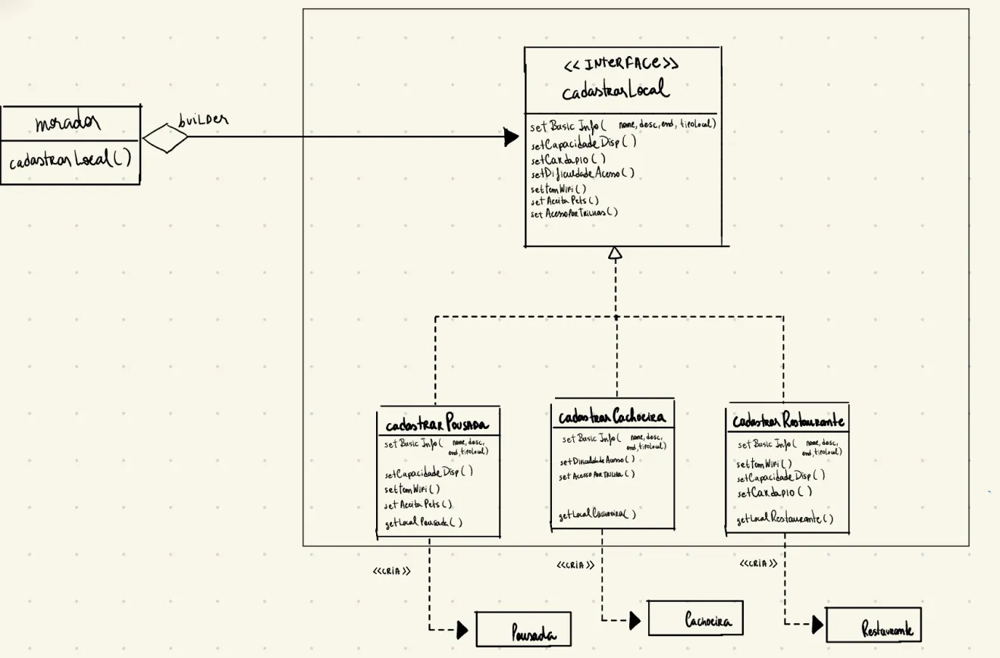

# 3.1.2 Builder

## Introdução

Para essa solução, nos baseamos no livro Design Patterns, de Erich Gamma e colaboradores, referência fundamental para o desenvolvimento de softwares orientados a objetos mais flexíveis e reutilizáveis. Entre os padrões apresentados na obra, utilizamos o padrão criacional Builder, responsável por separar a construção de objetos complexos de sua representação. Essa abordagem permite criar diferentes configurações de um mesmo objeto de forma organizada, legível e escalável, evitando construtores extensos e facilitando a manutenção do sistema.

## Objetivo

Segundo Gamma et al. no livro Design Patterns, o padrão criacional Builder tem como principal objetivo separar a construção de um objeto complexo de sua representação, permitindo que o mesmo processo de construção possa gerar diferentes representações do produto final. Dessa forma, o padrão torna o algoritmo de criação independente das partes que compõem o objeto e da maneira como essas partes são montadas.

A interação entre os participantes do padrão ocorre de forma estruturada e sequencial. Inicialmente, o cliente instancia o objeto Director e o associa a um Builder específico. Durante o processo de construção, o Director coordena cada etapa e solicita ao Builder a criação das partes necessárias do produto. O Builder, por sua vez, é responsável por construir e organizar internamente os componentes do objeto complexo. Ao final da execução, o cliente obtém o produto completamente montado diretamente pelo Builder, garantindo maior flexibilidade, organização e reutilização no processo de criação de objetos (GAMMA et al., 1995).

## Metodologia

Para confecção deste artefato, usamos o Discord de maneira assíncrona, especialmente para discussão de alguns tópicos.


<center>Figura 1 — Primeiras discussões a respeito do padrão</center>

Com as análises realizadas foi-se levantadas idealizações para a construção do projeto por parte de Milena, definindo o escopo da solução com base em análises referentes à estrutura padrão do projeto. Dentre tantas opções dentro do projeto em si, o argumento de que já com o Builder pode-se pensar em uma solução que envolva criar um construtor direcionou a escolha para a entidade Local. Diferente de funcionalidades mais estáticas, como login, cadastro, comentários, denúncias e visualização de dashboard, a entidade apresenta maior complexidade estrutural e múltiplas variações, podendo representar diferentes tipos de estabelecimentos e pontos turísticos. Dessa forma, o padrão Builder se adequa ao permitir a separação do processo de construção do objeto de sua representação final, possibilitando a criação de diferentes configurações de Local de maneira organizada e flexível. 

Análises de codificação e soluções diversas serão pontuadas no tópico Evolução do artefato. Portanto, a metodologia seguiu-se por discurssões.


<center>Figura 2 — Construção da solução definitiva por parte de Amanda</center>

Nessa fase Amanda exerceu o papel de deixar o projeto ainda mais robusto visualizando a solução final do protótipo, construindo o diagrama e implementando o código em python pois o projeto segue essa orientação de linguagem.


<center>Figura 3 — Discussões a respeito do padrão</center>

Nessa etapa de discussão ajustes foram implementadas, como por exemplo, adição da tag de interface no Builder, tag criar entre o concrete Builder e o produto, criação do método para cadastrar as informações que serão base para qualquer um dos locais, retirada de id e adição de especificação das características que fazem parte da individualidade de cada local.


<center>Figura 4 — Solução robusta proposta por Amanda</center>

Foi-se realizada a implementação da solução em linguagem python, que será descrito com mais ênfase no tópico Evolução do artefato.


<center>Figura 5 — Alinhamento com Revisores</center>

Foi-se realizada as testagens para validar a versão de código Python. Por fim, a partir desse tópico os revisores foram mencionados para investigar a proposta de solução.

## Evolução do artefato

## Diagrama nao sei o nome


<center>Figura 6 — Diagrama</center>

## Solução em Typescript - Versão Inicial

```typescript
new LocalBuilder()
  .setNome("Cachoeira X")
  .setDescricao("Linda cachoeira")
  .setEndereco("Rua Y")
  .setTipo("Ponto Turístico")
  .build();
```

Esse trecho de código representa a construção gradual e configurável de um objeto complexo utilizando o padrão de projeto `Builder`.

Nele, o objeto `Local` é montado passo a passo por meio de métodos específicos (`setNome`, `setDescricao`, `setEndereco`, etc.), permitindo criar diferentes representações da entidade de forma organizada, legível e flexível, finalizando a construção com o método `build()`.

A seguir, apresenta-se a estrutura do padrão `Builder` aplicada à entidade `Local`, evidenciando seus principais participantes: o produto, a interface de construção, o builder concreto e o diretor.

```typescript
class Local {
  id?: number;
  nome?: string;
  descricao?: string;
  endereco?: string;
  tipo?: string;
}

// interface
interface LocalBuilder {
  setNome(nome: string): LocalBuilder;
  setDescricao(descricao: string): LocalBuilder;
  setEndereco(endereco: string): LocalBuilder;
  setTipo(tipo: string): LocalBuilder;
  build(): Local;
}

// builder concreto
class ConcreteLocalBuilder implements LocalBuilder {
  private local: Local;

  constructor() {
    this.local = new Local();
  }

  setNome(nome: string): LocalBuilder {
    this.local.nome = nome;
    return this;
  }

  setDescricao(descricao: string): LocalBuilder {
    this.local.descricao = descricao;
    return this;
  }

  setEndereco(endereco: string): LocalBuilder {
    this.local.endereco = endereco;
    return this;
  }

  setTipo(tipo: string): LocalBuilder {
    this.local.tipo = tipo;
    return this;
  }

  build(): Local {
    return this.local;
  }
}

// Director 
class LocalDirector {
  construirPontoTuristico(): Local {
    return new ConcreteLocalBuilder()
      .setNome("Ponto Turístico")
      .setTipo("Turismo")
      .build();
  }

  construirEstabelecimento(): Local {
    return new ConcreteLocalBuilder()
      .setNome("Restaurante")
      .setTipo("Estabelecimento")
      .build();
  }
}
```
Nesse código, a classe `Local` representa o produto final a ser construído. A interface `LocalBuilder` define o contrato de criação do objeto, estabelecendo quais etapas podem ser utilizadas na montagem de um local. A classe `ConcreteLocalBuilder` implementa essas etapas, preenchendo os atributos do objeto gradualmente e retornando a própria instância do builder para permitir o encadeamento das chamadas.

Já a classe `LocalDirector` centraliza formas específicas de construção, criando representações pré-definidas de `Local`, como ponto turístico e estabelecimento. Assim, o código evidencia como o padrão `Builder` separa o processo de construção do objeto de sua representação final.

Com essa estrutura, a criação de um objeto `Local` pode ser realizada de forma encadeada com o construtor citado anteriormente. Por fim, essa foi a primeira maneira de pensar no contexto de build, sendo a primeira versão do protótipo.


## Solução com Python - Versão Final

```python
import sys
from abc import ABC, abstractmethod
from typing import List

# =====================================================================
# 1. OS PRODUTOS 
# =====================================================================
class Local:
    def __init__(self):
        self.nome: str = None
        self.desc: str = None
        self.end: str = None
        self.tipoLocal: str = None


class Cachoeira(Local):
    def __init__(self):
        super().__init__()
        self.dificuldadeAcesso: str = None
        self.acessoPorTrilha: bool = False


class Pousada(Local):
    def __init__(self):
        super().__init__()
        self.capacidadeDisp: int = 0
        self.temWifi: bool = False
        self.aceitaPets: bool = False


class Restaurante(Local):
    def __init__(self):
        super().__init__()
        self.capacidadeDisp: int = 0
        self.temWifi: bool = False
        self.cardapio: List[str] = []

# 2. BUILDER ABSTRATO 
# =====================================================================

class Builder(ABC):
    """Especifica interface para criar partes do produto; subclasses definem self.product."""

    @abstractmethod
    def _build_part_a(self) -> None:
        pass

    @abstractmethod
    def _build_part_b(self) -> None:
        pass

    @abstractmethod
    def _build_part_c(self) -> None:
        pass

# 3. BUILDER CONCRETO 
# =====================================================================

class CachoeiraBuilder(Builder):
    def __init__(
        self,
        nome: str,
        desc: str,
        end: str,
        tipo_local: str,
        dificuldade_acesso: str,
        acesso_por_trilha: bool,
    ):
        self._nome = nome
        self._desc = desc
        self._end = end
        self._tipo_local = tipo_local
        self._dificuldade_acesso = dificuldade_acesso
        self._acesso_por_trilha = acesso_por_trilha
        self.product = Cachoeira()
        # Visualização: o produto já existe, mas ainda sem os dados aplicados — o Director chamará os 3 passos.
        print("    [CachoeiraBuilder] __init__: instanciou self.product (Cachoeira vazia) e guardou parâmetros no builder.")

    def _build_part_a(self) -> None:
        # Parte A (comum ao domínio): dados básicos do Local (sem id persistido aqui — cabe à camada de BD).
        print("    [CachoeiraBuilder] _build_part_a -> preenche nome, desc, end, tipoLocal no produto.")
        self.product.nome = self._nome
        self.product.desc = self._desc
        self.product.end = self._end
        self.product.tipoLocal = self._tipo_local

    def _build_part_b(self) -> None:
        # Parte B específica de Cachoeira: dificuldade de acesso.
        print("    [CachoeiraBuilder] _build_part_b -> preenche dificuldadeAcesso.")
        self.product.dificuldadeAcesso = self._dificuldade_acesso

    def _build_part_c(self) -> None:
        # Parte C específica de Cachoeira: acesso por trilha.
        print("    [CachoeiraBuilder] _build_part_c -> preenche acessoPorTrilha.")
        self.product.acessoPorTrilha = self._acesso_por_trilha

    def getLocalCachoeira(self) -> Cachoeira:
        return self.product


class PousadaBuilder(Builder):
    def __init__(
        self,
        nome: str,
        desc: str,
        end: str,
        tipo_local: str,
        capacidade_disp: int,
        tem_wifi: bool,
        aceita_pets: bool,
    ):
        self._nome = nome
        self._desc = desc
        self._end = end
        self._tipo_local = tipo_local
        self._capacidade_disp = capacidade_disp
        self._tem_wifi = tem_wifi
        self._aceita_pets = aceita_pets
        self.product = Pousada()
        print("    [PousadaBuilder] __init__: instanciou self.product (Pousada vazia) e guardou parâmetros no builder.")

    def _build_part_a(self) -> None:
        # Parte A: mesmos campos base que qualquer Local.
        print("    [PousadaBuilder] _build_part_a -> preenche nome, desc, end, tipoLocal no produto.")
        self.product.nome = self._nome
        self.product.desc = self._desc
        self.product.end = self._end
        self.product.tipoLocal = self._tipo_local

    def _build_part_b(self) -> None:
        # Parte B específica: capacidade disponível.
        print("    [PousadaBuilder] _build_part_b -> preenche capacidadeDisp.")
        self.product.capacidadeDisp = self._capacidade_disp

    def _build_part_c(self) -> None:
        # Parte C específica: comodidades da pousada.
        print("    [PousadaBuilder] _build_part_c -> preenche temWifi e aceitaPets.")
        self.product.temWifi = self._tem_wifi
        self.product.aceitaPets = self._aceita_pets

    def getLocalPousada(self) -> Pousada:
        return self.product


class RestauranteBuilder(Builder):
    def __init__(
        self,
        nome: str,
        desc: str,
        end: str,
        tipo_local: str,
        capacidade_disp: int,
        tem_wifi: bool,
        cardapio: List[str],
    ):
        self._nome = nome
        self._desc = desc
        self._end = end
        self._tipo_local = tipo_local
        self._capacidade_disp = capacidade_disp
        self._tem_wifi = tem_wifi
        self._cardapio = list(cardapio)
        self.product = Restaurante()
        print("    [RestauranteBuilder] __init__: instanciou self.product (Restaurante vazio) e guardou parâmetros no builder.")

    def _build_part_a(self) -> None:
        print("    [RestauranteBuilder] _build_part_a -> preenche nome, desc, end, tipoLocal no produto.")
        self.product.nome = self._nome
        self.product.desc = self._desc
        self.product.end = self._end
        self.product.tipoLocal = self._tipo_local

    def _build_part_b(self) -> None:
        # Capacidade e Wi‑Fi no mesmo passo (conforme o roteiro em 3 partes deste exemplo).
        print("    [RestauranteBuilder] _build_part_b -> preenche capacidadeDisp e temWifi.")
        self.product.capacidadeDisp = self._capacidade_disp
        self.product.temWifi = self._tem_wifi

    def _build_part_c(self) -> None:
        print("    [RestauranteBuilder] _build_part_c -> preenche cardapio (cópia da lista).")
        self.product.cardapio = list(self._cardapio)

    def getLocalRestaurante(self) -> Restaurante:
        return self.product

# 4. O DIRETOR 
# =====================================================================

class Director:
    """Constrói o objeto usando a interface do Builder."""

    def __init__(self):
        self._builder = None

    def construct(self, builder: Builder) -> None:
        # O Director não recebe dados de negócio: só delega ao builder na ordem A -> B -> C (padrão Builder / SourceMaking).
        print("  [Director] construct(builder): guarda referência e executa a sequência fixa _build_part_a -> b -> c.")
        self._builder = builder
        print("  [Director] -> _build_part_a()")
        builder._build_part_a()
        print("  [Director] -> _build_part_b()")
        builder._build_part_b()
        print("  [Director] -> _build_part_c()")
        builder._build_part_c()
        print("  [Director] sequência concluída; o cliente pode obter o produto via getLocal*().\n")


# 5. CLIENTE (para testes/exemplificação)
# =====================================================================

def main() -> None:
    # Ajuda o terminal Windows a mostrar acentos nos prints (opcional; em Linux/macOS costuma ja ser UTF-8).
    if hasattr(sys.stdout, "reconfigure"):
        try:
            sys.stdout.reconfigure(encoding="utf-8")
        except (OSError, ValueError):
            pass

    director = Director()

    print("=" * 72)
    print("[Cliente] Montagem 1/3 — tipo: cachoeira")
    print("(Cliente cria o ConcreteBuilder com TODOS os dados; o Director só orquestra os passos.)\n")

    b_cachoeira = CachoeiraBuilder(
        nome="Cachoeira do Salto",
        desc="Queda d'água com poço para banho.",
        end="Estrada municipal km 12",
        tipo_local="cachoeira",
        dificuldade_acesso="moderada",
        acesso_por_trilha=True,
    )
    director.construct(b_cachoeira)
    # Após construct, o produto está completo; getLocal* devolve o tipo específico (facilita leitura do código cliente).
    print("[Cliente] getLocalCachoeira() -> produto pronto para uso.\n")
    cachoeira = b_cachoeira.getLocalCachoeira()

    print("=" * 72)
    print("[Cliente] Montagem 2/3 — tipo: pousada\n")

    b_pousada = PousadaBuilder(
        nome="Pousada Encanto da Serra",
        desc="Hospedagem com café da manhã regional.",
        end="Rua das Palmeiras, 45",
        tipo_local="pousada",
        capacidade_disp=18,
        tem_wifi=True,
        aceita_pets=False,
    )
    director.construct(b_pousada)
    print("[Cliente] getLocalPousada() -> produto pronto.\n")
    pousada = b_pousada.getLocalPousada()

    print("=" * 72)
    print("[Cliente] Montagem 3/3 — tipo: restaurante\n")

    b_restaurante = RestauranteBuilder(
        nome="Restaurante Panela de Barro",
        desc="Comida regional e sucos naturais.",
        end="Praça Central, 10",
        tipo_local="restaurante",
        capacidade_disp=40,
        tem_wifi=True,
        cardapio=["Peixe na telha", "Angu", "Tutu à mineira"],
    )
    director.construct(b_restaurante)
    print("[Cliente] getLocalRestaurante() -> produto pronto.\n")

    restaurante = b_restaurante.getLocalRestaurante()

    print("=" * 72)
    print("[Cliente] Resumo final — objetos construídos (confirmação no terminal):")
    print(f"  • Cachoeira: {cachoeira.nome!r} | {cachoeira.dificuldadeAcesso!r} | trilha={cachoeira.acessoPorTrilha}")
    print(f"  • Pousada: {pousada.nome!r} | cap={pousada.capacidadeDisp} | wifi={pousada.temWifi} | pets={pousada.aceitaPets}")
    print(f"  • Restaurante: {restaurante.nome!r} | cardápio={restaurante.cardapio}")


if __name__ == "__main__":
    main()
```


## Visão dos contribuidores na concepção do artefato

Milena(executora): Aprendi muito com as análises do padrão de projeto ainda mais buscando informações com a bibliografia de Design Patterns: Elements of Reusable Object-Oriented Software. Eu não tinha conhecimento a respeito de como a estruturação de código faz toda a diferença pro projeto, visando isso, gostei da abordagem porque traz clareza a solução.
Amanda(executora):
Eduardo(revisor):
Samuel(revisor): 

## Referências

GAMMA, Erich; HELM, Richard; JOHNSON, Ralph; VLISSIDES, John. Design Patterns: Elements of Reusable Object-Oriented Software. Boston: Addison-Wesley, 1995.

## Histórico do artefato

| Data       | Versão | Descrição     | Autor            | Revisores                                                                                                                         |
| 02/05/2026 | `1.0`  | Desenvolvimento da solução protótipo | [Milena](https://github.com/milenamso) | [Amanda](https://github.com/amandademoura)  |   
| 03/05/2026 | `1.1`  | Robustez na solução, construção de diagrama, implementação de código. Versão Final | [Amanda](https://github.com/AmandaaMoura) | [Milena](https://github.com/milenamso)  |         


## Histórico do documento

| Data       | Versão | Descrição                                                      | Autor                                                      | Revisores |
| 06/05/2026 | `1.0`  | Construção da primeira versão da documentação | [Milena](https://github.com/milenamso) | [Amanda](https://github.com/amandademoura)  |    
