# 3.1.2 Builder

## Introdução

Para essa solução, nos baseamos no livro Design Patterns, de Erich Gamma e colaboradores, referência fundamental para o desenvolvimento de softwares orientados a objetos mais flexíveis e reutilizáveis. Entre os padrões apresentados na obra, utilizamos o padrão criacional Builder, responsável por simplificar a construção de objetos complexos de sua representação. Essa abordagem permite criar diferentes configurações de um mesmo objeto de forma organizada, legível e escalável, evitando construtores extensos e facilitando a manutenção do sistema.

## Objetivo

Segundo Gamma et al. no livro Design Patterns, o padrão criacional Builder tem como principal objetivo separar a construção de um objeto complexo de sua representação, permitindo que o mesmo processo de construção possa gerar diferentes representações do produto final. Dessa forma, o padrão torna o algoritmo de criação independente das partes que compõem o objeto e da maneira como essas partes são montadas.

A interação entre os participantes do padrão ocorre de forma estruturada e sequencial. Inicialmente, o cliente instancia o objeto Director e o associa a um Builder específico. Durante o processo de construção, o Director coordena cada etapa e solicita ao Builder a criação das partes necessárias do produto. O Builder, por sua vez, é responsável por construir e organizar internamente os componentes do objeto complexo. Ao final da execução, o cliente obtém o produto completamente montado diretamente pelo Builder, garantindo maior flexibilidade, organização e reutilização no processo de criação de objetos (GAMMA et al., 1995).

## Metodologia

Para confecção deste artefato, usamos o Discord de maneira assíncrona, especialmente para discussão de alguns tópicos.

<center>Figura 1 — Primeiras discussões a respeito do padrão</center>

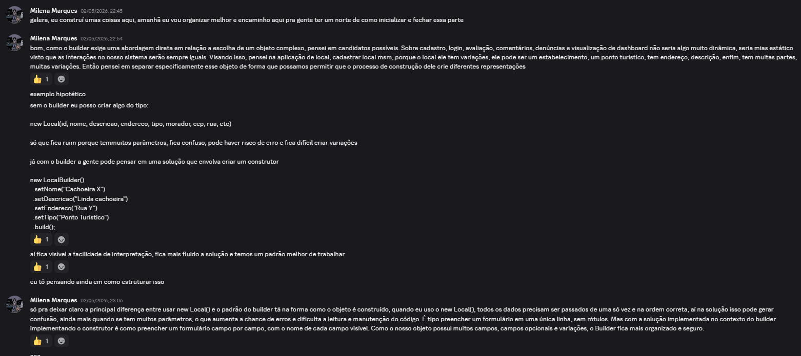

<center>Fonte: Discord</center>

Com as análises realizadas foi-se levantadas idealizações para a construção do projeto por parte de Milena, definindo o escopo da solução com base em análises referentes à estrutura padrão do projeto. Dentre tantas opções dentro do projeto em si, o argumento de que já com o Builder pode-se pensar em uma solução que envolva criar um construtor direcionou a escolha para a entidade Local. Diferente de funcionalidades mais estáticas, como login, cadastro, comentários, denúncias e visualização de dashboard, a entidade apresenta maior complexidade estrutural e múltiplas variações, podendo representar diferentes tipos de estabelecimentos e pontos turísticos. Dessa forma, o padrão Builder se adequa ao permitir a separação do processo de construção do objeto de sua representação final, possibilitando a criação de diferentes configurações de Local de maneira organizada e flexível. 

Análises de codificação e soluções diversas serão pontuadas no tópico Evolução do artefato. Portanto, a metodologia seguiu-se por discurssões.

<center>Figura 2 — Construção da solução definitiva por parte de Amanda</center>

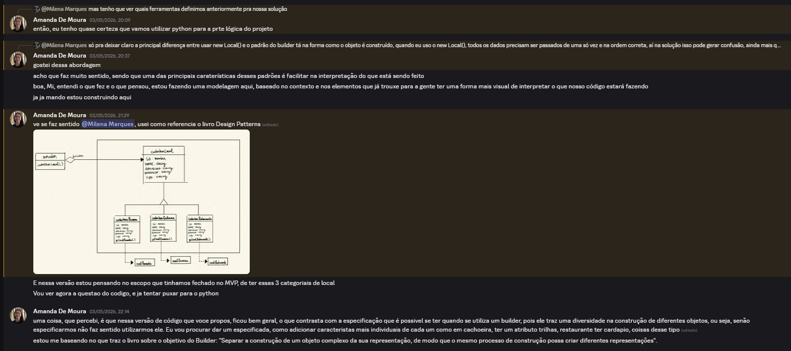

<center>Fonte: Discord</center>

Nessa fase Amanda exerceu o papel de deixar o projeto ainda mais robusto visualizando a solução final do protótipo, construindo o diagrama e implementando o código em python pois o projeto segue essa orientação de linguagem.

<center>Figura 3 — Discussões a respeito do padrão</center>

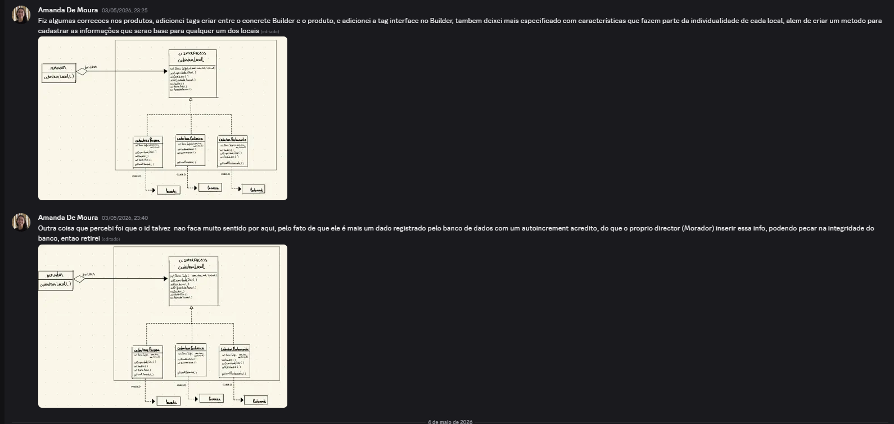

<center>Fonte: Discord</center>

Nessa etapa de discussão ajustes foram implementadas, como por exemplo, adição da tag de interface no Builder, tag criar entre o concrete Builder e o produto, criação do método para cadastrar as informações que serão base para qualquer um dos locais, retirada de id e adição de especificação das características que fazem parte da individualidade de cada local.

<center>Figura 4 — Solução robusta proposta por Amanda</center>

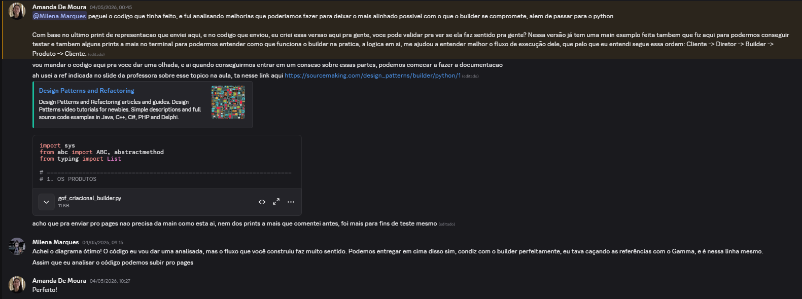

<center>Fonte: Discord</center>

Foi-se realizada a implementação da solução em linguagem python, que será descrito com mais ênfase no tópico Evolução do artefato.

<center>Figura 5 — Alinhamento com Revisores</center>

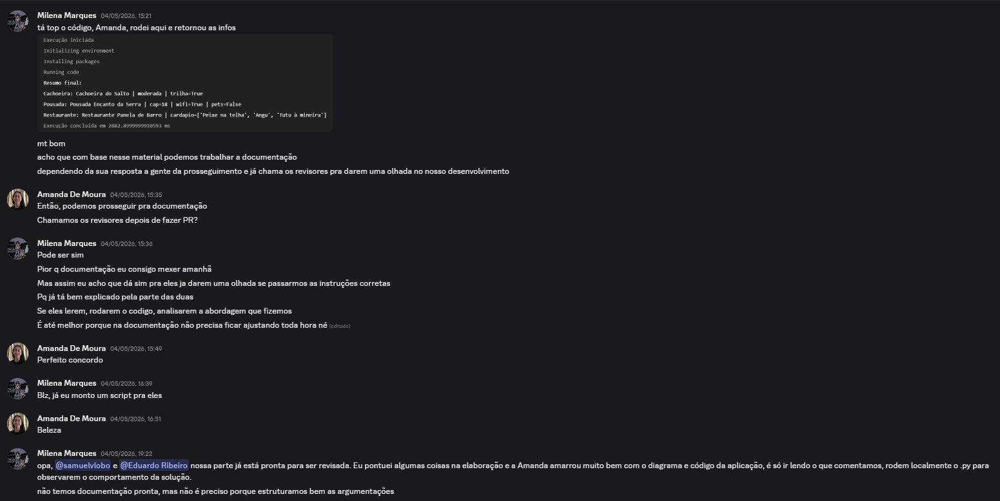

<center>Figura 5 — Fonte: Discord</center>

Foi-se realizada as testagens para validar a versão de código Python. Por fim, a partir desse tópico os revisores foram mencionados para investigar a proposta de solução.

## Revisões com base na V1 

Após a entrega da V1 em Python, Eduardo e Samuel revisaram a implementação. A sequência abaixo registra o feedback, o alinhamento entre executores e revisores, a refatoração após compreensão da necessidade de mudanças e a validação final.

---

<center>Figura 6 — Revisão inicial de Eduardo: parâmetros no construtor dos builders e interface comum com `build()`</center>

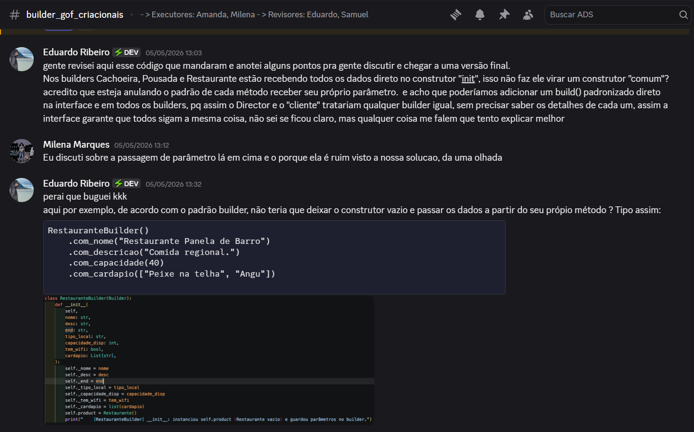

<center>Fonte: Discord</center>

**Ponto Central da Discussão:** O revisor Eduardo Ribeiro abre o debate identificando um "code smell" na versão inicial entregue pelas executoras. Nos builders de Cachoeira, Pousada e Restaurante, todos os dados estavam sendo injetados de forma massiva diretamente no método construtor (`__init__`).

**Argumentação:** Eduardo aponta que essa abordagem anula o propósito do padrão de projeto, transformando-o em um construtor comum e monolítico. Ele sugere a criação de uma interface abstrata padronizada contendo o método `build()`, garantindo que o Director e o cliente consigam tratar qualquer builder de forma polimórfica e uniforme, sem necessidade de conhecer detalhes internos de implementação. Milena Marques intervém reforçando que já havia mapeado previamente os problemas decorrentes desse modelo de passagem de parâmetros diante da solução proposta.

---

<center>Figura 7 — Discussão entre Eduardo e Amanda sobre construção passo a passo e experiência de uso</center>

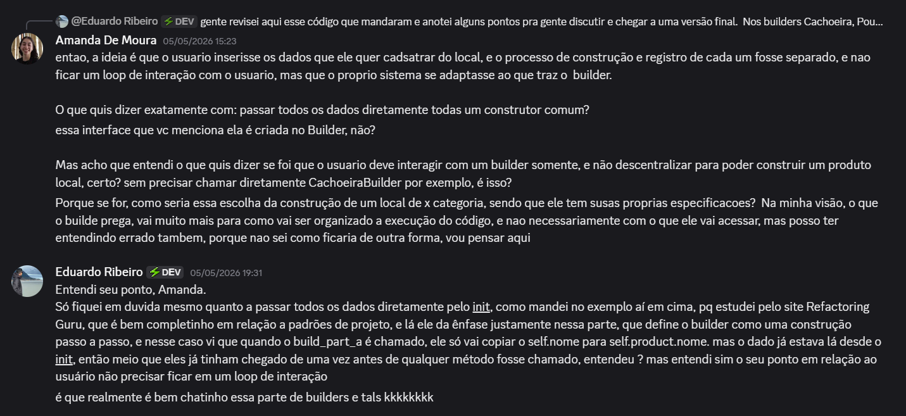

<center>Fonte: Discord</center>


**Ponto Central da Discussão:** Amanda De Moura retoma o feedback de Eduardo e aprofunda o debate sobre como conciliar a rigidez do padrão Builder com a proposta do EuAmoPiri. Ela defende que o usuário informe os dados do local, mas que construção e cadastro permaneçam desacoplados, evitando laços de interação repetitivos com o usuário final.

**Argumentação:** Amanda questiona o que significa passar todos os dados por um construtor comum e se a interface citada pelo revisor deve existir no próprio Builder. Eduardo concorda com a preocupação de usabilidade, mas mantém a crítica à V1: ao receber todos os parâmetros no `__init__`, métodos como `_build_part_a` apenas copiam valores já armazenados, o que contradiz a construção passo a passo descrita na literatura (Refactoring Guru). O trecho ilustrado no chat reforça a expectativa de API fluente — por exemplo, `RestauranteBuilder().com_nome(...).com_descricao(...)` — em vez de um construtor monolítico.

---

<center>Figura 8 — Samuel valida a execução do código e Amanda alinha o escopo das classes ao MVP</center>

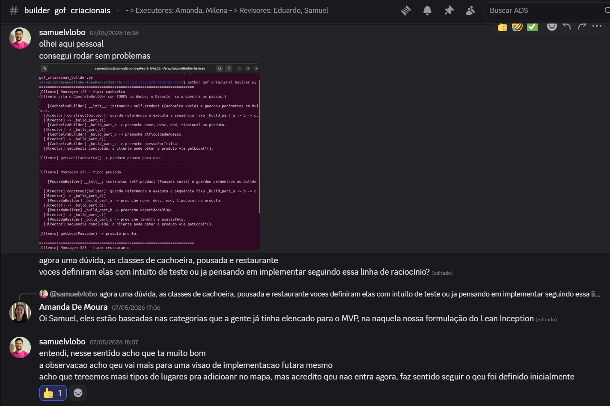

<center>Fonte: Discord</center>

**VALIDAÇÃO DA EXECUÇÃO E ESCOPO DAS CLASSES NO MVP**

**Ponto Central da Discussão:** Samuel informa no canal que conseguiu executar o script (`python gof_criacional_builder.py`) sem problemas e anexa o log do terminal, que registra a montagem de três locais — Cachoeira, Pousada e Restaurante — com a sequência orquestrada pelo Director (`_build_part_a` → `_build_part_b` → `_build_part_c`) e a obtenção do produto final em cada caso.

**Argumentação:** Em seguida, Samuel pergunta se as classes `Cachoeira`, `Pousada` e `Restaurante` foram definidas apenas para fins de teste ou se fazem parte da implementação definitiva do sistema. Amanda esclarece que elas correspondem às categorias de locais já elencadas para o MVP na formulação da Lean Inception. Samuel concorda com esse recorte, considera a solução muito boa nesse sentido e observa que, embora novos tipos de locais possam ser adicionados ao mapa no futuro, faz sentido manter, por ora, o que foi definido na concepção inicial do produto.

---

<center>Figura 9 — Amanda envia a refatoração do código após o feedback dos revisores</center>

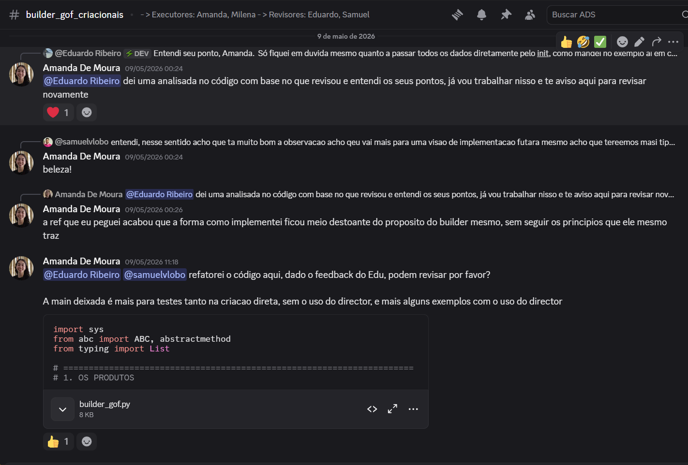

<center>Fonte: Discord</center>

</br>

<center>Figura 10 — Samuel, Amanda e Eduardo: revisão após refatoração da V1</center>

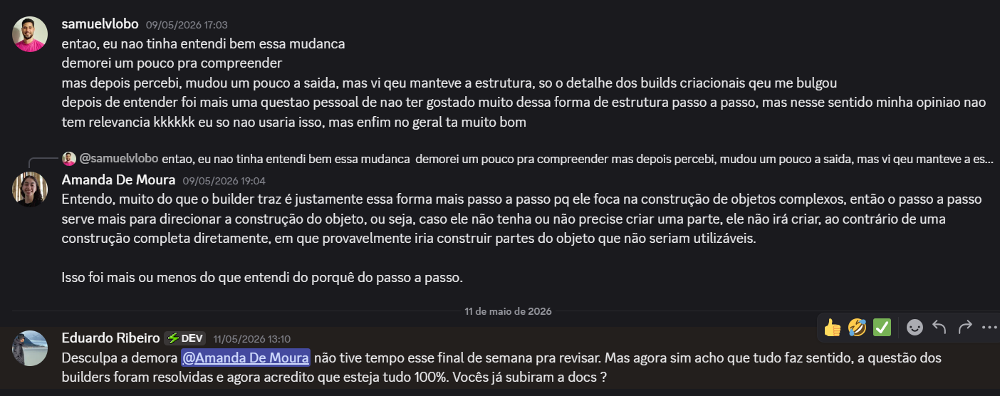

<center>Fonte: Discord</center>

**REVISÃO FINAL - Com base no código refatorado após feedbacks(V2)**

**Ponto Central da Discussão:** Após o alinhamento no canal `#builder_gof_criacionais`, Amanda reconhece que a V1 se afastou do propósito central do padrão Builder e comunica a entrega da versão refatorada, solicitando nova revisão a Eduardo e Samuel novamente. Samuel relata que, ao analisar a versão refatorada, teve dificuldade inicial para compreender a mudança na saída do programa, embora a estrutura geral tenha sido mantida. Ele comenta que os detalhes dos builds criacionais o incomodaram e que, por preferência pessoal, não adotaria uma montagem tão fragmentada — ressaltando, porém, que isso é subjetivo e que o resultado final está muito bom. Além disso, Eduardo também traz sua revisão final de que agora a entrega parece adequada para a proposta desse padrão de projeto.

**Argumentação:** Amanda responde sobre a  porquê da proposta que o builder empregada, já que a construção passo a passo é intencional, pois o Builder trata da montagem de objetos complexos e permite direcionar o processo de forma que partes desnecessárias não sejam criadas, ao contrário de uma construção completa que poderia gerar componentes sem uso.

---

# Evolução do artefato

## Estrutura Final do Builder 

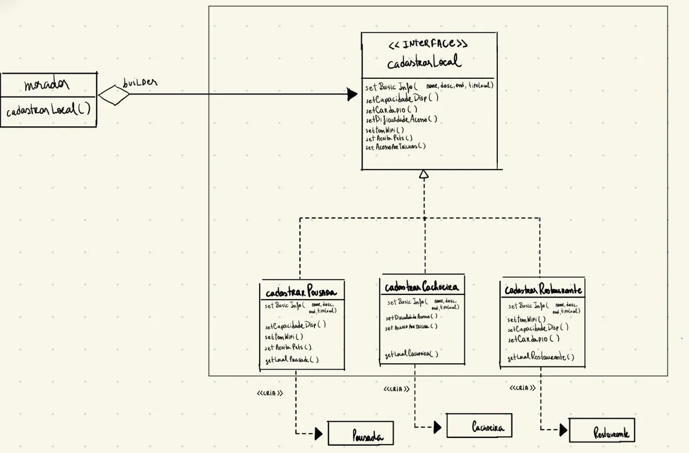
<center>Figura 11 — Estrutura final do Builder aplicado ao contexto escolhido pela dupla</center>

## Implementação em Typescript - V0

```typescript
new LocalBuilder()
  .setNome("Cachoeira X")
  .setDescricao("Linda cachoeira")
  .setEndereco("Rua Y")
  .setTipo("Ponto Turístico")
  .build();
```

Esse trecho de código representa a construção gradual e configurável de um objeto complexo utilizando o padrão de projeto `Builder`.

Nele, o objeto `Local` é montado passo a passo por meio de métodos específicos (`setNome`, `setDescricao`, `setEndereco`, etc.), permitindo criar diferentes representações da entidade de forma organizada, legível e flexível, finalizando a construção com o método `build()`.

A seguir, apresenta-se a estrutura do padrão `Builder` aplicada à entidade `Local`, evidenciando seus principais participantes: o produto, a interface de construção, o builder concreto e o diretor.

```typescript
class Local {
  id?: number;
  nome?: string;
  descricao?: string;
  endereco?: string;
  tipo?: string;
}

// interface
interface LocalBuilder {
  setNome(nome: string): LocalBuilder;
  setDescricao(descricao: string): LocalBuilder;
  setEndereco(endereco: string): LocalBuilder;
  setTipo(tipo: string): LocalBuilder;
  build(): Local;
}

// builder concreto
class ConcreteLocalBuilder implements LocalBuilder {
  private local: Local;

  constructor() {
    this.local = new Local();
  }

  setNome(nome: string): LocalBuilder {
    this.local.nome = nome;
    return this;
  }

  setDescricao(descricao: string): LocalBuilder {
    this.local.descricao = descricao;
    return this;
  }

  setEndereco(endereco: string): LocalBuilder {
    this.local.endereco = endereco;
    return this;
  }

  setTipo(tipo: string): LocalBuilder {
    this.local.tipo = tipo;
    return this;
  }

  build(): Local {
    return this.local;
  }
}

// Director 
class LocalDirector {
  construirPontoTuristico(): Local {
    return new ConcreteLocalBuilder()
      .setNome("Ponto Turístico")
      .setTipo("Turismo")
      .build();
  }

  construirEstabelecimento(): Local {
    return new ConcreteLocalBuilder()
      .setNome("Restaurante")
      .setTipo("Estabelecimento")
      .build();
  }
}
```
Nesse código, a classe `Local` representa o produto final a ser construído. A interface `LocalBuilder` define o contrato de criação do objeto, estabelecendo quais etapas podem ser utilizadas na montagem de um local. A classe `ConcreteLocalBuilder` implementa essas etapas, preenchendo os atributos do objeto gradualmente e retornando a própria instância do builder para permitir o encadeamento das chamadas.

Já a classe `LocalDirector` centraliza formas específicas de construção, criando representações pré-definidas de `Local`, como ponto turístico e estabelecimento. Assim, o código evidencia como o padrão `Builder` separa o processo de construção do objeto de sua representação final.

Com essa estrutura, a criação de um objeto `Local` pode ser realizada de forma encadeada com o construtor citado anteriormente. Por fim, essa foi a primeira maneira de pensar no contexto de build, sendo a primeira versão do protótipo.

## Implementação aprimorada com Python(stack do projeto) - V1

```python
import sys
from abc import ABC, abstractmethod
from typing import List

# =====================================================================
# PRODUTOS 
# =====================================================================
class Local:
    def __init__(self):
        self.nome: str = None
        self.desc: str = None
        self.end: str = None
        self.tipoLocal: str = None


class Cachoeira(Local):
    def __init__(self):
        super().__init__()
        self.dificuldadeAcesso: str = None
        self.acessoPorTrilha: bool = False


class Pousada(Local):
    def __init__(self):
        super().__init__()
        self.capacidadeDisp: int = 0
        self.temWifi: bool = False
        self.aceitaPets: bool = False


class Restaurante(Local):
    def __init__(self):
        super().__init__()
        self.capacidadeDisp: int = 0
        self.temWifi: bool = False
        self.cardapio: List[str] = []

# BUILDER ABSTRATO 
# =====================================================================

class Builder(ABC):
    """Especifica interface para criar partes do produto; subclasses definem self.product."""

    @abstractmethod
    def _build_part_a(self) -> None:
        pass

    @abstractmethod
    def _build_part_b(self) -> None:
        pass

    @abstractmethod
    def _build_part_c(self) -> None:
        pass

# BUILDER CONCRETO 
# =====================================================================

class CachoeiraBuilder(Builder):
    def __init__(
        self,
        nome: str,
        desc: str,
        end: str,
        tipo_local: str,
        dificuldade_acesso: str,
        acesso_por_trilha: bool,
    ):
        self._nome = nome
        self._desc = desc
        self._end = end
        self._tipo_local = tipo_local
        self._dificuldade_acesso = dificuldade_acesso
        self._acesso_por_trilha = acesso_por_trilha
        self.product = Cachoeira()
        # Visualização: o produto já existe, mas ainda sem os dados aplicados — o Director chamará os 3 passos.
        print("    [CachoeiraBuilder] __init__: instanciou self.product (Cachoeira vazia) e guardou parâmetros no builder.")

    def _build_part_a(self) -> None:
        # Parte A (comum ao domínio): dados básicos do Local (sem id persistido aqui — cabe à camada de BD).
        print("    [CachoeiraBuilder] _build_part_a -> preenche nome, desc, end, tipoLocal no produto.")
        self.product.nome = self._nome
        self.product.desc = self._desc
        self.product.end = self._end
        self.product.tipoLocal = self._tipo_local

    def _build_part_b(self) -> None:
        # Parte B específica de Cachoeira: dificuldade de acesso.
        print("    [CachoeiraBuilder] _build_part_b -> preenche dificuldadeAcesso.")
        self.product.dificuldadeAcesso = self._dificuldade_acesso

    def _build_part_c(self) -> None:
        # Parte C específica de Cachoeira: acesso por trilha.
        print("    [CachoeiraBuilder] _build_part_c -> preenche acessoPorTrilha.")
        self.product.acessoPorTrilha = self._acesso_por_trilha

    def getLocalCachoeira(self) -> Cachoeira:
        return self.product


class PousadaBuilder(Builder):
    def __init__(
        self,
        nome: str,
        desc: str,
        end: str,
        tipo_local: str,
        capacidade_disp: int,
        tem_wifi: bool,
        aceita_pets: bool,
    ):
        self._nome = nome
        self._desc = desc
        self._end = end
        self._tipo_local = tipo_local
        self._capacidade_disp = capacidade_disp
        self._tem_wifi = tem_wifi
        self._aceita_pets = aceita_pets
        self.product = Pousada()
        print("    [PousadaBuilder] __init__: instanciou self.product (Pousada vazia) e guardou parâmetros no builder.")

    def _build_part_a(self) -> None:
        # Parte A: mesmos campos base que qualquer Local.
        print("    [PousadaBuilder] _build_part_a -> preenche nome, desc, end, tipoLocal no produto.")
        self.product.nome = self._nome
        self.product.desc = self._desc
        self.product.end = self._end
        self.product.tipoLocal = self._tipo_local

    def _build_part_b(self) -> None:
        # Parte B específica: capacidade disponível.
        print("    [PousadaBuilder] _build_part_b -> preenche capacidadeDisp.")
        self.product.capacidadeDisp = self._capacidade_disp

    def _build_part_c(self) -> None:
        # Parte C específica: comodidades da pousada.
        print("    [PousadaBuilder] _build_part_c -> preenche temWifi e aceitaPets.")
        self.product.temWifi = self._tem_wifi
        self.product.aceitaPets = self._aceita_pets

    def getLocalPousada(self) -> Pousada:
        return self.product


class RestauranteBuilder(Builder):
    def __init__(
        self,
        nome: str,
        desc: str,
        end: str,
        tipo_local: str,
        capacidade_disp: int,
        tem_wifi: bool,
        cardapio: List[str],
    ):
        self._nome = nome
        self._desc = desc
        self._end = end
        self._tipo_local = tipo_local
        self._capacidade_disp = capacidade_disp
        self._tem_wifi = tem_wifi
        self._cardapio = list(cardapio)
        self.product = Restaurante()
        print("    [RestauranteBuilder] __init__: instanciou self.product (Restaurante vazio) e guardou parâmetros no builder.")

    def _build_part_a(self) -> None:
        print("    [RestauranteBuilder] _build_part_a -> preenche nome, desc, end, tipoLocal no produto.")
        self.product.nome = self._nome
        self.product.desc = self._desc
        self.product.end = self._end
        self.product.tipoLocal = self._tipo_local

    def _build_part_b(self) -> None:
        # Capacidade e Wi‑Fi no mesmo passo (conforme o roteiro em 3 partes deste exemplo).
        print("    [RestauranteBuilder] _build_part_b -> preenche capacidadeDisp e temWifi.")
        self.product.capacidadeDisp = self._capacidade_disp
        self.product.temWifi = self._tem_wifi

    def _build_part_c(self) -> None:
        print("    [RestauranteBuilder] _build_part_c -> preenche cardapio (cópia da lista).")
        self.product.cardapio = list(self._cardapio)

    def getLocalRestaurante(self) -> Restaurante:
        return self.product

# DIRECTOR 
# =====================================================================

class Director:
    """Constrói o objeto usando a interface do Builder."""

    def __init__(self):
        self._builder = None

    def construct(self, builder: Builder) -> None:
        # O Director não recebe dados de negócio: só delega ao builder na ordem A -> B -> C (padrão Builder / SourceMaking).
        print("  [Director] construct(builder): guarda referência e executa a sequência fixa _build_part_a -> b -> c.")
        self._builder = builder
        print("  [Director] -> _build_part_a()")
        builder._build_part_a()
        print("  [Director] -> _build_part_b()")
        builder._build_part_b()
        print("  [Director] -> _build_part_c()")
        builder._build_part_c()
        print("  [Director] sequência concluída; o cliente pode obter o produto via getLocal*().\n")


# 5. CLIENTE (para testes/exemplificação)
# =====================================================================

def main() -> None:
    # Ajuda o terminal Windows a mostrar acentos nos prints (opcional; em Linux/macOS costuma ja ser UTF-8).
    if hasattr(sys.stdout, "reconfigure"):
        try:
            sys.stdout.reconfigure(encoding="utf-8")
        except (OSError, ValueError):
            pass

    director = Director()

    print("=" * 72)
    print("[Cliente] Montagem 1/3 — tipo: cachoeira")
    print("(Cliente cria o ConcreteBuilder com TODOS os dados; o Director só orquestra os passos.)\n")

    b_cachoeira = CachoeiraBuilder(
        nome="Cachoeira do Salto",
        desc="Queda d'água com poço para banho.",
        end="Estrada municipal km 12",
        tipo_local="cachoeira",
        dificuldade_acesso="moderada",
        acesso_por_trilha=True,
    )
    director.construct(b_cachoeira)
    # Após construct, o produto está completo; getLocal* devolve o tipo específico (facilita leitura do código cliente).
    print("[Cliente] getLocalCachoeira() -> produto pronto para uso.\n")
    cachoeira = b_cachoeira.getLocalCachoeira()

    print("=" * 72)
    print("[Cliente] Montagem 2/3 — tipo: pousada\n")

    b_pousada = PousadaBuilder(
        nome="Pousada Encanto da Serra",
        desc="Hospedagem com café da manhã regional.",
        end="Rua das Palmeiras, 45",
        tipo_local="pousada",
        capacidade_disp=18,
        tem_wifi=True,
        aceita_pets=False,
    )
    director.construct(b_pousada)
    print("[Cliente] getLocalPousada() -> produto pronto.\n")
    pousada = b_pousada.getLocalPousada()

    print("=" * 72)
    print("[Cliente] Montagem 3/3 — tipo: restaurante\n")

    b_restaurante = RestauranteBuilder(
        nome="Restaurante Panela de Barro",
        desc="Comida regional e sucos naturais.",
        end="Praça Central, 10",
        tipo_local="restaurante",
        capacidade_disp=40,
        tem_wifi=True,
        cardapio=["Peixe na telha", "Angu", "Tutu à mineira"],
    )
    director.construct(b_restaurante)
    print("[Cliente] getLocalRestaurante() -> produto pronto.\n")

    restaurante = b_restaurante.getLocalRestaurante()

    print("=" * 72)
    print("[Cliente] Resumo final — objetos construídos (confirmação no terminal):")
    print(f"  • Cachoeira: {cachoeira.nome!r} | {cachoeira.dificuldadeAcesso!r} | trilha={cachoeira.acessoPorTrilha}")
    print(f"  • Pousada: {pousada.nome!r} | cap={pousada.capacidadeDisp} | wifi={pousada.temWifi} | pets={pousada.aceitaPets}")
    print(f"  • Restaurante: {restaurante.nome!r} | cardápio={restaurante.cardapio}")


if __name__ == "__main__":
    main()
```

## Implementação da refatoração após feedbacks - V2

```python
import sys
from abc import ABC, abstractmethod
from typing import List

# =====================================================================
# 1. OS PRODUTOS
# =====================================================================
class Local:
    def __init__(self):
        self.nome: str = None
        self.desc: str = None
        self.end: str = None
        self.tipoLocal: str = None

class Cachoeira(Local):
    def __init__(self):
        super().__init__()
        self.dificuldadeAcesso: str = None
        self.acessoPorTrilha: bool = False

class Pousada(Local):
    def __init__(self):
        super().__init__()
        self.capacidadeDisp: int = 0
        self.temWifi: bool = False
        self.aceitaPets: bool = False

class Restaurante(Local):
    def __init__(self):
        super().__init__()
        self.capacidadeDisp: int = 0
        self.temWifi: bool = False
        self.cardapio: List[str] = []

# =====================================================================
# 2. BUILDER ABSTRATO 
# =====================================================================
class LocalBuilder(ABC):
    
    @abstractmethod
    def reset(self) -> None:
        pass

    # Padronização do método build solicitada pelo Edu
    @abstractmethod
    def build(self) -> Local:
        pass

    # Passo obrigatório fluído
    @abstractmethod
    def informacoes_basicas(self, nome: str, desc: str, end: str, tipo_local: str) -> 'LocalBuilder':
        pass

# =====================================================================
# 3. BUILDERS CONCRETOS
# =====================================================================
class PousadaBuilder(LocalBuilder):
    def __init__(self):
        self.reset()

    def reset(self) -> None:
        self.product = Pousada()

    def informacoes_basicas(self, nome: str, desc: str, end: str, tipo_local: str) -> 'PousadaBuilder':
        self.product.nome = nome
        self.product.desc = desc
        self.product.end = end
        self.product.tipoLocal = tipo_local
        return self # Retorna self para permitir o encadeamento

    def com_capacidade(self, capacidade: int) -> 'PousadaBuilder':
        self.product.capacidadeDisp = capacidade
        return self

    def com_comodidades(self, wifi: bool, pets: bool) -> 'PousadaBuilder':
        self.product.temWifi = wifi
        self.product.aceitaPets = pets
        return self

    # Implementação do build padronizado
    def build(self) -> Pousada:
        resultado = self.product
        self.reset()
        return resultado


class RestauranteBuilder(LocalBuilder):
    def __init__(self):
        self.reset()

    def reset(self) -> None:
        self.product = Restaurante()

    def informacoes_basicas(self, nome: str, desc: str, end: str, tipo_local: str) -> 'RestauranteBuilder':
        self.product.nome = nome
        self.product.desc = desc
        self.product.end = end
        self.product.tipoLocal = tipo_local
        return self

    def com_capacidade_e_wifi(self, capacidade: int, wifi: bool) -> 'RestauranteBuilder':
        self.product.capacidadeDisp = capacidade
        self.product.temWifi = wifi
        return self

    def com_cardapio(self, cardapio: List[str]) -> 'RestauranteBuilder':
        self.product.cardapio = cardapio
        return self

    def build(self) -> Restaurante:
        resultado = self.product
        self.reset()
        return resultado

class CachoeiraBuilder(LocalBuilder):
    def __init__(self):
        self.reset()

    def reset(self) -> None:
        self.product = Cachoeira()

    def informacoes_basicas(self, nome: str, desc: str, end: str, tipo_local: str) -> 'CachoeiraBuilder':
        self.product.nome = nome
        self.product.desc = desc
        self.product.end = end
        self.product.tipoLocal = tipo_local
        return self

    def com_trilha(self, dificuldade: str, acesso_trilha: bool) -> 'CachoeiraBuilder':
        self.product.dificuldadeAcesso = dificuldade
        self.product.acessoPorTrilha = acesso_trilha
        return self

    def build(self) -> Cachoeira:
        resultado = self.product
        self.reset()
        return resultado

# =====================================================================
# 4. DIRECTOR
# =====================================================================
class Director:
    def __init__(self):
        self._builder = None

    def set_builder(self, builder: LocalBuilder) -> None:
        self._builder = builder
    
    def construir_restaurante_completo(self, nome, desc, end, cap, wifi, cardapio) -> Restaurante:
        return (self._builder
                .informacoes_basicas(nome, desc, end, "restaurante")
                .com_capacidade_e_wifi(cap, wifi)
                .com_cardapio(cardapio)
                .build())

    def construir_pousada_completo(self, nome, desc, end, cap, wifi, pets) -> Pousada:
        return (self._builder
                .informacoes_basicas(nome, desc, end, "pousada")
                .com_capacidade(cap)
                .com_comodidades(wifi, pets)
                .build())
    
    def construir_cachoeira_completo(self, nome, desc, end, dificuldade, acesso_trilha) -> Cachoeira:
        return (self._builder
                .informacoes_basicas(nome, desc, end, "cachoeira")
                .com_trilha(dificuldade, acesso_trilha)
                .build())

# =====================================================================
# CLIENTE (Para testes)
# =====================================================================
def main():
    # Exemplo 1: Usando apenas o Builder utilizando builder diretamente, sem diretor
    print("--- Criação Direta utilizando builder diretamente, sem diretor ---")
    builder_pousada = PousadaBuilder()
    minha_pousada = (builder_pousada
                     .informacoes_basicas("Pousada Encanto", "Vista linda", "Rua 1", "pousada")
                     .com_capacidade(20)
                     .com_comodidades(wifi=True, pets=False)
                     .build())
    
    print(f"Pousada: {minha_pousada.nome} | Cap: {minha_pousada.capacidadeDisp}\n")

    # Exemplo 2: Usando o Diretor para orquestrar (Padrão GoF)
    print("--- Criação via Diretor ---")
    director = Director()
    builder_rest = RestauranteBuilder()
    
    director.set_builder(builder_rest)
    meu_restaurante = director.construir_restaurante_completo(
        "Restaurante Panela de Barro", 
        "Comida regional", 
        "Praça Central", 
        40, 
        True, 
        ["Peixe na telha", "Angu"]
    )
    
    print(f"Restaurante: {meu_restaurante.nome} | Cardápio: {meu_restaurante.cardapio} \n")


    # Exemplo 3: Usando o Diretor para orquestrar a criação de uma pousada
    print("--- Criação via Diretor para pousada ---")
    director.set_builder(PousadaBuilder())
    minha_pousada = director.construir_pousada_completo(
        "Pousada Encanto", 
        "Vista linda", 
        "Rua 1", 
        20, 
        True, False)

    print(f"Pousada: {minha_pousada.nome} | Cap: {minha_pousada.capacidadeDisp}\n")

    # Exemplo 4: Usando o Diretor para orquestrar a criação de uma cachoeira
    print("--- Criação via Diretor para cachoeira ---")
    director.set_builder(CachoeiraBuilder())
    minha_cachoeira = director.construir_cachoeira_completo(
        "Cachoeira Encantada", 
        "Vista linda", 
        "Rua 1", 
        "Média", True)
        
    print(f"Cachoeira: {minha_cachoeira.nome} | Dificuldade: {minha_cachoeira.dificuldadeAcesso}\n")

if __name__ == "__main__":
    main()
```

## Estrutura Final do Builder 

<center>Figura 11 — Estrutura final do Builder aplicado ao contexto escolhido pela dupla</center>


<center>Fonte: Autoria Própria</center>


## Visão dos contribuidores na concepção do artefato

**Milena(executora)**: Aprendi muito com as análises do padrão de projeto ainda mais buscando informações com a bibliografia de Design Patterns: Elements of Reusable Object-Oriented Software. Eu não tinha conhecimento a respeito de como a estruturação de código faz toda a diferença pro projeto, visando isso, gostei da abordagem porque traz clareza a solução.

**Amanda(executora)**: Realizar a execução do builder no domínio do EuAmoPiri me fez ter uma visão mais técnica sobre as regras de negócio conectada a implementação da mesma em código. Pensar na simplificação que o builder traz quando trabalhamos com construcões de objetos complexos, me fez ver a grande utilidade desse padrão, diminuindo depêndencias tentando deixar o sistema cada vez mais flúido, principalmente quando pensamos na manuntenção dele, e isso porquê o nosso projeto aina, na minha concepção, não tem uma alta complexidade, e no contexto que decidimos implementar o builder, já a diferênça que faz esse tipo de conhecimento e o quanto ele pode impactar positivamente no desenvolvimento do projeto. 

**Eduardo(revisor)**: O trabalho apresentado demonstra uma boa compreensão conceitual do padrão Builder. A escolha do domínio, cadastro de locais turísticos com tipos distintos como Cachoeira, Pousada e Restaurante é adequada para justificar o uso do padrão, já que os objetos possuem variações e atributos específicos por tipo.

**Samuel(revisor)**: Achei interessante a construção com o Builder, precisa de um amadurecimento arquitetural, mas gostei. Depois de conseguir entender melhor como é a dinâmica do estrutura e o funcionamento, percebi que o intuito é facilitar algumas criações de objetos por etapas. Apesar da proposta, não sei se é por falta de experiência, mas não acho que esse seria minha escolha de arquitetura para trabalhar, tive dificuldade de entendimento. Acredito que tem sua utilidade e função. Estudos mais aprofundados serão necessários.

# Vídeo Apresentação

<iframe width="560" height="315" 
src="https://youtu.be/Zp5aM1bTuNk" 
title="YouTube video player" 
frameborder="0" 
allow="accelerometer; autoplay; clipboard-write; encrypted-media; gyroscope; picture-in-picture; web-share" 
allowfullscreen>
</iframe>

## Referências

GAMMA, Erich; HELM, Richard; JOHNSON, Ralph; VLISSIDES, John. Design Patterns: Elements of Reusable Object-Oriented Software. Boston: Addison-Wesley, 1995.

## Histórico do artefato

| Data       | Versão | Descrição                                                                                              | Autor                                        | Revisores                                                                                    |
| ---------- | ------ | ------------------------------------------------------------------------------------------------------ | -------------------------------------------- | -------------------------------------------------------------------------------------------- |
| 02/05/2026 | `1.0`  | Desenvolvimento da solução protótipo                                                                   | [Milena](https://github.com/milenamso)       | [Amanda](https://github.com/amandademoura)                                                   |
| 03/05/2026 | `1.1`  | Robustez na solução, construção de diagrama, implementação de código. Versão melhorada do código em Python | [Amanda](https://github.com/AmandaaMoura)    | [Milena](https://github.com/milenamso)                                                       |
| 09/05/2026 | `1.2`  | Refatoração da V1 do código com base nos feedbacks dos revisores                                       | [Amanda](https://github.com/AmandaaMoura)    | [Eduardo](https://github.com/EduardoRibeiroXavier) e [Samuel](https://github.com/Samuelvlobo) |

## Histórico do documento

| Data       | Versão | Descrição                                                                                                                    | Autor                                       | Revisores                                  |
| ---------- | ------ | ---------------------------------------------------------------------------------------------------------------------------- | ------------------------------------------- | ------------------------------------------ |
| 06/05/2026 | `1.0`  | Construção da primeira versão da documentação                                                                                | [Milena](https://github.com/milenamso)      | [Amanda](https://github.com/amandademoura)  |
| 16/05/2026 | `2.0`  | Adição dos feedbacks dos revisores, V2 do código após refatoração e melhorias nos textos de introdução e objetivos               | [Amanda](https://github.com/amandademoura)  | [Milena](https://github.com/milenamso)     |
