# 3.1.4 GoF Criacional - Multiton

---

## Introdução

O **Multiton** é um padrão **criacional** que generaliza o *Singleton*:
em vez de apenas uma instância global, ele mantém **múltiplas instâncias únicas**, **uma por chave**.

Cada chave representa um contexto específico (ex.: local, usuário, categoria), garantindo que **todas as requisições com a mesma chave retornem o mesmo objeto**.

Esse conceito deriva das variações do padrão *Singleton* apresentadas por Gamma et al. (1995), no contexto de controle da criação de objetos.

**Comparação com Padrões Relacionados:**

| Padrão          | Diferença principal                                       |
| :-------------: | :-------------------------------------------------------: |
| **Singleton**   | Apenas uma instância global.                              |
| **Multiton**    | Uma instância por chave (ex.: Local).                     |
| **Object Pool** | Várias instâncias reutilizáveis, sem unicidade por chave. |
| **Flyweight**   | Compartilha objetos leves, sem controle direto por chave. |

---

## Objetivo

No sistema proposto (plataforma de turismo com relatos e avaliação de locais), existem cenários em que é necessário:

- gerenciar **informações centralizadas por Local**;
- evitar recriação de dados como pontos turísticos e estabelecimentos;
- manter **consistência nos relatos e avaliações**;
- reduzir acessos repetitivos ao banco de dados.

De acordo com Gamma et al. (1995), padrões criacionais como *Singleton* e *Multiton* permitem encapsular a lógica de criação de objetos, promovendo reutilização e reduzindo acoplamento.

Nesse contexto, o **Multiton** foi escolhido para controlar instâncias de objetos associados a cada **Local**, garantindo eficiência e consistência no sistema.

---

## Metodologia

Com base no cenário de estudo e no **Diagrama de Classes da entrega**, o padrão Multiton foi aplicado para controlar a criação de objetos associados aos **Locais turísticos** do sistema.

O artefato foi feito pelos membros: [Anna Clara Brandão][Anna] e [Samuel Rodrigues][Samuel], e revisado por: [Davi Marques][Davi] e [João Victor Mello][Joao]. O resto dos membros da equipe também ficou responsável por acompanhar o andamento do desenvolvimento do **Multiton**, e intervir caso fossem requisitados.

A comunicação da dupla se deu inteiramente através do servidor da equipe no Discord, em um canal criado especialmente para discussão do artefato e compartilhamento de links e avisos importantes.

Os estudos para a criação do artefato foram feitos de forma individual, tanto por parte dos executores, quanto por parte dos revisores, através das referências que constam ao fim desta página.

No início sofremos uma certa dificuldade para achar referências confiáveis que falassem sobre o **Multiton**:

<center>Figura 1 — Relato de dificuldade.</center>

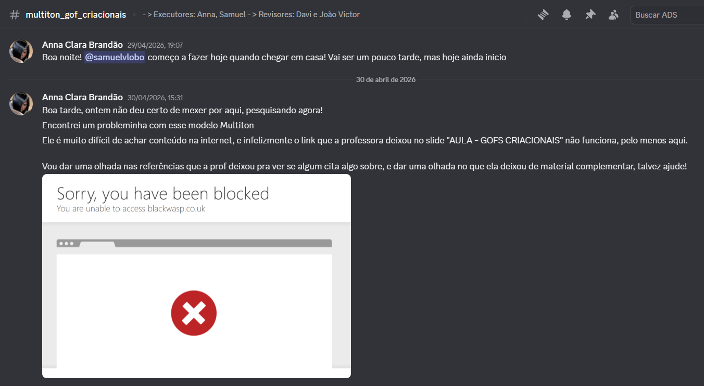

<center>Fonte: Print do Discord (2026).</center>

Após bastante pesquisa conseguimos achar livros que aparentavam ser de autores confiáveis, e então começamos a nos basear neles:

<center>Figura 2 — Referências encontradas.</center>

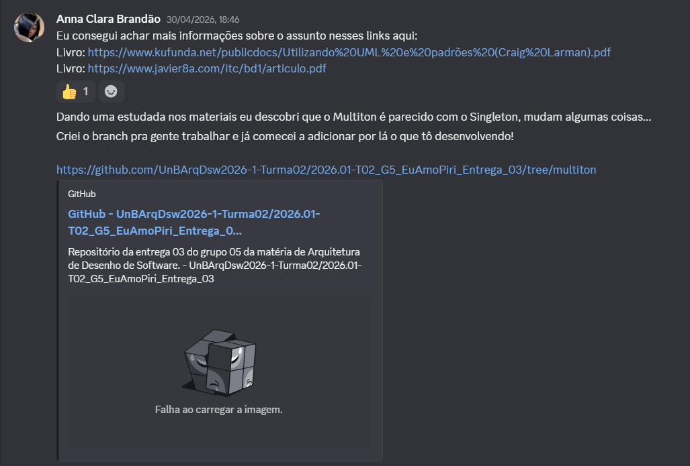

<center>Fonte: Print do Discord (2026).</center>

Assim pudemos prosseguir para a primeira evolução do artefato.

---

## Evolução do artefato 1 - Anna

A primeira versão do artefato se deu através da tecnologia TypeScript, e o que foi idealizado para a construção desta primeira versão pode ser lido na figura abaixo, por meio de uma explicação feita no canal da equipe no Discord:

<center>Figura 3 — Explicação da V1 (Anna).</center>

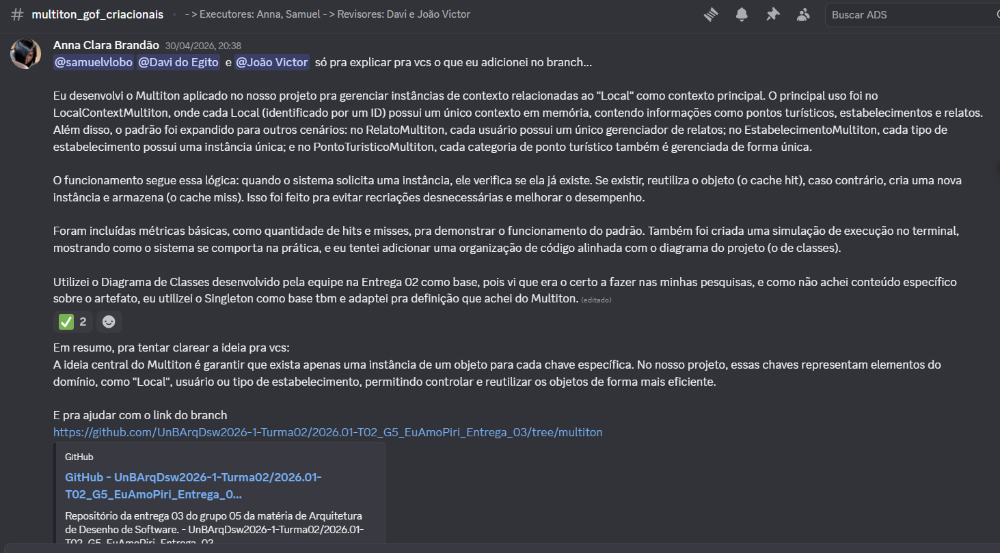

<center>Fonte: Print do Discord (2026).</center>

Em seguida, foi enviado o link de acesso ao código para os membros da equipe:

<center>Figura 4 — Envio do código TypeScript (Anna).</center>

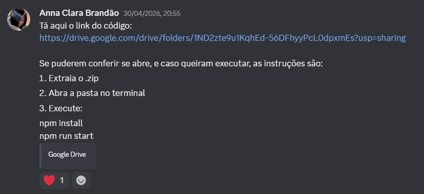

<center>Fonte: Print do Discord (2026).</center>

---

### Sistema de Turismo - Eu Amo Piri

Neste projeto, o Multiton foi utilizado para gerenciar instâncias de contexto relacionadas aos **Locais**, evitando duplicidade e garantindo reuso eficiente.

O sistema possui entidades como:

- Pessoa (Turista e Morador);
- Local;
- Ponto Turístico;
- Estabelecimento;
- Endereço;
- Relato.

O **Local** atua como entidade central, sendo associado a diversos elementos. Por isso, ele foi escolhido como chave principal do Multiton.

---

## Aplicação do Multiton

### LocalContextMultiton

O **LocalContextMultiton** utiliza o `localId` como chave e mantém em memória o contexto de cada Local.

Esse contexto inclui:

- informações do Local;
- lista de pontos turísticos;
- estabelecimentos;
- relatos e avaliações.

Dessa forma, quando o sistema acessa o mesmo `Local` novamente, ele reutiliza o objeto já existente, evitando recriação.

---

### Funcionamento

O funcionamento segue a lógica:

- **Cache miss:** cria uma nova instância.
- **Cache hit:** reutiliza a instância existente.

Exemplo:

```ts
LocalContextMultiton.getInstance(local)
```

---

### Outras aplicações do Multiton

Além do contexto principal de Local, o padrão também foi aplicado em outros cenários do sistema, demonstrando sua flexibilidade:

---

#### RelatoMultiton - por usuário

- **Chave:** `nomeUsuario`.
- Garante que cada usuário possua um único gerenciador de relatos.

---

#### EstabelecimentoMultiton - por tipo

- **Chave:** tipo do estabelecimento (`"Hotel"`, `"Restaurante"`).
- Evita recriação de objetos por categoria.

---

#### PontoTuristicoMultiton - por categoria

- **Chave:** tipo (`"Museu"`, `"Parque"`)
- Centraliza configurações e dados por categoria.

---

## Estrutura Pensada

```md
turismo-app/
  src/
    domain.ts
    local-context.ts
    local-multiton.ts
    relato-multiton.ts
    estabelecimento-multiton.ts
    ponto-multiton.ts
    main.ts
  package.json
  tsconfig.json
```

---

## Implementação

### 1) package.json

```json
{
  "name": "turismo-multiton-demo",
  "version": "1.0.0",
  "type": "module",
  "scripts": {
    "start": "tsx src/main.ts"
  },
  "devDependencies": {
    "tsx": "^4.19.2",
    "typescript": "^5.6.3"
  }
}
```

---

### 2) tsconfig.json

```json
{
  "compilerOptions": {
    "target": "ES2022",
    "module": "ES2022",
    "strict": true,
    "outDir": "dist"
  },
  "include": ["src"]
}
```

---

### 3) src/domain.ts

```ts
export type ID = number;

export interface Pessoa {
  nome: string;
  email: string;
  nomeUsuario: string;
  senha: string;
}

export interface Local {
  id: ID;
  nome: string;
  descricao: string;
}

export interface PontoTuristico {
  tipo: string;
}

export interface Estabelecimento {
  tipo: string;
}

export interface Relato {
  nomeUsuario: string;
  relato: string;
  avaliacao: number;
}
```

---

### 4) src/local-context.ts

```ts
import { Local, PontoTuristico, Estabelecimento, Relato } from "./domain";

export class LocalContext {
  constructor(
    public local: Local,
    public pontos: PontoTuristico[],
    public estabelecimentos: Estabelecimento[],
    public relatos: Relato[]
  ) {}

  adicionarRelato(relato: Relato) {
    this.relatos.push(relato);
  }

  mediaAvaliacoes(): number {
    if (this.relatos.length === 0) return 0;
    return this.relatos.reduce((s, r) => s + r.avaliacao, 0) / this.relatos.length;
  }
}
```

---

### 5) src/local-multiton.ts

```ts
import { LocalContext } from "./local-context";
import { Local } from "./domain";

type Metrics = {
  hits: number;
  misses: number;
};

export class LocalContextMultiton {
  private static instances = new Map<number, LocalContext>();
  private static metrics: Metrics = { hits: 0, misses: 0 };

  static getInstance(local: Local): LocalContext {
    if (!this.instances.has(local.id)) {
      console.log("Cache MISS");

      const ctx = new LocalContext(local, [], [], []);
      this.instances.set(local.id, ctx);
      this.metrics.misses++;
    } else {
      console.log("Cache HIT");
      this.metrics.hits++;
    }

    return this.instances.get(local.id)!;
  }

  static getMetrics() {
    return {
      ...this.metrics,
      size: this.instances.size
    };
  }
}
```

---

### 6) Outras implementações resumidas

```ts
// RelatoMultiton (por usuário)
Map<string, RelatoUsuarioContext>

// EstabelecimentoMultiton (por tipo)
Map<string, EstabelecimentoContext>

// PontoTuristicoMultiton (por categoria)
Map<string, PontoTuristicoContext>
```

---

### 7) src/main.ts

```ts
import { LocalContextMultiton } from "./local-multiton";

const local = { id: 1, nome: "Rio de Janeiro", descricao: "Cidade turística" };

console.log("=== 1º acesso ===");
LocalContextMultiton.getInstance(local);

console.log("\n=== 2º acesso ===");
LocalContextMultiton.getInstance(local);

console.log("\n=== Métricas Multiton ===");
console.table(LocalContextMultiton.getMetrics());
```

---

## Saída esperada

Ao executar o código acima, a saída esperada é:

```
=== 1º acesso ===
Cache MISS

=== 2º acesso ===
Cache HIT

=== Métricas Multiton ===
┌───────────┬────────┐
│ (index)   │ Values │
├───────────┼────────┤
│ hits      │ 1      │
│ misses    │ 1      │
│ size      │ 1      │
└───────────┴────────┘
```

Como quando eu, [Anna][Anna], executei no meu terminal na ferramenta *VSCode* e obtive isto:

<center>Figura 5 — Resultado de Execução TypeScript.</center>

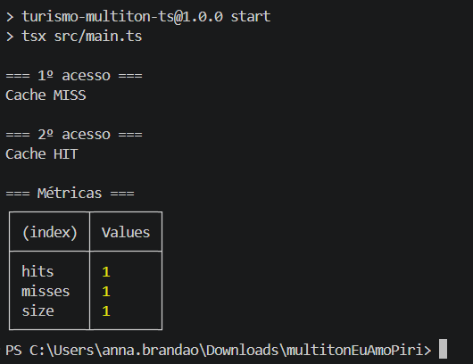

<center>Fonte: Print de execução no terminal (2026).</center>

---

## Execução

O código acima foi desenvolvido em **TypeScript**, com as seguintes tecnologias e ferramentas:

- **Node.js** testado com `v24.14.1`;
- **TypeScript** na versão: `v5.9.3`;
- **TSX** (executor de TypeScript) na versão: `v4.21.0`

O projeto utiliza o modelo de módulos **ESM (ECMAScript Modules)** e não depende de bibliotecas externas, sendo focado apenas na demonstração do padrão de projeto **Multiton**.

O arquivo executável está disponível [neste link](https://drive.google.com/file/d/1usXoYxydgFK56SiJnPkzJFluUiz5vaBW/view?usp=sharing). Para executá-lo cumpra os passos a seguir:

**1. Extraia o .zip.**

**2. Abra a pasta no terminal.**

**3. Entre na pasta para execução:**

- ``cd multitonEuAmoPiri``

**4. Execute:**

- ``npm install``
- ``npm run start``

>**Observação:**
>Se estiver usando Linux e tiver problemas com permissão de execução, execute no seu terminal:
>
>`chmod +x tsx`

---

## Vídeo de Execução

<font size="2"><p style="text-align: center">Vídeo 1 - Código Multiton TypeScript.</p></font>

<iframe
    width="560"
    height="315"
    src="https://www.youtube.com/embed/J6PbAzQdSBM?si=0KiYwttOsdxJjkEb"
    title="YouTube video player"
    frameborder="0"
    allow="accelerometer; autoplay; clipboard-write; encrypted-media; gyroscope; picture-in-picture; web-share" referrerpolicy="strict-origin-when-cross-origin"
    allowfullscreen>
</iframe>

<font size="2"><p style="text-align: center">*Fonte: Anna Clara (2026).*</p></font>

---

## Evolução e Refatoração para Python - Samuel

Após a elaboração do protótipo inicial em TypeScript pela integrante [Anna Clara][Anna], pode-se perceber um trabalho próximo ao **Multiton**. Depois de estudo feitos principalmente na fonte abaixo:

- **Material de Referência Estudado:** [UTILIZANDO UML
E PADRÕES](https://www.kufunda.net/publicdocs/Utilizando%20UML%20e%20padr%C3%B5es%20(Craig%20Larman).pdf).

Ao avaliar o código inicial, constatou-se que a estrutura lógica do TypeScript estava excelente, rodando bem. No entanto, como definimos **Python** como a tecnologia oficial do nosso back-end, decidi assumir ([Samuel][Samuel]) a refatoração do código do protótipo (TypeScript) para a linguagem definitiva da aplicação (Python). 

O print da discussão realizada, em que foram tratadas a realização de um diagrama UML e a refatoração do código de TypeScript para Python, no canal da equipe no Discord, encontra-se abaixo:

<center>Figura 6 — Considerações iniciais (Samuel).</center>

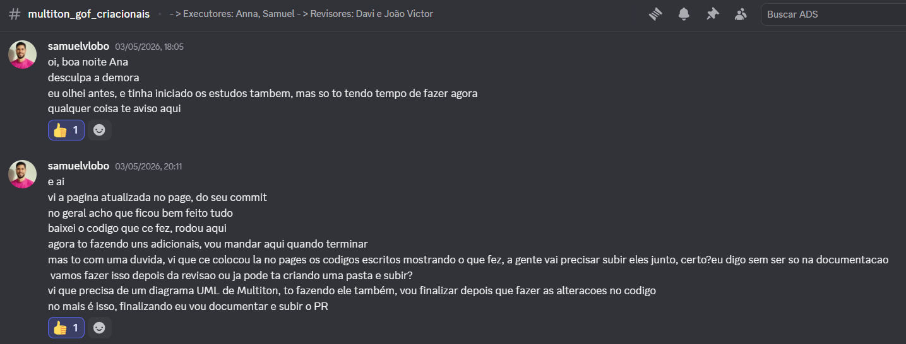

<center>Fonte: Print do Discord (2026).</center>

<center>Figura 7 — Discussão sobre mudança de linguagem.</center>

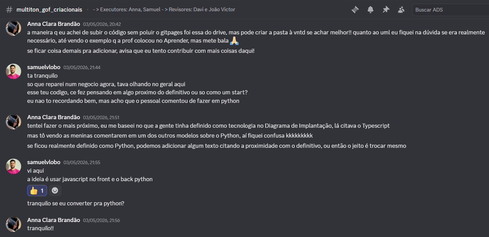

<center>Fonte: Print do Discord (2026).</center>

<center>Figura 8 — Envio do código Python (Samuel).</center>

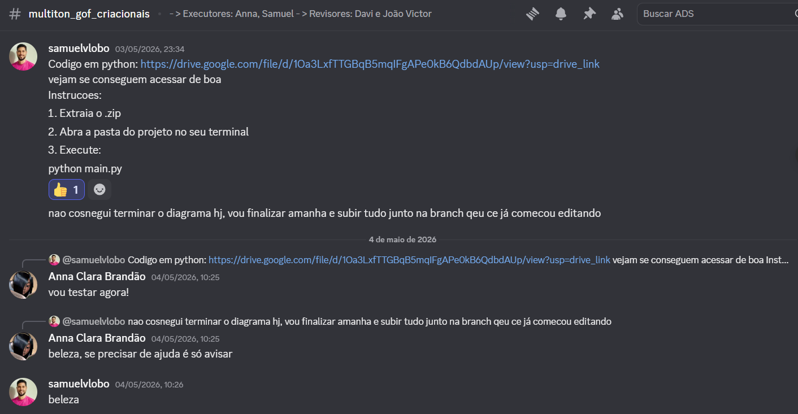

<center>Fonte: Print do Discord (2026).</center>

<center>Figura 9 — Teste no terminal (Anna).</center>

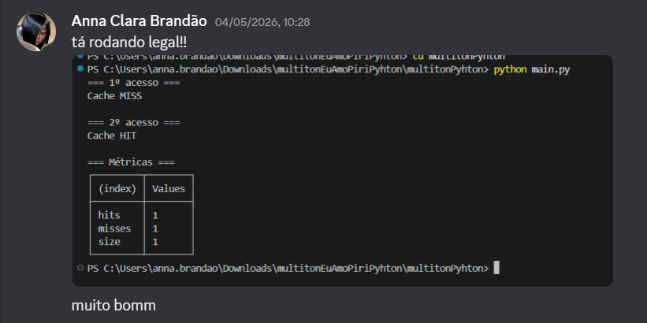

<center>Fonte: Print do Discord (2026).</center>

---

## Estrutura de Diretórios e Componentes (Python)

A refatoração seguiu uma arquitetura limpa, baseada na separação de responsabilidades e fortemente inspirada nos conceitos de *Domain-Driven Design* (DDD):

- `domain.py`: Contém as Entidades de Domínio (Modelos).
- `local_context.py`: Contém o Contexto Agregado (*Aggregate Root*).
- `multitons.py`: Gerencia o ciclo de vida, o estado e o *cache* das instâncias.
- `main.py`: Ponto de entrada da aplicação (Apresentação e Testes).

---

## Implementação em Python

Abaixo estão os códigos refatorados que compõem o ecossistema Multiton no nosso back-end:

### 1) `domain.py`

```python
from dataclasses import dataclass

@dataclass
class Local:
    id: int
    nome: str
    descricao: str

@dataclass
class Relato:
    nome_usuario: str
    relato: str
    avaliacao: int

@dataclass
class Estabelecimento:
    tipo: str

@dataclass
class PontoTuristico:
    tipo: str
```

---

### 2) `local_context.py`

```python
from typing import List
from domain import Local, Relato

class LocalContext:
    def __init__(self, local: Local):
        self.local = local
        self.relatos: List[Relato] = []

    def adicionar_relato(self, relato: Relato):
        self.relatos.append(relato)
```

---

### 3) `multitons.py`

```python
from collections import OrderedDict
from typing import List
from domain import Local, Estabelecimento, PontoTuristico, Relato
from local_context import LocalContext

class LocalContextMultiton:
    _instances: OrderedDict[int, LocalContext] = OrderedDict()
    MAX_CACHE_SIZE = 100
    hits = 0
    misses = 0

    @classmethod
    def get_instance(cls, local: Local) -> LocalContext:
        if local.id in cls._instances:
            cls.hits += 1
            print("Cache HIT")
            return cls._instances[local.id]
        
        cls.misses += 1
        print("Cache MISS")
        
        if len(cls._instances) >= cls.MAX_CACHE_SIZE:
            # Remove o item mais antigo (Política de Evicção FIFO)
            cls._instances.popitem(last=False)
            
        new_context = LocalContext(local)
        cls._instances[local.id] = new_context
        return new_context

class EstabelecimentoMultiton:
    _instances: OrderedDict[str, List[Estabelecimento]] = OrderedDict()
    MAX_CACHE_SIZE = 100

    @classmethod
    def get_instance(cls, tipo: str) -> List[Estabelecimento]:
        if tipo not in cls._instances:
            if len(cls._instances) >= cls.MAX_CACHE_SIZE:
                cls._instances.popitem(last=False)
            cls._instances[tipo] = []
        return cls._instances[tipo]

class PontoTuristicoMultiton:
    _instances: OrderedDict[str, List[PontoTuristico]] = OrderedDict()
    MAX_CACHE_SIZE = 100

    @classmethod
    def get_instance(cls, tipo: str) -> List[PontoTuristico]:
        if tipo not in cls._instances:
            if len(cls._instances) >= cls.MAX_CACHE_SIZE:
                cls._instances.popitem(last=False)
            cls._instances[tipo] = []
        return cls._instances[tipo]

class RelatoMultiton:
    _instances: OrderedDict[str, List[Relato]] = OrderedDict()
    MAX_CACHE_SIZE = 100

    @classmethod
    def get_instance(cls, nome_usuario: str) -> List[Relato]:
        if nome_usuario not in cls._instances:
            if len(cls._instances) >= cls.MAX_CACHE_SIZE:
                cls._instances.popitem(last=False)
            cls._instances[nome_usuario] = []
        return cls._instances[nome_usuario]
```

---

### 4) `main.py`

```python
from domain import Local
from multitons import LocalContextMultiton

def imprimir_tabela(metricas: dict):
    print("┌─────────┬────────┐")
    print("│ (index) │ Values │")
    print("├─────────┼────────┤")
    for key, value in metricas.items():
        col1 = f" {key}".ljust(9)
        col2 = f" {value}".ljust(8)
        print(f"│{col1}│{col2}│")
    print("└─────────┴────────┘")

def main():
    # 1. Instancie um objeto Local
    local = Local(id=1, nome="Pirenópolis", descricao="Destino turístico")

    # 2. Imprima na tela "=== 1º acesso ===" e busque o LocalContext no LocalContextMultiton
    print("=== 1º acesso ===")
    context1 = LocalContextMultiton.get_instance(local)

    # 3. Imprima "=== 2º acesso ===" e busque exatamente o mesmo Local novamente
    print("\n=== 2º acesso ===")
    context2 = LocalContextMultiton.get_instance(local)

    # 4. Imprima "=== Métricas ===" e exiba os valores finais de hits, misses e tamanho atual do cache
    print("\n=== Métricas ===")
    metricas = {
        "hits": LocalContextMultiton.hits,
        "misses": LocalContextMultiton.misses,
        "size": len(LocalContextMultiton._instances)
    }
    imprimir_tabela(metricas)

if __name__ == "__main__":
    main()
```

---

## Testes e Validação do Código

Após finalizar a refatoração, a aplicação foi executada para garantir que o comportamento original definido pelo protótipo fosse mantido. Os resultados comprovaram a integridade estrutural das políticas de *Cache Hit* e *Cache Miss*:

<center>Figura 10 — Resultado da execução no terminal.</center>

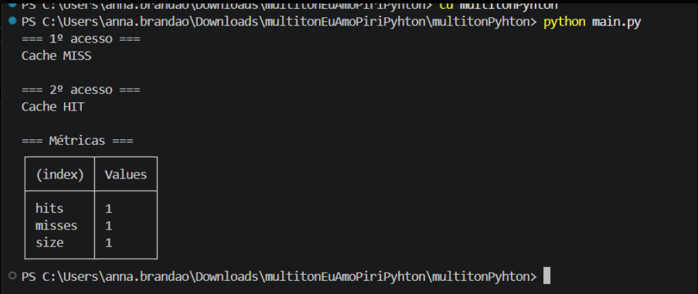

<center>Fonte: Print de execução do terminal (2026).</center>

---

## Instruções de Execução

O arquivo executável está disponível [neste link](https://drive.google.com/file/d/19liuNnGiroE5KkL0RKF0oU2o9sKH34ig/view?usp=drive_link). Para executá-lo cumpra os passos a seguir:

**1. Extraia o .zip.**

**2. Abra a pasta do projeto no seu terminal.**

**3. No terminal faça "cd" para a pasta "multitonPython":**

- `cd multitonPython`

**4. Execute:**

- `python main.py`

---

### Implementação do Padrão Multiton

Para demonstrar o funcionamento e a validação do padrão Multiton (prevenção de Memory Leak com estratégia FIFO), gravamos um vídeo da execução do código com auditoria do cache.

<font size="2"><p style="text-align: center">Vídeo 2 - Código Multiton Python.</p></font>

<iframe 
  width="560"
  height="315"
  src="https://www.youtube.com/embed/Qfs8Hc2VG5o?si=YHcNwZ28af72PgRR"
  title="YouTube video player"
  frameborder="0"
  allow="accelerometer; autoplay; clipboard-write; encrypted-media; gyroscope; picture-in-picture; web-share"
  referrerpolicy="strict-origin-when-cross-origin" allowfullscreen>
</iframe>

<font size="2"><p style="text-align: center">*Fonte: Samuel (2026).*</p></font>

---

## Diagrama UML do Multiton (Python)

Para garantir a **Rastreabilidade** exigida pelo projeto e consolidar a documentação do Desenho de Software, também foi elaborado o Diagrama de Classes UML representando a estrutura final adotada para o padrão Multiton:

Versão [Samuel][Samuel]:

<center>Figura 11 — Diagrama Multiton - Eu Amo Piri.</center>

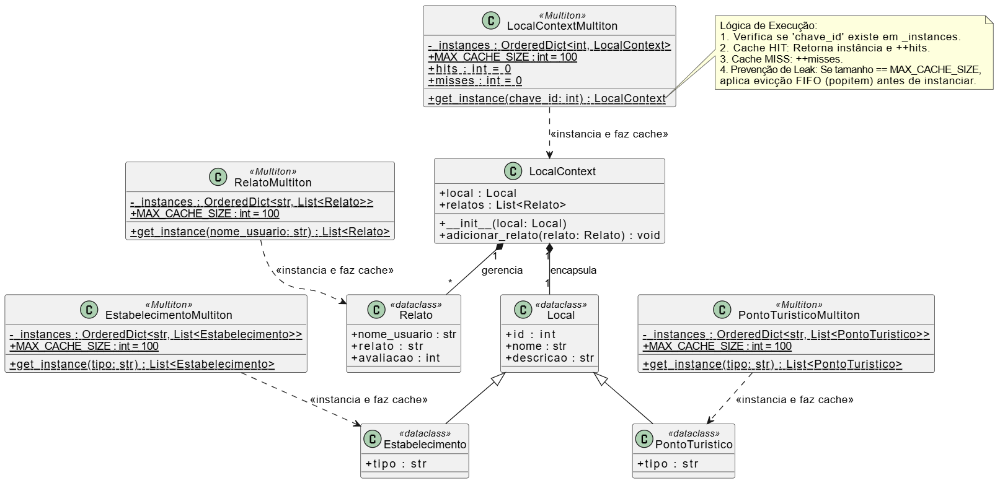

<center>Fonte: Samuel (2026).</center>

Revisão [Anna Clara][Anna]:

<center>Figura 12 — Envio do link do Diagrama (Samuel) e revisão (Anna).</center>

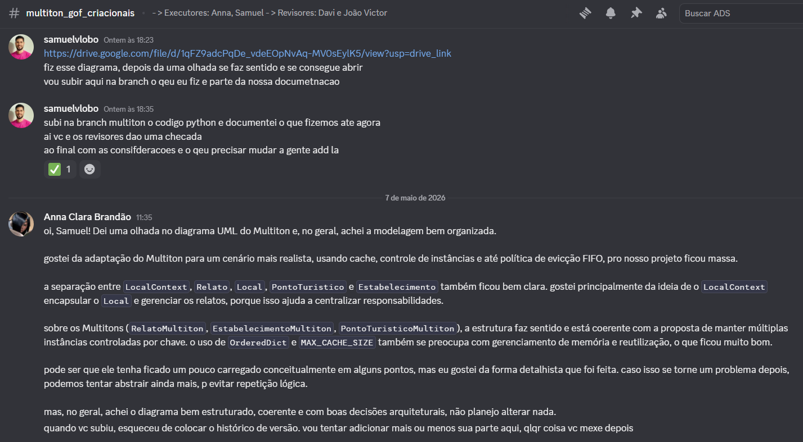

<center>Fonte: Anna (2026).</center>

---

## Visão dos contribuidores na concepção do artefato

> **Anna:**
> Tive muita dificuldade em encontrar conteúdos acerca do Multiton de maneira específica, só após muita leitura, informações meio soltas de blogs e busca por projetos antigos que utilizaram o artefato, que consegui desenvolver minha versão dele aplicado ao nosso projeto e consegui revisar/auxiliar minha dupla na versão dele. Apesar da dificuldade, executá-lo foi bastante agregador para o conhecimento que venho adquirindo ao longo da matéria.

> **Samuel:**
> Nessa demanda, percebi muita dificuldade para entender sobre o tema e o que especificamente precisava ser feito, mas depois com o tempo, fazendo aos poucos, acredito que deu pra compreeder melhor. Um tema difícil, mas que deu pra perceber a importância.

### Feedback dos Revisores

> **Davi**:

<center>Figura 13 — Feedback do artefato (Davi).</center>

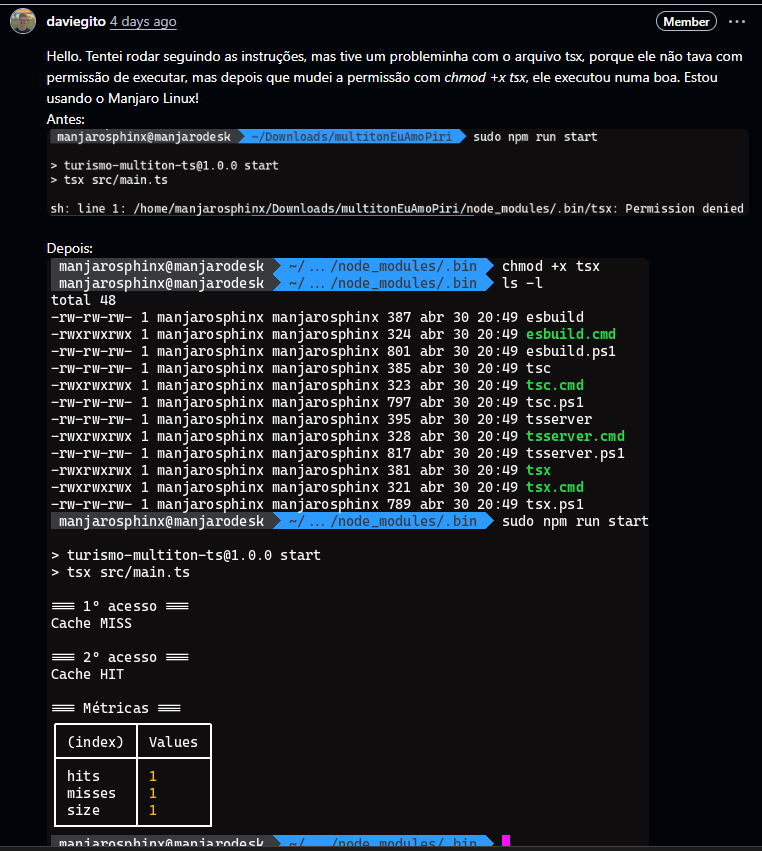

<center>Fonte: Print do GitHub (2026).</center>

<center>Figura 14 — Feedback do artefato (Davi).</center>

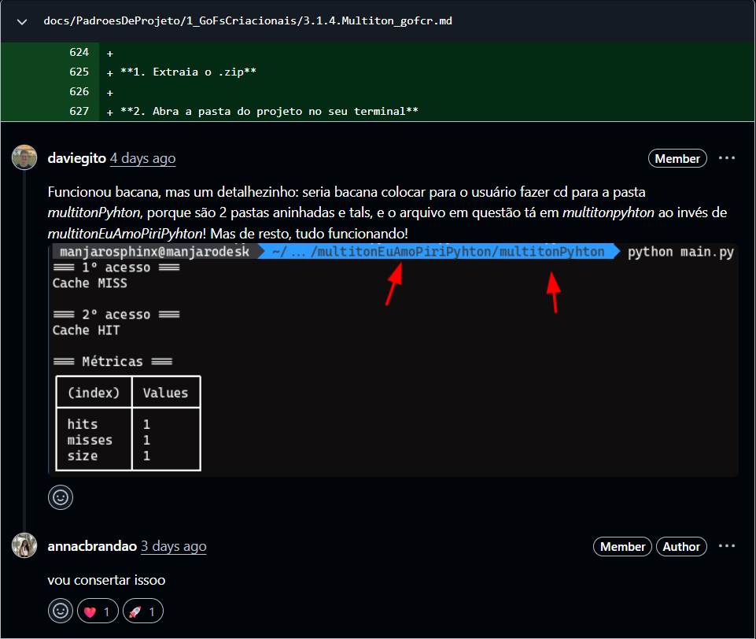

<center>Fonte: Print do GitHub (2026).</center>

> **João Victor:**

<center>Figura 15 — Feedback do artefato (João Victor).</center>


<center>Fonte: Print do Discord (2026).</center>

<center>Figura 16 — Feedback do artefato após mudanças (João Victor).</center>

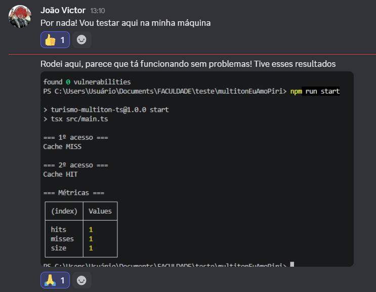

<center>Fonte: Print do Discord (2026).</center>

As sugestões foram aplicadas e resolvidas!

---

## Referências

> [1] GAMMA, Erich et al. **Design Patterns**, 1995. Acesso em: 30 abr. 2026.

> [2] LARMAN, Craig. **UML e padrões**, 2007. Acesso em: 30 abr. 2026.

> [3] PRESSMAN, Roger S. **Engenharia de Software**, 2006. Acesso em: 30 abr. 2026.

> [4] JESUS, D. **Design Patterns — O que são e quais os benefícios?** Disponível em: <https://djesusnet.medium.com/design-patterns-gof-o-que-s%C3%A3o-e-quais-os-benef%C3%ADcios-9cd0cfdd6ebf>. Acesso em: 30 abr. 2026.

> [5] ROGÉRIO ARAÚJO. **Padrões de Projetos GoF: Padrões de Criação.** Disponível em: <https://blog.grancursosonline.com.br/padroes-de-projetos-gof-padroes-de-criacao/>. Acesso em: 30 abr. 2026.

---

## Histórico do artefato

| Data | Versão | Descrição | Autor(es) | Revisor(es) |
| ---- | ------ | --------- | :-------: | :---------: |
| 30/04/2026 | `1.0` | Estudo individual acerca do artefato. | [Anna Clara][Anna] | [Samuel Lobo][Samuel], [Davi Marques][Davi], [João Victor][Joao] |
| 30/04/2026 | `1.0` | Desenvolvimento do código Typescript após estudos em editor paralelo. | [Anna Clara][Anna] | [Samuel Lobo][Samuel], [Davi Marques][Davi], [João Victor][Joao] |
| 30/04/2026 | `1.1` | Desenvolvimento do Multiton com suas explicações de forma completa. | [Anna Clara][Anna] | [Samuel Lobo][Samuel], [Davi Marques][Davi], [João Victor][Joao] |
| 06/05/2026 | `1.2` | Estudos iniciais e levantamento de embasamento acadêmico. | [Samuel Lobo][Samuel] | [Anna Clara][Anna], [Davi Marques][Davi], [João Victor][Joao] |
| 06/05/2026 | `1.3` | Refatoração do código-fonte de TypeScript para Python. | [Samuel Lobo][Samuel] | [Anna Clara][Anna], [Davi Marques][Davi], [João Victor][Joao] |
| 06/05/2026 | `1.4` | Documentação das discussões iniciais e registro de decisões de design. | [Samuel Lobo][Samuel] | [Anna Clara][Anna], [Davi Marques][Davi], [João Victor][Joao] |
| 06/05/2026 | `1.5` | Término de desenvolvimento de Diagrama UML. | [Samuel Lobo][Samuel] | [Anna Clara][Anna], [Davi Marques][Davi], [João Victor][Joao] |
| 11/05/2026 | `1.6` | Alteração de nomes de pastas .zip e unificação das pastas em uma pasta só (para mitigar confusão). | [Anna Clara][Anna] | [Samuel Lobo][Samuel], [Davi Marques][Davi], [João Victor][Joao] |

---

## Histórico do documento

| Data | Versão | Descrição | Autor(es) | Revisor(es) |
| ---- | ------ | --------- | :-------: | :---------: |
| 30/04/2026 | `1.0` | Adição de introdução e metodologia. | [Anna Clara][Anna] | [Samuel Lobo][Samuel], [Davi Marques][Davi], [João Victor][Joao] |
| 30/04/2026 | `1.1` | Adição de artefato desenvolvido na primeira versão. | [Anna Clara][Anna] | [Samuel Lobo][Samuel], [Davi Marques][Davi], [João Victor][Joao] |
| 30/04/2026 | `1.2` | Adição de visão de contribuidora. | [Anna Clara][Anna] | [Samuel Lobo][Samuel], [Davi Marques][Davi], [João Victor][Joao] |
| 30/04/2026 | `1.3` | Atualização de forma de execução do código. | [Anna Clara][Anna] | [Samuel Lobo][Samuel], [Davi Marques][Davi], [João Victor][Joao] |
| 30/04/2026 | `1.4` | Adição de revisores. | [Anna Clara][Anna] | [Samuel Lobo][Samuel], [Davi Marques][Davi], [João Victor][Joao] |
| 30/04/2026 | `1.5` | Conserto de alinhamento de tabelas e adição de foto de resultado de execução do código. | [Anna Clara][Anna] | [Samuel Lobo][Samuel], [Davi Marques][Davi], [João Victor][Joao] |
| 06/05/2026 | `1.6` | Atualização da evolução do artefato com refatoração para Python e histórico de decisões. | [Samuel Lobo][Samuel] | [Anna Clara][Anna], [Davi Marques][Davi], [João Victor][Joao] |
| 07/05/2026 | `1.7` | Mudanças em formatação de imagens, texto e histórico de versão. | [Anna Clara][Anna] | [Samuel Lobo][Samuel], [Davi Marques][Davi], [João Victor][Joao] |
| 11/05/2026 | `1.8` | Mudanças em instruções de execução de ambas as linguagens. | [Anna Clara][Anna] | [Samuel Lobo][Samuel], [Davi Marques][Davi], [João Victor][Joao] |
| 11/05/2026 | `1.9` | Adiciona prints de revisões. | [Anna Clara][Anna] | [Samuel Lobo][Samuel], [Davi Marques][Davi], [João Victor][Joao] |
| 20/05/2026 | `2.0` | Atualiza instruções de execução TypeScript e adiciona vídeo. | [Anna Clara][Anna] | [Samuel Lobo][Samuel], [Davi Marques][Davi], [João Victor][Joao] |
| 20/05/2026 | `2.1` | Adicionando vídeo de execução python. | [Samuel Lobo][Samuel] | [Anna Clara][Anna], [Davi Marques][Davi], [João Victor][Joao] |
| 20/05/2026 | `2.2` | Atualiza formato de link do vídeo em Python. | [Anna Clara][Anna] | [Samuel Lobo][Samuel], [Davi Marques][Davi], [João Victor][Joao] |
| 22/05/2026 | `2.3` | Corrige caminho das imagens. | [Anna Clara][Anna] | [Samuel Lobo][Samuel], [Davi Marques][Davi], [João Victor][Joao] |

[Anna]: https://github.com/annacbrandao
[Samuel]: https://github.com/Samuelvlobo
[Davi]: https://github.com/daviegito
[Joao]: https://github.com/Chaotzuu
