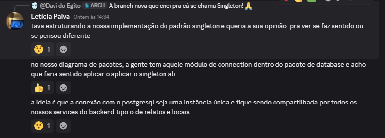
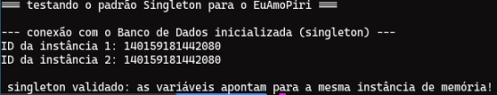
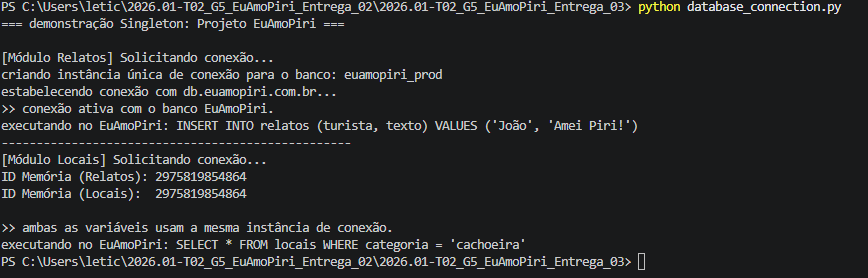

# 3.1.5 Singleton

## Introdução

O Singleton é um padrão de projeto criacional que tem como regra principal garantir que uma classe tenha apenas uma instância durante toda a execução do software, oferecendo um ponto de acesso global para ela (REFACTORING GURU, 2025). No nosso sistema, ele funciona como um guardião da conexão com o banco de dados, impedindo que cada parte do código tente abrir uma nova porta de comunicação sem necessidade.

## Objetivo

O foco aqui é restringir a criação de objetos para economizar recursos computacionais, garantindo que todos os módulos do EuAmoPiri compartilhem a mesma “ponte” de dados. Conforme apresentado pela Profa. Milene Serrano, o padrão Singleton define uma “classe que permite a criação de uma única instância e fornece um método estático para recuperá-la” (SERRANO, 2025) . De forma alinhada, o padrão Singleton também é descrito como uma solução que garante a existência de uma única instância e disponibiliza um ponto de acesso global a ela (CLIMACO, 2025).

## Metodologia

Para a entrega do Singleton, Davi e Letícia optaram por usar Python por ser mais simples e ser uma linguagem que possua classes.


Depois, olhamos para os diagrama de pacotes que já tínhamos feito para entender onde o Singleton se encaixaria melhor e mapeamos que o pacote Database seria o "gargalo" de conexões, tornando-o o candidato ideal para a aplicação do Singleton



Além disso, houve a discussão acerca de como o programa seria apresentado e optamos por fazê-lo rodar em um interpretador.


A comunicação se deu inteiramente de forma assíncrona via Discord para a confecção destes artefato e documento.

### Instruções

Traremos algumas possibilidades para rodar o nosso código abaixo. Como o Python é uma linguagem interpretada, o processo de executar o programa abre mais portas. Dentre as alternativas que temos, há:

#### Terminal

Para que o código rode no terminal, basta copiar o código fonte de versão mais recente para um programa de edição de texto e salvá-lo com o formato .py - desta forma, outros programas vão conseguir interpretá-lo corretamente como um programa de python! Como recomendações dentro do terminal, existe o [nano](https://help.ubuntu.com/community/Nano), [vim](https://vim.rtorr.com/) e [nvim (neovim)](https://neovim.io/doc/user/).  

#### Online Python

Para rodar o programa em um interpretador online, basta acessar algum interpretador primeiro - escolhemos o [Online Python](https://www.online-python.com/) pela conveniência e rapidez. Dentro dele, basta copiar e colar o código da versão mais recente e apertar _Run_ para executar o código. 

#### Programiz

Caso o Online Python não seja do agrado, existe também opções como o [Programiz](https://www.programiz.com/python-programming/online-compiler/) e [OnlineGDB](https://www.onlinegdb.com/online_python_interpreter), que funcionam de maneira similar ao Online Python.

## Evolução do artefato

### Versão 1.0

Letícia: A primeira versão foi desenvolvida como um rascunho inicial, com o objetivo de validar rapidamente o funcionamento do padrão Singleton. O foco estava em comprovar que apenas uma instância da classe seria criada e reutilizada ao longo da execução.

A implementação em Python utiliza o método especial __new__ para garantir que, independentemente de quantas vezes a classe seja chamada, apenas um endereço de memória seja reservado para a instância e a A validação é feita comparando os IDs de memória, comprovando que ambas as variáveis apontam para o mesmo objeto.

```python
class DatabaseConnection:
    _instance = None

    def __new__(cls):
        if cls._instance is None:
            cls._instance = super(DatabaseConnection, cls).__new__(cls)
            
            cls._instance.connection_string = "postgresql://localhost:5432/euamopiri_db"
            cls._instance.status = "conectado"
            print("--- conexão com o Banco de Dados inicializada (singleton) ---")
            
        return cls._instance

    @staticmethod
    def get_instance():
        if DatabaseConnection._instance is None:
            DatabaseConnection() 
        return DatabaseConnection._instance

if __name__ == "__main__":
    print("=== testando o padrão Singleton para o EuAmoPiri ===\n")

    db1 = DatabaseConnection.get_instance()
    db2 = DatabaseConnection.get_instance()

    print(f"ID da instância 1: {id(db1)}")
    print(f"ID da instância 2: {id(db2)}")

    if db1 is db2:
        print("\n singleton validado: as variáveis apontam para a mesma instância de memória!")
    else:
        print("\n singleton falhou: as instâncias são diferentes.")

``` 

#### Saída da execução — Versão 1.0



Essa versão cumpre seu objetivo como prova inicial de conceito, validando a unicidade da instância de forma simples e direta.

### Versão 1.1

Letícia: A segunda versão evolui o rascunho inicial para uma representação mais próxima do contexto real do sistema EuAmoPiri. Além de manter a garantia de instância única, o código passa a simular um cenário mais prático de uso, incluindo operações de conexão e execução de consultas.

Há também uma melhoria na organização e legibilidade, com nomes mais descritivos, separação de responsabilidades e métodos que refletem o comportamento esperado de uma conexão com banco de dados.

```python
import time

class ConexaoBancoPiri:
    _instancia = None

    def __new__(cls):
        if cls._instancia is None:
            cls._instancia = super(ConexaoBancoPiri, cls).__new__(cls)
            
            cls._instancia.host = "db.euamopiri.com.br"
            cls._instancia.banco = "euamopiri_prod"
            cls._instancia.porta = 5432
            cls._instancia.status_conexao = False
            
            print(f"criando instância única de conexão para o banco: {cls._instancia.banco}")
        return cls._instancia

    @classmethod
    def obter_instancia(cls):
        if cls._instancia is None:
            cls()
        return cls._instancia

    def conectar(self):
        if not self.status_conexao:
            print(f"estabelecendo conexão com {self.host}...")
            time.sleep(0.5) 
            self.status_conexao = True
            print(">> conexão ativa com o banco EuAmoPiri.")
        else:
            print(">> o sistema já possui uma conexão ativa.")

    def executar_query(self, query):
        if self.status_conexao:
            print(f"executando no EuAmoPiri: {query}")
            return "resultado da consulta"
        else:
            raise Exception("erro: não há conexão ativa com o banco.")

if __name__ == "__main__":
    print("=== demonstração Singleton: Projeto EuAmoPiri ===\n")

    print("solicitando conexão...")
    conexao_relatos = ConexaoBancoPiri.obter_instancia()
    conexao_relatos.conectar()
    conexao_relatos.executar_query("INSERT INTO relatos (turista, texto) VALUES ('João', 'Amei Piri!')")

    print("-" * 50)

    print("solicitando conexão...")
    conexao_locais = ConexaoBancoPiri.obter_instancia()
    
    print(f"ID Memória (Relatos): {id(conexao_relatos)}")
    print(f"ID Memória (Locais):  {id(conexao_locais)}")

    if conexao_relatos is conexao_locais:
        print("\n>> ambas as variáveis usam a mesma instância de conexão.")
    
    conexao_locais.executar_query("SELECT * FROM locais WHERE categoria = 'cachoeira'")

```

Nesta versão, o padrão Singleton é aplicado em um cenário mais próximo da realidade do sistema. O método __new__ continua garantindo a instância única, enquanto o método obter_instancia centraliza o acesso ao objeto.

Além disso, foram adicionados comportamentos que simulam uma conexão real com banco de dados:

O método conectar estabelece a conexão apenas uma vez, controlando o estado por meio do atributo status_conexao;
O método executar_query só permite operações caso a conexão esteja ativa;
A simulação de tempo com time.sleep reforça o comportamento de uma operação real.

A validação ocorre novamente pela comparação dos IDs de memória, demonstrando que diferentes partes do sistema (Relatos e Locais) utilizam a mesma instância de conexão.

#### Saída da execução — Versão 1.1



A execução do código demonstra o comportamento esperado do padrão Singleton. Os IDs de memória apresentados são idênticos, confirmando que ambas as variáveis referenciam a mesma instância. Também é possível notar que a conexão não é reestabelecida na segunda chamada, evidenciando o reaproveitamento do objeto.

A saída exibida no terminal valida, portanto, a aplicação correta do padrão Singleton no contexto do sistema EuAmoPiri.

## Visão dos contribuidores na concepção do artefato

Davi: para esta entrega, colaborei mais na documentação do que em qualquer outra parte, mas gostei muito dos insights da Letícia em fazer o link desta entrega com o diagrama de pacotes da entrega passada, porque dá uma sensação de coesão e continuidade. Antes de elaborar o artefato, assisti a alguns vídeos no YouTube explicando como o Singleton funciona e de maneira geral achei o conceito tranquilo de se entender. Não que seja completamente fácil, mas definitivamente menos complicada que algumas das entregas anteriores. 

Letícia: Deu para perceber claramente o quanto os diagramas das entregas anteriores ajudaram. Na hora de implementar o Singleton, isso fez muita diferença. Já ter o Diagrama de Pacotes pronto praticamente indicou onde o padrão deveria ser aplicado, então o caminho ficou bem mais claro. Os vídeos e referências que o Davi compartilhou no Discord também ajudaram bastante na hora de entender melhor o conceito e como aplicar na prática. No geral, achei uma implementação tranquila, principalmente por já ter essa base bem estruturada.

## Referências

[1] SERRANO, Milene. Arquitetura e Desenho de Software - Aula GoFs Criacionais. Slides. Universidade de Brasília, 2025.

[2] REFACTORING GURU. Singleton. Disponível em: https://refactoring.guru/pt-br/design-patterns/singleton. Acesso em: 03 de maio 2026.

[3] CLIMACO, Vinicius. Design Pattern: Singleton. Disponível em: https://climaco.medium.com/design-pattern-singleton-16f4285dc6e. Acesso em: 03 de maio 2026.

## Histórico do artefato

| Data       | Versão | Descrição                                           | Autor                                                    | Revisores                                             |
|------------|--------|-----------------------------------------------------|----------------------------------------------------------|------------------------------------------------------|
| 02/05/2026 | 1.0    | Implementação inicial do padrão Singleton (PoC)     | [Letícia Paiva](https://github.com/leticiakrpaiva)       | [Davi do Egito](https://github.com/daviegito)         |
| 03/05/2026 | 1.1    | Evolução do código com simulação de uso real        | [Letícia Paiva](https://github.com/leticiakrpaiva)       | [Davi do Egito](https://github.com/daviegito)         |

---

## Histórico do documento

| Data       | Versão | Descrição                                              | Autor                                                   | Revisores                                              |
|------------|--------|-------------------------------------------------------|---------------------------------------------------------|-------------------------------------------------------|
| 01/05/2026 | 1.0    | Criação inicial do documento                          | [Davi do Egito](https://github.com/daviegito)           | [Letícia Paiva](https://github.com/leticiakrpaiva)     |
| 03/05/2026 | 1.1    | Acréscimo das versões do código                       | [Davi do Egito](https://github.com/daviegito)           | [Letícia Paiva](https://github.com/leticiakrpaiva)     |
| 03/05/2026 | 1.2    | Inclusão das explicações, saídas e padronização geral  | [Letícia Paiva](https://github.com/leticiakrpaiva)      | [Davi do Egito](https://github.com/daviegito)          |
| 03/05/2026 | 1.3    | Mudança nos espaçamentos e deleção da versão 1.2 do artefato  | [Davi do Egito](https://github.com/daviegito)      | [Letícia Paiva](https://github.com/leticiakrpaiva)        |
