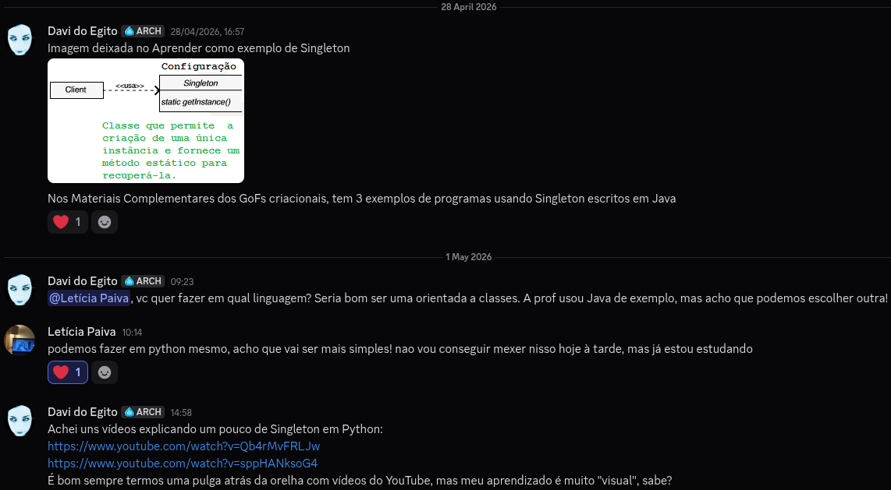
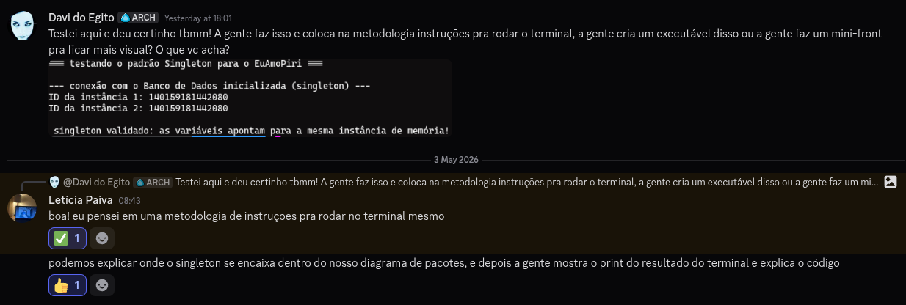

# 3.1.5 Singleton

## Introdução


## Objetivo


## Metodologia

Para a entrega do Singleton, Davi e Letícia optaram por usar Python por ser mais simples e ser uma linguagem que possua classes.



Além disso, houve a discussão acerca de como o programa seria apresentado e optamos por fazê-lo rodar em um interpretador.



A comunicação se deu inteiramente de forma assíncrona via Discord para a confecção destes artefato e documento.

### Instruções

Traremos algumas possibilidades para rodar o nosso código abaixo. Como o Python é uma linguagem interpretada, o processo de executar o programa abre mais portas. Dentre as alternativas que temos, há:

#### Terminal

Para que o código rode no terminal, basta copiar o código fonte de versão mais recente para um programa de edição de texto e salvá-lo com o formato .py - desta forma, outros programas vão conseguir interpretá-lo corretamente como um programa de python! Como recomendações dentro do terminal, existe o [nano](https://help.ubuntu.com/community/Nano), [vim](https://vim.rtorr.com/) e [nvim (neovim)](https://neovim.io/doc/user/).  

#### Online Python

Para rodar o programa em um interpretador online, basta acessar algum interpretador primeiro - escolhemos o [Online Python](https://www.online-python.com/) pela conveniência e rapidez. Dentro dele, basta copiar e colar o código da versão mais recente e apertar _Run_ para executar o código. 

#### Programiz

Caso o Online Python não seja do agrado, existe também opções como o [Programiz](https://www.programiz.com/python-programming/online-compiler/) e [OnlineGDB](https://www.onlinegdb.com/online_python_interpreter), que funcionam de maneira similar ao Online Python.

## Evolução do artefato

### Versão 1.0

Letícia:

```python3
class DatabaseConnection:
    _instance = None

    def __new__(cls):
        if cls._instance is None:
            cls._instance = super(DatabaseConnection, cls).__new__(cls)
            
            cls._instance.connection_string = "postgresql://localhost:5432/euamopiri_db"
            cls._instance.status = "conectado"
            print("--- conexão com o Banco de Dados inicializada (singleton) ---")
            
        return cls._instance

    @staticmethod
    def get_instance():
        if DatabaseConnection._instance is None:
            DatabaseConnection() 
        return DatabaseConnection._instance

if __name__ == "__main__":
    print("=== testando o padrão Singleton para o EuAmoPiri ===\n")

    db1 = DatabaseConnection.get_instance()
    db2 = DatabaseConnection.get_instance()

    print(f"ID da instância 1: {id(db1)}")
    print(f"ID da instância 2: {id(db2)}")

    if db1 is db2:
        print("\n singleton validado: as variáveis apontam para a mesma instância de memória!")
    else:
        print("\n singleton falhou: as instâncias são diferentes.")
```

### Versão 1.1

Letícia:

```python3
import time

class ConexaoBancoPiri:
    _instancia = None

    def __new__(cls):
        if cls._instancia is None:
            cls._instancia = super(ConexaoBancoPiri, cls).__new__(cls)
            
            cls._instancia.host = "db.euamopiri.com.br"
            cls._instancia.banco = "euamopiri_prod"
            cls._instancia.porta = 5432
            cls._instancia.status_conexao = False
            
            print(f"criando instância única de conexão para o banco: {cls._instancia.banco}")
        return cls._instancia

    @classmethod
    def obter_instancia(cls):
        if cls._instancia is None:
            cls()
        return cls._instancia

    def conectar(self):
        if not self.status_conexao:
            print(f"estabelecendo conexão com {self.host}...")
            time.sleep(0.5) 
            self.status_conexao = True
            print(">> conexão ativa com o banco EuAmoPiri.")
        else:
            print(">> o sistema já possui uma conexão ativa.")

    def executar_query(self, query):
        if self.status_conexao:
            print(f"executando no EuAmoPiri: {query}")
            return "resultado da consulta"
        else:
            raise Exception("erro: não há conexão ativa com o banco.")

if __name__ == "__main__":
    print("=== demonstração Singleton: Projeto EuAmoPiri ===\n")

    print("solicitando conexão...")
    conexao_relatos = ConexaoBancoPiri.obter_instancia()
    conexao_relatos.conectar()
    conexao_relatos.executar_query("INSERT INTO relatos (turista, texto) VALUES ('João', 'Amei Piri!')")

    print("-" * 50)

    print("solicitando conexão...")
    conexao_locais = ConexaoBancoPiri.obter_instancia()
    
    print(f"ID Memória (Relatos): {id(conexao_relatos)}")
    print(f"ID Memória (Locais):  {id(conexao_locais)}")

    if conexao_relatos is conexao_locais:
        print("\n>> ambas as variáveis usam a mesma instância de conexão.")
    
    conexao_locais.executar_query("SELECT * FROM locais WHERE categoria = 'cachoeira'")
```

### Versão 1.2


## Visão dos contribuidores na concepção do artefato

Davi: 

Letícia:

## Referências


## Histórico do artefato

| Data       | Versão | Descrição                                               | Autor                                                      | Revisores                                                                                                                         |
| ---------- | ------ | ------------------------------------------------------- | ---------------------------------------------------------- | --------------------------------------------------------------------------------------------------------------------------------- |
| 02/05/2026 | `1.0`  | XYZ  | [Letícia Paiva](https://github.com/FuLaNohttps://github.com/leticiakrpaiva)              |   [Davi do Egito](https://github.com/daviegito)   
| 03/05/2026 | `1.1`  | XYZ  | [Letícia Paiva](https://github.com/FuLaNohttps://github.com/leticiakrpaiva)              | [Davi do Egito](https://github.com/daviegito)                                                                                                                                                                                    

## Histórico do documento

| Data       | Versão | Descrição                                                      | Autor                                                      | Revisores |
| ---------- | ------ | -------------------------------------------------------------- | ---------------------------------------------------------- | --------- |
| 01/05/2026 | `1.0`  | Criação inicial do documento | [Davi do Egito](https://github.com/daviegito) |
| 03/05/2026 | `1.1`  | Acréscimo das versões do código | [Davi do Egito](https://github.com/daviegito) |
