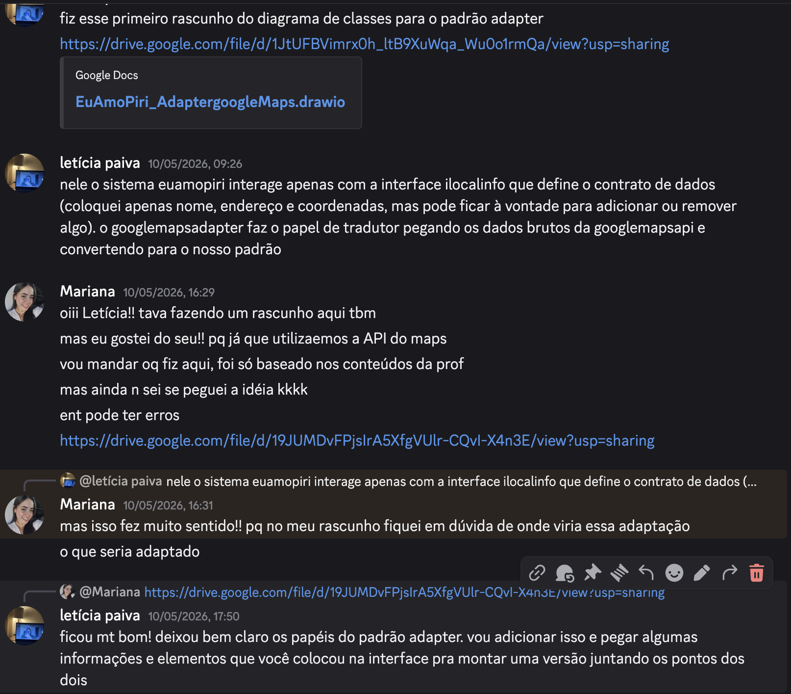
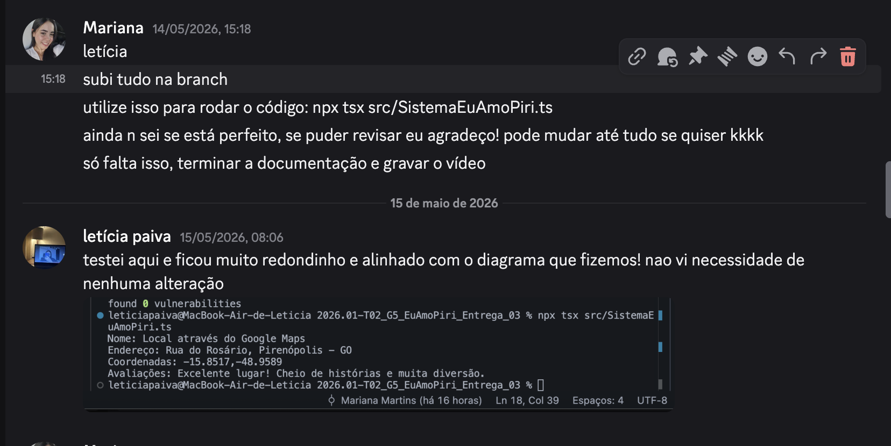
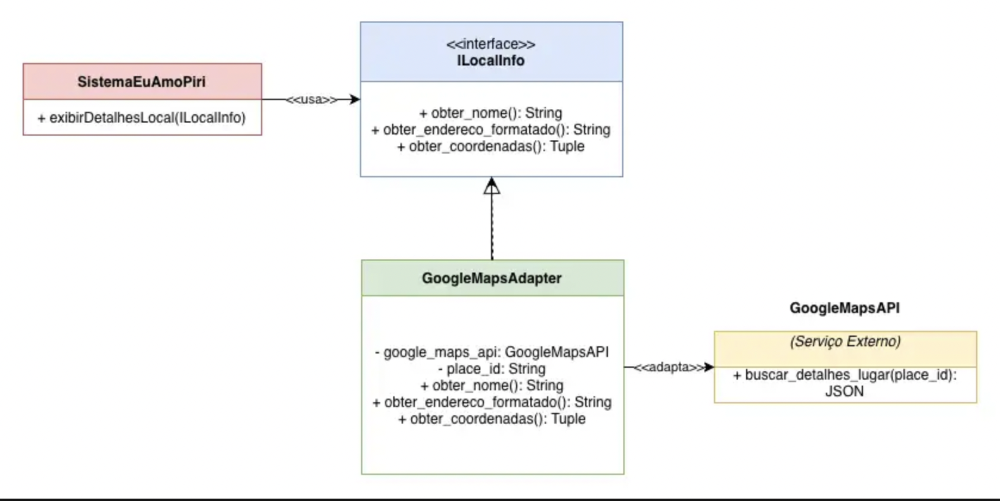
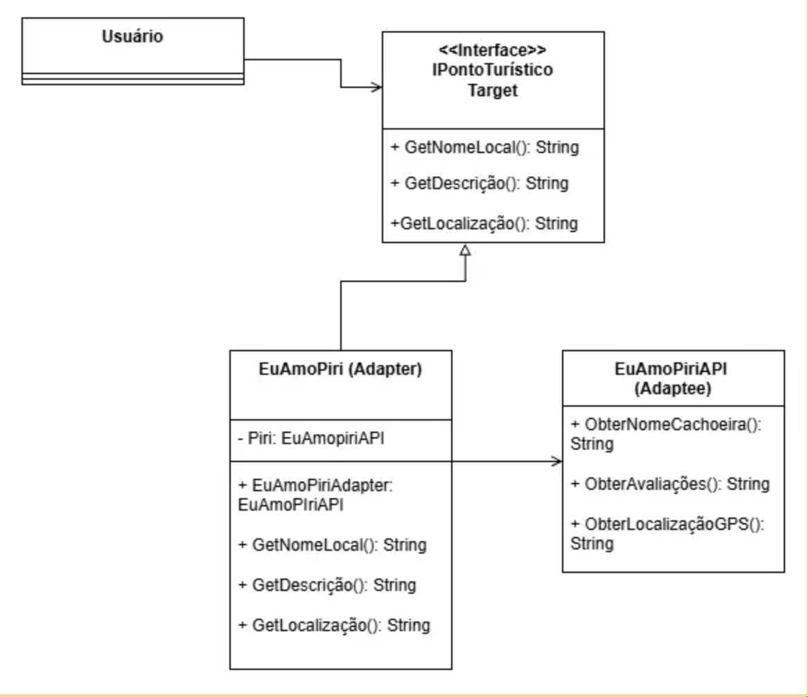
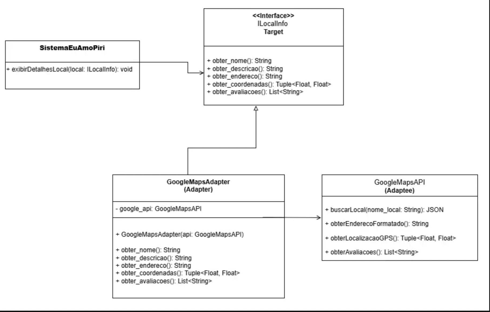
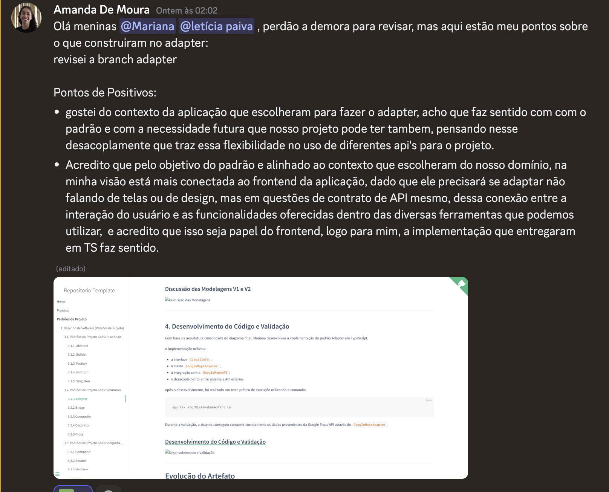
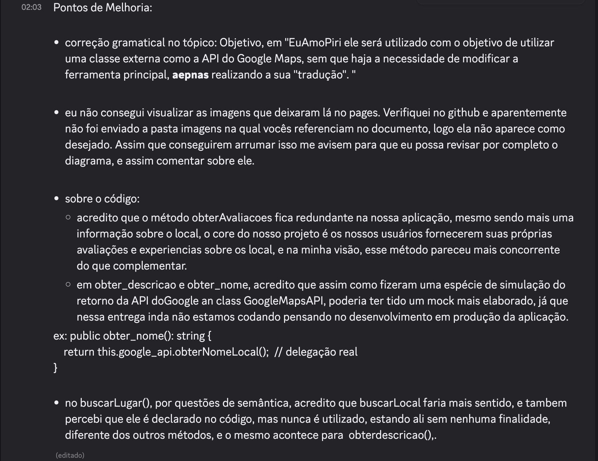
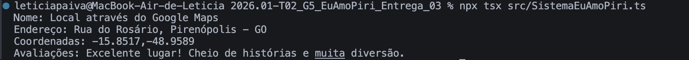

# 3.2.1. Padrão de Projeto Estrutural Adapter

## Introdução

A finalidade do Adapter é servir como um mediador entre duas interfaces para que elas consigam se comunicar/ conversar ou se tornarem compatíveis entre si.

Em aspectos mais técnicos, o Adapter é composto no total por 4 elementos, sendo eles:

Client: aquele que vai utilizar os objetos;
Target: estabelece a interface que o Cliente empregará;
Adaptee: refere-se à classe que requer adaptação;
Adapter: efetua a conexão entre as interfaces.

*Fonte: (CELESTINO, 2014)*

---

## Objetivo

O objetivo principal do Adapter é permitir que um objeto seja substituído por outro que mesmo realizando a mesma tarefa, possui uma interface diferente.
No projeto EuAmoPiri ele será utilizado com o objetivo de utilizar uma classe externa como a API do Google Maps, sem que haja a necessidade de modificar a ferramenta principal, apenas realizando a sua "tradução". Se no futuro for decidido a troca de API, como por exemplo par o uso do "OpenStreetMap", apenas precisamos criar um novo Adapter, mantendo o restante do código intacto.

*Fonte: (SERRANO, 2020)*

---

# Metodologia

Para a implementação do padrão estrutural Adapter no projeto EuAmoPiri, foram realizadas etapas de análise, discussão arquitetural, modelagem UML e validação prática da solução.

---

## 1. Discussão Inicial sobre o Uso do Adapter

Inicialmente, Leticia e Mariana discutiram como o padrão Adapter poderia ser aplicado no contexto do sistema EuAmoPiri.

Durante a análise, foi identificado que o sistema precisava se comunicar com um serviço externo (Google Maps API), porém sem depender diretamente da estrutura da API. A principal ideia discutida foi utilizar o Adapter como uma camada intermediária responsável por traduzir os dados externos para um formato compreendido pelo sistema.

Também foi definido que o sistema deveria depender apenas de uma interface interna, evitando acoplamento direto com a API externa.

### Discussão Inicial


---

## 2. Discussão das Modelagens UML

Após a definição inicial da aplicação do padrão Adapter, Leticia desenvolveu a primeira versão do diagrama UML representando a estrutura inicial da solução.

Em seguida, Mariana desenvolveu uma segunda versão da modelagem UML reorganizando os componentes para representar de forma mais clara o funcionamento do padrão Adapter dentro do projeto.

Durante essa etapa foram discutidos:

- os elementos principais do padrão Adapter;
- a relação entre o sistema e a API externa;
- a necessidade de uma interface intermediária;
- o papel do Adapter dentro da arquitetura;
- o desacoplamento entre sistema e API externa;
- a separação entre interface, Adapter e serviço externo;
- o fluxo de comunicação realizado pelo Adapter;
- a substituição do elemento “Usuário” por “Sistema”.

As duas modelagens contribuíram para a consolidação da arquitetura final utilizada posteriormente no desenvolvimento do código.

### Discussão das Modelagens V1 e V2



---

## 4. Desenvolvimento do Código e Validação

Com base na arquitetura consolidada no diagrama final, Mariana desenvolveu a implementação do padrão Adapter em TypeScript.

A implementação utilizou:

- a interface `ILocalInfo`;
- a classe `GoogleMapsAdapter`;
- a integração com a `GoogleMapsAPI`;
- o desacoplamento entre sistema e API externa.

Após o desenvolvimento, foi realizado um teste prático de execução utilizando o comando:

```bash
npx tsx src/SistemaEuAmoPiri.ts
```

Durante a validação, o sistema conseguiu consumir corretamente os dados provenientes da Google Maps API através do `GoogleMapsAdapter`.


### Desenvolvimento do Código e Validação



---

# Evolução do Artefato

## Versão V1 do Diagrama UML

A primeira versão do diagrama UML foi desenvolvida por Leticia com o objetivo de estruturar inicialmente a aplicação do padrão Adapter no projeto.

Nessa modelagem foram definidos os principais elementos da arquitetura:

- Interface alvo (`IPontoTurístico`);
- Adapter (`EuAmoPiri`);
- Serviço externo (`EuAmoPiriAPI`);
- Relação entre sistema, interface e API externa.

A V1 representou a primeira visão arquitetural da integração entre o sistema e a API externa.

### Diagrama V1



---

## Versão V2 do Diagrama UML

A segunda versão do diagrama UML foi desenvolvida por Mariana, reorganizando os componentes do padrão Adapter para representar de forma mais clara o fluxo arquitetural da solução.

A V2 apresentou:

- melhor separação entre sistema, interface e API externa;
- maior clareza no papel do Adapter;
- organização mais explícita das dependências;

Essa versão aproximou a modelagem da implementação prática realizada posteriormente.

### Diagrama V2



---

## Versão V3 do Diagrama UML

A terceira versão consolidou a arquitetura final utilizada no desenvolvimento do código.

A V3 passou a representar de forma definitiva:

- a dependência do sistema em relação à interface `ILocalInfo`;
- a implementação da interface pelo `GoogleMapsAdapter`;
- o encapsulamento da `GoogleMapsAPI`;
- o Adapter como intermediador entre o sistema e o serviço externo.

O fluxo arquitetural final ficou definido da seguinte forma:

```text
Sistema → ILocalInfo → GoogleMapsAdapter → GoogleMapsAPI
```

Essa versão serviu como base para o desenvolvimento e validação da implementação em TypeScript.

### Diagrama V3



---

# Implementação do Padrão Adapter - 1.1

A implementação do padrão Adapter foi realizada em TypeScript utilizando os componentes principais do padrão GoF: Target, Adaptee, Adapter e Client.

---

## 1. Interface Alvo (Target)

A interface `ILocalInfo` define o contrato esperado pelo sistema EuAmoPiri.

```ts
// Target -> Interface

export interface ILocalInfo {
    obter_nome(): string;
    obter_descricao(): string;
    obter_endereco(): string;
    obter_coordenadas(): [number, number];
    obter_avaliacoes(): string[];
}
```

---

## 2. Serviço Externo (Adaptee)

A classe `GoogleMapsAPI` representa a API externa utilizada pelo sistema.

```ts
// Adaptee -> Google Maps API 

export class GoogleMapsAPI {
    public buscarLugar(nome_local: string): object {
        return { info: "Dados brutos do Google" };
    }

    public obterEnderecoFormatado(): string {
        return "Rua do Rosário, Pirenópolis - GO";
    }

    public obterLocalizacaoGPS(): [number, number] {
        return [-15.8517, -48.9589];
    }

    public obterAvaliacoes(): string[] {
        return ["Excelente lugar! Cheio de histórias e muita diversão."];
    }
}
```

---

## 3. Adapter

A classe `GoogleMapsAdapter` implementa a interface `ILocalInfo` e adapta os métodos da `GoogleMapsAPI` para o formato esperado pelo sistema.

```ts
// Adapter -> GoogleMapsAPI

import { ILocalInfo } from './ILocalInfo';
import { GoogleMapsAPI } from './GoogleMapsAPI';

export class GoogleMapsAdapter implements ILocalInfo {
    private google_api: GoogleMapsAPI;

    constructor(api: GoogleMapsAPI) {
        this.google_api = api;
    }

    public obter_nome(): string {
        return "Local através do Google Maps";
    }

    public obter_descricao(): string {
        return "Descrição adaptada da API externa";
    }

    public obter_endereco(): string {
        return this.google_api.obterEnderecoFormatado();
    }

    public obter_coordenadas(): [number, number] {
        return this.google_api.obterLocalizacaoGPS();
    }

    public obter_avaliacoes(): string[] {
        return this.google_api.obterAvaliacoes();
    }
}
```

---

## 4. Sistema Cliente (Client)

O sistema EuAmoPiri consome apenas a interface `ILocalInfo`, permanecendo desacoplado da API externa.

```ts
// Sistema EuAmoPiri

import { GoogleMapsAPI } from './GoogleMapsAPI';
import { GoogleMapsAdapter } from './GoogleMapsAdapter';
import { ILocalInfo } from './ILocalInfo';

export class SistemaEuAmoPiri {
    public exibirDetalhesLocal(local: ILocalInfo): void {
        console.log(`Nome: ${local.obter_nome()}`);
        console.log(`Endereço: ${local.obter_endereco()}`);
        console.log(`Coordenadas: ${local.obter_coordenadas()}`);
        console.log(`Avaliações: ${local.obter_avaliacoes().join(", ")}`);
    }
}

const apiGoogle = new GoogleMapsAPI();
const adapter = new GoogleMapsAdapter(apiGoogle);
const sistemaEuAmoPiri = new SistemaEuAmoPiri();

sistemaEuAmoPiri.exibirDetalhesLocal(adapter);
```
---

### Feedback dos revisores

Feedback do João Victor: 


Feedback da Amanda: 



---

# Implementação do Padrão Adapter - 1.2
A partir do feedback recebido pelos revisores, foi desenvolvida uma segunda versão da implementação do padrão Adapter, com melhorias estruturais e ajustes de coerência em relação ao domínio do projeto EuAmoPiri. 

Entre as principais melhorias realizadas, destacam-se:

- remoção do método `obterAvaliacoes()`, já que as avaliações fazem parte do núcleo da própria aplicação;
- alteração do método `buscarLugar()` para `buscarLocal()`, melhorando a semântica do código;
- criação de métodos reais na `GoogleMapsAPI` para nome e descrição do local;
- implementação de delegação real no Adapter;
- utilização efetiva do método `buscarLocal()` no fluxo da aplicação;
- inclusão da descrição do local no sistema cliente.


## 1. Interface Alvo (Target)

```ts
export interface ILocalInfo {
    obter_nome(): string;
    obter_descricao(): string;
    obter_endereco(): string;
    obter_coordenadas(): [number, number];
}
```

---

## 2. Serviço Externo (Adaptee)

```ts
// Adaptee -> Google Maps API

export class GoogleMapsAPI {

    public buscarLocal(nome_local: string): object {
        return {
            nome: nome_local,
            descricao: "Um dos pontos turísticos mais visitados de Pirenópolis.",
            endereco: "Rua do Rosário, Pirenópolis - GO",
            coordenadas: [-15.8517, -48.9589]
        };
    }

    public obterNomeLocal(): string {
        return "Igreja Matriz de Pirenópolis";
    }

    public obterDescricaoLocal(): string {
        return "Local histórico conhecido pela arquitetura colonial e importância cultural.";
    }

    public obterEnderecoFormatado(): string {
        return "Rua do Rosário, Pirenópolis - GO";
    }

    public obterLocalizacaoGPS(): [number, number] {
        return [-15.8517, -48.9589];
    }
}
```

---

## 3. Adapter

```ts
// Adapter -> GoogleMapsAdapter

import { ILocalInfo } from './ILocalInfo';
import { GoogleMapsAPI } from './GoogleMapsAPI';

export class GoogleMapsAdapter implements ILocalInfo {

    private google_api: GoogleMapsAPI;

    constructor(api: GoogleMapsAPI) {
        this.google_api = api;
    }

    public obter_nome(): string {
        return this.google_api.obterNomeLocal();
    }

    public obter_descricao(): string {
        return this.google_api.obterDescricaoLocal();
    }ß

    public obter_endereco(): string {
        return this.google_api.obterEnderecoFormatado();
    }

    public obter_coordenadas(): [number, number] {
        return this.google_api.obterLocalizacaoGPS();
    }
}
```

---

## 4. Sistema Cliente (Client)

```ts
// Sistema EuAmoPiri

import { GoogleMapsAPI } from './GoogleMapsAPI';
import { GoogleMapsAdapter } from './GoogleMapsAdapter';
import { ILocalInfo } from './ILocalInfo';

export class SistemaEuAmoPiri {

    public exibirDetalhesLocal(local: ILocalInfo): void {

        console.log(`Nome: ${local.obter_nome()}`);
        console.log(`Descrição: ${local.obter_descricao()}`);
        console.log(`Endereço: ${local.obter_endereco()}`);
        console.log(`Coordenadas: ${local.obter_coordenadas()}`);
    }
}

const apiGoogle = new GoogleMapsAPI();

apiGoogle.buscarLocal("Igreja Matriz de Pirenópolis");

const adapter = new GoogleMapsAdapter(apiGoogle);

const sistemaEuAmoPiri = new SistemaEuAmoPiri();

sistemaEuAmoPiri.exibirDetalhesLocal(adapter);
```

---


#### Saída da execução — Versão 1.2



---

#### Vídeo da execução da versão 1.2 

<iframe width="560" height="315" 
src="https://youtu.be/KSZn6k5yeb4" 
title="YouTube video player" 
frameborder="0" 
allow="accelerometer; autoplay; clipboard-write; encrypted-media; gyroscope; picture-in-picture; web-share" 
allowfullscreen>
</iframe>

## Visão dos contribuidores na concepção do artefato

Letícia: Durante a concepção do artefato, achei muito interessante o conceito do padrão Adapter, principalmente pela forma como ele consegue desacoplar o sistema de serviços externos sem alterar diretamente a estrutura principal da aplicação. A parte mais complicada foi encontrar uma forma de adaptar o padrão ao contexto do projeto EuAmoPiri, tentando fazer com que a modelagem realmente representasse algo aplicável ao cenário proposto e não apenas um exemplo genérico do padrão. Ao longo do desenvolvimento, a construção das diferentes versões do diagrama ajudou a visualizar melhor a estrutura da solução. Além disso, ter a visão da Mariana durante a evolução da modelagem e posteriormente na implementação tornou o processo menos pesado, principalmente na etapa de transformar o diagrama em código funcional.

Mariana: O Padrão de Projeto Adapter até o momento é o meu queridinho, sua aplicação e adaptabilidade são muito interessantes! O fato dele conseguir "traduzir" ou adaptar mesmo a sua comunicação com outras partes do sistema é uma idéia muito proveitosa, além disso a sua idéia de reaproveitamento, em que podemos apenas criar uma "adaptação" para algo que já existe sem necessitar de toda a mudança em algo que já funciona, mas que talvez esteja apenas desatualizado.
Sua implemetação foi bem tranquila, um padrão de projeto em que eu consegui observar concretamente a sua utilidadade.
A interação com a Letícia foi muito interessante! Tivemos uma comunicação assíncrona, porém muito proveitosa. Cada uma com as suas visões particulares levou até a versão final do Adapter do Eu Amo Piri.

## Referências

[1] CELESTINO, André. Delphi Design Patterns – Adapter. André Celestino, 2014. Disponível em: https://www.andrecelestino.com/delphi-design-patterns-adapter/. Acesso em: 14 maio 2026.

[2] SERRANO, Milene. Arquitetura e Desenho de Software - Aula GoFs Estruturais. Slides. Universidade de Brasília, 2025. Acesso em: 14 maio 2026.

[3] REFACTORING GURU. Adapter. Disponível em: https://refactoring.guru/pt-br/design-patterns/adapter. Acesso em: 15 de maio 2026.


## Histórico do artefato

| Data       | Versão | Descrição                                               | Autor                                                      | Revisores                                                                                                                         |
| ---------- | ------ | ------------------------------------------------------- | ---------------------------------------------------------- | --------------------------------------------------------------------------------------------------------------------------------- |
| 10/05/2026 | `1.0`  | V1 do Padrão de Projeto Adapter | [Letícia](https://github.com/leticiakrpaiva)   | [Amanda](https://github.com/AmandaaMoura) e [João Victor](https://github.com/Chaotzuu) |
| 10/05/2026 | `1.1`  | V2 do Padrão de Projeto Adapter | [Mariana](https://github.com/Marianamrts) | [Amanda](https://github.com/AmandaaMoura) e [João Victor](https://github.com/Chaotzuu)  |   
| 11/05/2026 | `1.2`  | V3 do Padrão de Projeto Adapter | [Letícia](https://github.com/leticiakrpaiva)  | [Amanda](https://github.com/AmandaaMoura) e [João Victor](https://github.com/Chaotzuu)  |       
| 14/05/2026 | `1.3`  | Primeira Versão do código | [Mariana](https://github.com/Marianamrts) |  [Amanda](https://github.com/AmandaaMoura) e [João Victor](https://github.com/Chaotzuu) |                                                                                         | 15/05/2026 | `1.4`  | Revisão completa e teste do código |[Letícia](https://github.com/leticiakrpaiva) |  [Amanda](https://github.com/AmandaaMoura) e [João Victor](https://github.com/Chaotzuu) |   

## Histórico do documento

| Data       | Versão | Descrição                                                      | Autor                                                      | Revisores |
| ---------- | ------ | -------------------------------------------------------------- | ---------------------------------------------------------- | --------- |
| 14/05/2026 | `1.0`  | V1 do documento | [Mariana](https://github.com/Marianamrts) | [Letícia](https://github.com/leticiakrpaiva) |
| 14/05/2026 | `1.1`  | Atualização da metodologia, evolução do artefato e implementação do Adapter | [Letícia](https://github.com/leticiakrpaiva) | [Mariana](https://github.com/Marianamrts) |
| 16/05/2026 | `1.2`  | Inserção da Visão de Contribuição| [Mariana](https://github.com/Marianamrts) | [Letícia](https://github.com/leticiakrpaiva) |