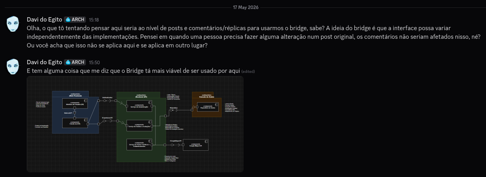
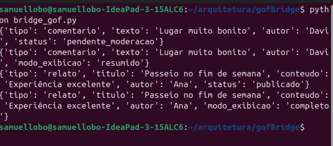
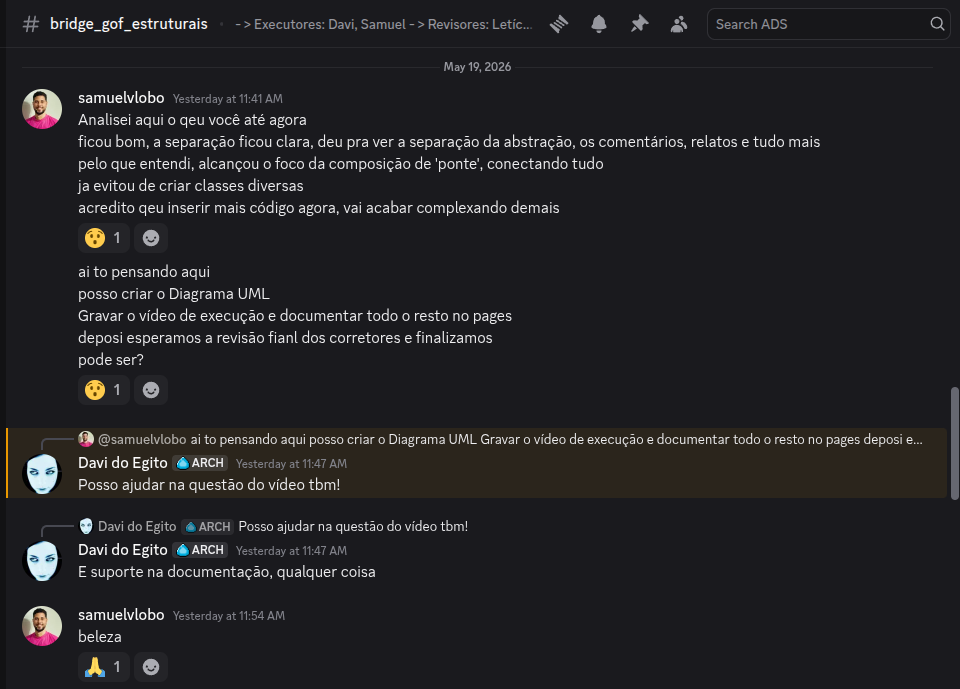
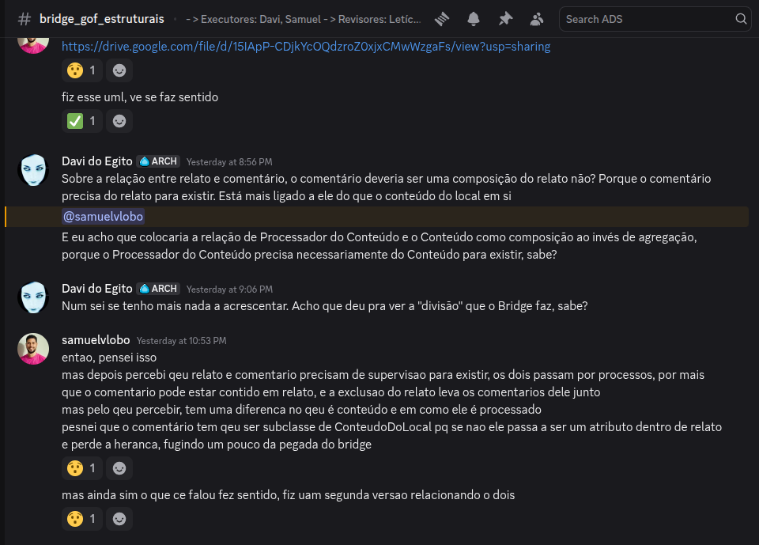
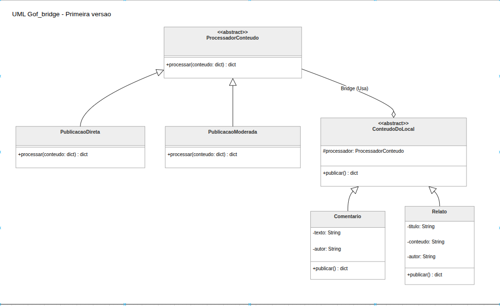
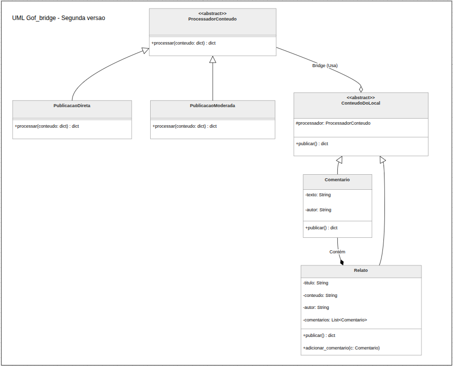

# 3.2.2 Bridge

## Introdução

O padrão Bridge desacopla uma abstração de sua implementação para que os 2 variem independentemente. Em suma, ele pode servir como um substituto para a herança, que muitas vezes se prova inflexível e torna difícil o uso de abstrações e implementações de maneira independente. (Gamma et al., 1994)


## Objetivo

Aqui está uma sugestão de texto para o objetivo do padrão Bridge, seguindo exatamente a mesma estrutura e o mesmo tom analítico e fundamentado que você usou para o Multiton:

No sistema proposto (plataforma de turismo com relatos e avaliação de locais), existem cenários em que é necessário:

 - separar as abstrações de conteúdo (como Comentários e Avaliações) de suas implementações de processamento ou formatação (como Texto Simples, JSON, etc.);

 - evitar uma explosão combinatória de subclasses (por exemplo, ter que criar um ComentarioTexto, ComentarioJSON, AvaliacaoTexto, etc.);

 - permitir que novos tipos de conteúdos ou novos formatos de   exportação sejam adicionados no futuro de forma independente;

 - isolar o domínio da aplicação das regras específicas de formatação ou envio de dados.

De acordo com Gamma et al. (1995), o padrão estrutural Bridge tem como intenção principal "desacoplar uma abstração da sua implementação, de modo que as duas possam variar independentemente", promovendo grande flexibilidade e evitando o forte acoplamento por herança.

Nesse contexto, o Bridge foi escolhido para atuar como a "ponte" entre o conteúdo gerado pelos usuários e os processadores de formatação correspondentes, garantindo que o sistema "Eu Amo Piri" se mantenha modular, limpo e altamente expansível.

## Metodologia

O principal meio de comunicação usado foi o Discord e o trabalho foi realizado de forma assíncrona! A linguagem de programação acordada entre o Davi e o Samuel foi Python, por ele ter suporte à orientação a objetos e uma grande quantidade de bibliotecas que dão versatilidade à linguagem.

A comunicação da dupla se deu inteiramente através do servidor da equipe no Discord, em um canal criado especialmente para discussão do artefato e compartilhamento de links e avisos importantes.

## Evolução do artefato

### Versão 1.0


Fonte: Print Discord(2026)

Davi: A primeira versão, de rascunho, tomou por base uma ideia que eu tive sobre tentar encaixar os conteúdos, como postagens e réplicas, dentro do padrão Bridge. De início, achava que eles poderiam ser encaixados na questão da edição de posts já lançados não afetarem as réplicas, mas com o auxílio de uma ferramenta de IA, houve um insight sobre o uso do Bridge para separação entre o conteúdo em si e como esse conteúdo é tratado. 

A ideia da primeira versão é que o tratamento do conteúdo (representado por ProcessadorConteudo e seus herdeiros) fique de um lado e que os tipos de conteúdo, como os herdeiros de conteúdo do local, fique em outro para evitar muitas combinações de classe como ComentarioModerado (o que for denunciado), ComentarioPublico e por assim vai. Desta forma, ficam 2 hierarquias independentes conectadas por composição:

```python
from abc import ABC, abstractmethod


class ProcessadorConteudo(ABC):
    @abstractmethod
    def processar_publicacao(self, dados: dict) -> dict:
        pass

    @abstractmethod
    def processar_exibicao(self, dados: dict) -> dict:
        pass


class PublicacaoDireta(ProcessadorConteudo):
    def processar_publicacao(self, dados: dict) -> dict:
        dados["status"] = "publicado"
        return dados

    def processar_exibicao(self, dados: dict) -> dict:
        dados["modo_exibicao"] = "completo"
        return dados


class PublicacaoModerada(ProcessadorConteudo):
    def processar_publicacao(self, dados: dict) -> dict:
        dados["status"] = "pendente_moderacao"
        return dados

    def processar_exibicao(self, dados: dict) -> dict:
        dados["modo_exibicao"] = "resumido"
        return dados


class ConteudoDoLocal(ABC):
    def __init__(self, processador: ProcessadorConteudo):
        self.processador = processador

    @abstractmethod
    def publicar(self) -> dict:
        pass

    @abstractmethod
    def exibir(self) -> dict:
        pass


class Comentario(ConteudoDoLocal):
    def __init__(self, texto: str, autor: str, processador: ProcessadorConteudo):
        super().__init__(processador)
        self.dados = {"tipo": "comentario", "texto": texto, "autor": autor}

    def publicar(self) -> dict:
        return self.processador.processar_publicacao(self.dados.copy())

    def exibir(self) -> dict:
        return self.processador.processar_exibicao(self.dados.copy())


class Relato(ConteudoDoLocal):
    def __init__(self, titulo: str, conteudo: str, autor: str, processador: ProcessadorConteudo):
        super().__init__(processador)
        self.dados = {
            "tipo": "relato",
            "titulo": titulo,
            "conteudo": conteudo,
            "autor": autor
        }

    def publicar(self) -> dict:
        return self.processador.processar_publicacao(self.dados.copy())

    def exibir(self) -> dict:
        return self.processador.processar_exibicao(self.dados.copy())


class Avaliacao(ConteudoDoLocal):
    def __init__(self, nota: int, autor: str, processador: ProcessadorConteudo):
        super().__init__(processador)
        self.dados = {"tipo": "avaliacao", "nota": nota, "autor": autor}

    def publicar(self) -> dict:
        return self.processador.processar_publicacao(self.dados.copy())

    def exibir(self) -> dict:
        return self.processador.processar_exibicao(self.dados.copy())


comentario = Comentario("Lugar muito bonito", "Davi", PublicacaoModerada())
relato = Relato("Passeio no fim de semana", "Experiência excelente", "Ana", PublicacaoDireta())

print(comentario.publicar())
print(comentario.exibir())
print(relato.publicar())
print(relato.exibir())
```
## Testes 

Após uma rodagem de testes, foi possível ver a execução da estrutura de código em ação.


Fonte: Samuel (2026).

Ainda sim, continuamos analisando o que poderiamos ir fazendo. Seguimos com mais discussões de alinhamento e execução.


Fonte: Print Discord(2026)


Fonte: Print Discord(2026)

### Implementação do Padrão Bridge

Para demonstrar o funcionamento e a validação do padrão Bridge (separação entre a abstração do conteúdo e a sua implementação de processamento), gravamos um vídeo da execução do código no terminal.

🎥 **[Clique aqui para assistir ao vídeo de execução do código no YouTube](https://youtu.be/9s5kdcydrk0)**


## Diagrama UML do Bridge (Python)

Para garantir a Rastreabilidade exigida pelo projeto e consolidar a documentação do Desenho de Software, também foi elaborado o Diagrama de Classes UML representando a estrutura final adotada para o padrão Bridge:

Versão Samuel:

Fonte: Samuel (2026).

Após uam discussão de ideias, evoluimos o diagrama para chegar em um modelo final:


Fonte: Print Discord(2026)

Revisão Davi - Versão final:

Fonte: Samuel (2026).

## Visão dos contribuidores na concepção do artefato

Davi: o Bridge definitivamente não é dos padrões mais fáceis "de se ver", e achei ele mais abstrato do que alguns dos outros padrões, então foi um verdadeiro desafio tentar encaixá-lo naquilo que tínhamos feito em diagramas anteriores. Apesar de ter sido um desafio, fico feliz em ter escolhido para confeccioná-lo e assim sair da zona de conforto.

Samuel: Foi interessante estudar o funcionamento do padrão Bridge. De maneira inconsciente, eu já pensava em como seria uam boa ideia explorar o máximo das heranças de classes, o padrão me ajudaou bastante a entender melhor isso. 

## Referências

GAMMA, Erich et al. Design patterns: elements of reusable object-oriented software. Disponível em: https://www.javier8a.com/itc/bd1/articulo.pdf. Acesso em: 15 maio 2026.


## Histórico do artefato

| Data       | Versão | Descrição                                               | Autor                                                      | Revisores                                                                                                                         |
| ---------- | ------ | ------------------------------------------------------- | ---------------------------------------------------------- | --------------------------------------------------------------------------------------------------------------------------------- |
| 17/05/2026 | `1.0`  | Rascunho inicial  | [Davi do Egito](https://github.com/daviegito)              |                                                                                                                                   |
| 18/05/2026 | `1.1`  | Adição da modelagem UML, vídeo de execução e refinamento de tópicos (Evolução para Produto Oficial)  | [Samuel Rodrigues](https://github.com/samuel-rodrigues) | [Davi do Egito](https://github.com/daviegito)                                                                                     |

## Histórico do documento

| Data       | Versão | Descrição                                                      | Autor                                                      | Revisores |
| ---------- | ------ | -------------------------------------------------------------- | ---------------------------------------------------------- | --------- |
| 15/05/2026 | `1.0`  | Criação do documento inicial                                   | [Davi do Egito](https://github.com/daviegito)              |           |
| 17/05/2026 | `1.1`  | Adição da versão 1.0 do artefato                               | [Davi do Egito](https://github.com/daviegito)              |           |
| 18/05/2026 | `1.2`  | Atualização para versão final com modelagem e comprovação em vídeo | [Samuel Rodrigues](https://github.com/samuel-rodrigues) | [Davi do Egito](https://github.com/daviegito) |