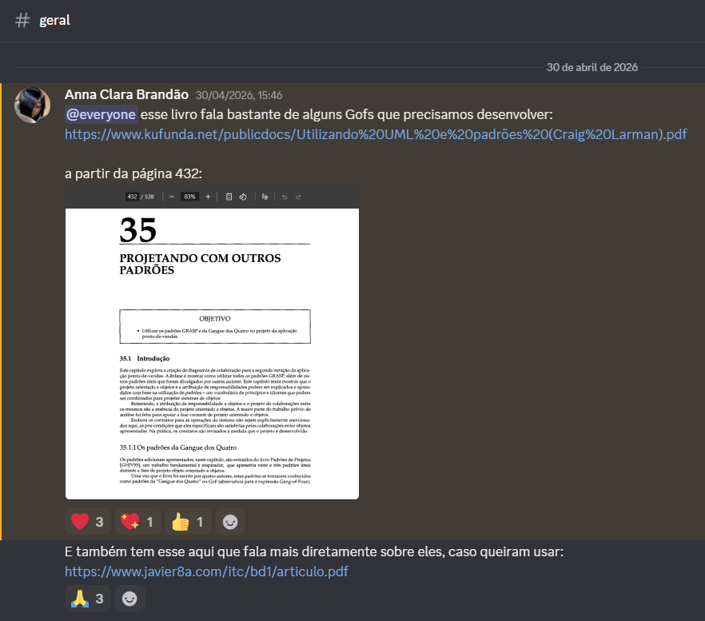
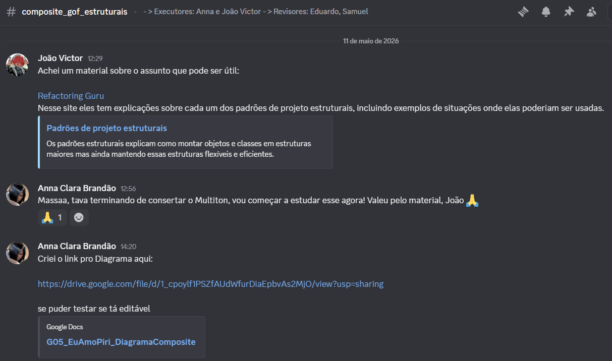
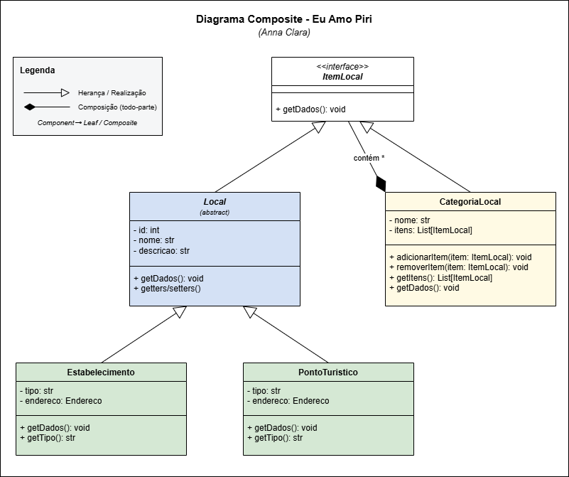
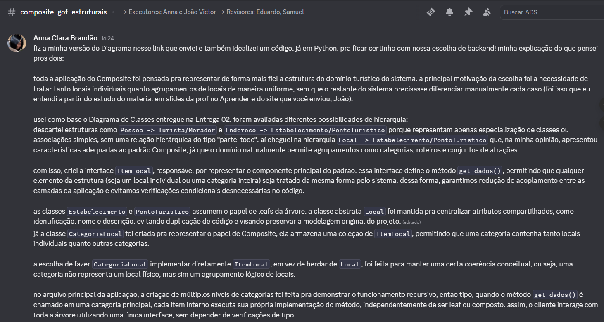
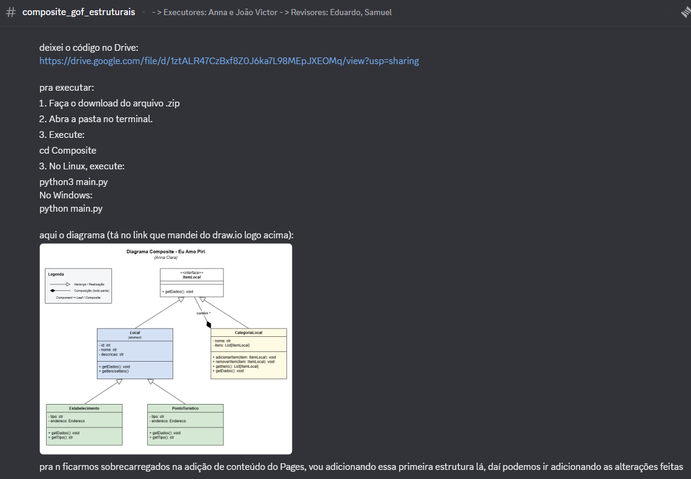
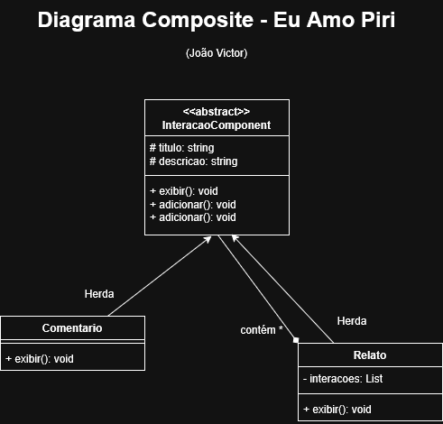
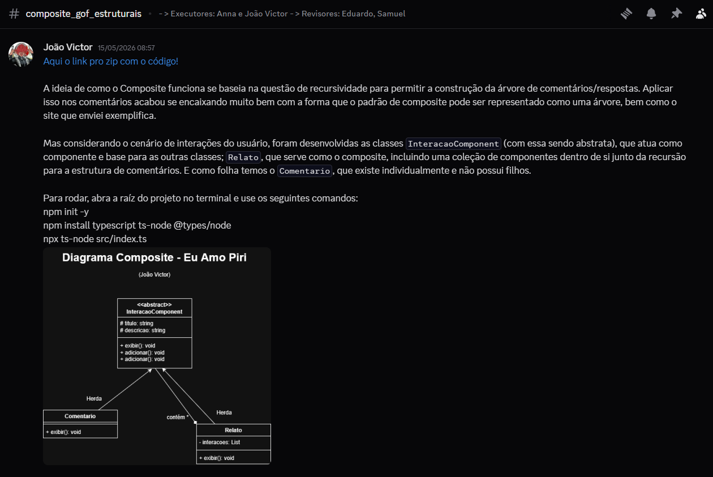

# 3.2.3 GoF Estrutural - Composite

---

## Introdução

O Composite é um padrão de projeto estrutural, ou seja, possui a função de diminuir o desacoplamento entre os objetos de um sistema. Segundo Gamma et. al (1995), esse padrão possui a função de organizar objetos em estruturas de árvore para representar relações de parte-todo, permitindo que objetos individuais e composições sejam tratados da mesma forma pelos clientes.

---

## Objetivo

Como o padrão Composite é um padrão de projeto orientado a objetos, utilizamos `Python` para o desenvolvimento, seguindo a stack do backend do projeto **EuAmoPiri**. O objetivo dessa implementação foi organizar e manipular locais individuais (estabelecimentos e pontos turísticos) e agrupamentos de locais (categorias) como se fossem um único tipo de objeto, simplificando a interação do cliente com a estrutura e permitindo a composição flexível de elementos hierárquicos do catálogo da cidade.

---

## Metodologia

Para alcançarmos nosso objetivo, foram adotados os seguintes passos:

- Utilização do **Diagrama de Classes** do projeto EuAmoPiri (criado na Entrega 02), que serviu como base para estruturar os elementos envolvidos no padrão, suas relações e hierarquias.
- Foram utilizados os materiais fornecidos pela professora para o desenvolvimento do tópico, como slides, videoaulas e exemplo de implementação em Java.
- O diagrama mostrado a seguir foi modelado através da ferramenta *draw.io*, o que auxiliou diretamente na visualização clara da composição dos objetos, seus relacionamentos e hierarquia.

O artefato foi feito pelos membros: [Anna Clara Brandão][Anna] e [João Victor Mello][Joao], e revisado por: [Eduardo Ribeiro][Eduardo] e [Samuel Lobo][Samuel]. O resto dos membros da equipe também ficou responsável por acompanhar o andamento do desenvolvimento do **Composite**, e intervir caso fossem requisitados.

A comunicação da dupla se deu inteiramente através do servidor da equipe no Discord, em um canal criado especialmente para discussão do artefato e compartilhamento de links e avisos importantes.

Os estudos para a criação do artefato foram feitos de forma individual, tanto por parte dos executores, quanto por parte dos revisores, através das referências que constam ao fim desta página.

Compartilhamos links de sites confiáveis no nosso canal voltado para o desenvolvimento do artefato **Composite** mas também os compartilhamos no canal "geral", como forma de auxiliar na busca de informações gerais sobre os GoFs:

<figure>
  <figcaption style="text-align: center"><strong>Figura 1:</strong> Envio de referências confiáveis no canal "geral" do Discord.</figcaption>
  
  <p style="text-align: center"><em>Fonte: Print do Discord.</em></p>
</figure>

<figure>
  <figcaption style="text-align: center"><strong>Figura 2:</strong> Envio de referência confiável no canal do Composite do Discord e criação de link no draw.io.</figcaption>
  
  <p style="text-align: center"><em>Fonte: Print do Discord.</em></p>
</figure>

---

## Evolução do artefato

---

### Diagrama Composite

O diagrama desenvolvido apresenta a estrutura do catálogo de locais do projeto **Eu Amo Piri**, organizada a partir do padrão **Composite**, evidenciando a relação hierárquica entre categorias e locais e permitindo representar tanto elementos simples (um estabelecimento, um ponto turístico) quanto compostos (uma categoria que agrupa vários locais ou até outras categorias) de forma unificada (Refactoring Guru, 2026).

<figure>
  <figcaption style="text-align: center"><strong>Figura 3:</strong> Diagrama Composite.</figcaption>
  
  <p style="text-align: center"><em>Fonte: Anna Clara (2026).</em></p>
</figure>

O link que leva para o Diagrama no *draw.io*, pode ser acessado [por aqui](https://drive.google.com/file/d/1_cpoylf1PSZfAUdWfurDiaEpbvAs2MjO/view?usp=sharing).

O que foi idealizado para a construção desta primeira versão pode ser lido na figura abaixo, por meio de uma explicação feita no canal da equipe no *Discord*:

<figure>
  <figcaption style="text-align: center"><strong>Figura 4:</strong> Explicação acerca da idealização da primeira versão do artefato (Anna Clara).</figcaption>
  
  <p style="text-align: center"><em>Fonte: Print do Discord.</em></p>
</figure>

<figure>
  <figcaption style="text-align: center"><strong>Figura 5:</strong> Continuação de explicação acerca da idealização da primeira versão do artefato (Anna Clara).</figcaption>
  
  <p style="text-align: center"><em>Fonte: Print do Discord.</em></p>
</figure>

Devido ao contexto do sistema EuAmoPiri, também foi preciso levar em conta a estrutura das interações realizadas pelos usuários da plataforma, como relatos e comentários. A necessidade surgiu devido à existência de relações hierárquicas entre essas interações, onde um relato pode conter múltiplos comentários e os próprios comentários também podem conter respostas encadeadas. Para essa questão, foi idealizado um padrão composite que pode ser observado no diagrama abaixo.

<figure>
  <figcaption style="text-align: center"><strong>Figura 6:</strong> Diagrama Composite.</figcaption>
  
  <p style="text-align: center"><em>Fonte: João Victor (2026).</em></p>
</figure>

<figure>
  <figcaption style="text-align: center"><strong>Figura 7:</strong> Explicação acerca da idealização da primeira versão do artefato (João Victor).</figcaption>
  
  <p style="text-align: center"><em>Fonte: Print do Discord.</em></p>
</figure>

O link que leva para o Diagrama no *draw.io*, pode ser acessado [por aqui](https://drive.google.com/file/d/1WmEerdjJwRnM9CZMnKQxO8bFl5uXZQGQ/view?usp=sharing).

---

### Estrutura do código

Implementação do padrão de projeto estrutural **Composite** (GoF) aplicado ao catálogo de locais do projeto **Eu Amo Piri** em *Python*.

```shell
Composite/
├── item_local.py        # Component (interface abstrata)
├── local.py             # Base abstrata das folhas (Leaf)
├── estabelecimento.py   # Leaf concreta
├── ponto_turistico.py   # Leaf concreta
├── categoria_local.py   # Composite
├── main.py              # Cliente — exemplo de uso
└── README.md
```

Implementação do padrão de projeto estrutural **Composite** (GoF) aplicado as interações de usuário do projeto **Eu Amo Piri** em *TypeScript*.

```shell
interacao_composite_EuAmoPiri/
├── package.json
├── tsconfig.json
└── src/
    ├── component/
    │   └── InteracaoComponent.ts   # Componente
    │
    ├── leaf/
    │   └── Comentario.ts           # Leaf concreta
    │
    ├── composite/
    │   └── Relato.ts               # Composite
    │
    └── index.ts                    # Cliente — exemplo de uso
```

A seguir explicamos as decisões tomadas para os dois modelos desenvolvidos:

- Catálogo de Locais (*Python*);
- Interações de Usuário (*TypeScript*).

---

### 1. Definição de uma interface comum (Component)

Representa a interface que define a operação comum para todos os objetos na composição, nesse caso, o método *get_dados()*, implementado em `ItemLocal`.

#### 1.1. ItemLocal

```python
from abc import ABC, abstractmethod


class ItemLocal(ABC):
    """
    Component do padrao Composite.

    Define a interface comum para os objetos da composicao,
    permitindo que folhas (Estabelecimento, PontoTuristico)
    e compostos (CategoriaLocal) sejam tratados de forma uniforme.
    """

    @abstractmethod
    def get_dados(self) -> None:
        pass
```

#### 1.2. InteracaoComponent (Interação)

Representa a interface comum utilizada por todos os elementos da composição, permitindo que objetos simples (Comentario) e compostos (Relato) sejam tratados de maneira uniforme. Essa abstração é implementada através da classe InteracaoComponent.

```typescript
export abstract class InteracaoComponent {

    constructor(
        protected titulo: string,
        protected descricao: string
    ) {}

    abstract exibir(): void;

    adicionar?(
        interacao: InteracaoComponent
    ): void;

    remover?(
        interacao: InteracaoComponent
    ): void;
}
```

---

### 2. Implementação dos Objetos Folha (Leaf)

As classes folha representam os objetos indivisíveis da estrutura. A classe abstrata `Local` herda de `ItemLocal` e define os atributos comuns; as classes concretas `Estabelecimento` e `PontoTuristico` herdam de `Local` e implementam comportamentos específicos.

#### 2.1. Classe Local

```python
from abc import abstractmethod
from item_local import ItemLocal


class Local(ItemLocal):
    """
    Classe abstrata base para os locais cadastrados no EuAmoPiri.

    Representa o no folha (Leaf) do padrao Composite na sua forma
    generica. Suas subclasses concretas (Estabelecimento e
    PontoTuristico) tambem sao folhas da arvore.
    """

    def __init__(self, id_local: int, nome: str, descricao: str):
        self._id = id_local
        self._nome = nome
        self._descricao = descricao

    def get_id(self) -> int:
        return self._id

    def set_id(self, id_local: int) -> None:
        self._id = id_local

    def get_nome(self) -> str:
        return self._nome

    def set_nome(self, nome: str) -> None:
        self._nome = nome

    def get_descricao(self) -> str:
        return self._descricao

    def set_descricao(self, descricao: str) -> None:
        self._descricao = descricao

    @abstractmethod
    def get_dados(self) -> None:
        pass
```

#### 2.2. Classe Estabelecimento

```python
from local import Local


class Estabelecimento(Local):
    """
    Folha (Leaf) do padrao Composite.

    Representa um estabelecimento (restaurante, pousada, loja, etc.)
    cadastrado por um Morador no EuAmoPiri.
    """

    def __init__(self, id_local: int, nome: str, descricao: str, tipo: str):
        super().__init__(id_local, nome, descricao)
        self._tipo = tipo

    def get_tipo(self) -> str:
        return self._tipo

    def set_tipo(self, tipo: str) -> None:
        self._tipo = tipo

    def get_dados(self) -> None:
        print(f"[Estabelecimento] {self._nome}")
        print(f"  Tipo: {self._tipo}")
        print(f"  Descricao: {self._descricao}")
        print(f"  ID: {self._id}")
```

#### 2.3. Classe PontoTuristico

```python
from local import Local


class PontoTuristico(Local):
    """
    Folha (Leaf) do padrao Composite.

    Representa um ponto turistico (cachoeira, igreja historica,
    mirante, etc.) cadastrado no EuAmoPiri.
    """

    def __init__(self, id_local: int, nome: str, descricao: str, tipo: str):
        super().__init__(id_local, nome, descricao)
        self._tipo = tipo

    def get_tipo(self) -> str:
        return self._tipo

    def set_tipo(self, tipo: str) -> None:
        self._tipo = tipo

    def get_dados(self) -> None:
        print(f"[Ponto Turistico] {self._nome}")
        print(f"  Tipo: {self._tipo}")
        print(f"  Descricao: {self._descricao}")
        print(f"  ID: {self._id}")
```

#### 2.4. Classe Comentario (Interação)

```typescript
import { InteracaoComponent } from "../component/InteracaoComponent";

export class Comentario
extends InteracaoComponent {

    exibir(): void {

        console.log(
            `Comentário: ${this.descricao}`
        );
    }
}
```

A classe Comentario representa o Leaf do padrão Composite.

Sua principal responsabilidade é representar uma interação simples dentro do sistema, sem armazenar outras interações internamente.

O método exibir() implementa o comportamento específico do comentário, exibindo suas informações no terminal.

---

### 3. Implementação de Objetos Compostos (Composite)

Os objetos do tipo Composite armazenam outros componentes. Eles implementam os mesmos métodos da interface base, mas adicionam a capacidade de agregar e manipular uma coleção interna de componentes. A classe que define isso é a classe `CategoriaLocal`.

#### 3.1. CategoriaLocal

```python
from typing import List
from item_local import ItemLocal


class CategoriaLocal(ItemLocal):
    """
    Composite do padrao Composite.

    Agrupa varios ItemLocal (folhas ou outras categorias),
    permitindo construir hierarquias como "Cachoeiras de Pirenopolis"
    ou "Restaurantes do Centro Historico". Como implementa a mesma
    interface ItemLocal, o cliente trata categorias e locais
    individuais da mesma forma.
    """

    def __init__(self, nome: str):
        self._nome = nome
        self._itens: List[ItemLocal] = []

    def get_nome(self) -> str:
        return self._nome

    def set_nome(self, nome: str) -> None:
        self._nome = nome

    def adicionar_item(self, item: ItemLocal) -> None:
        self._itens.append(item)

    def remover_item(self, item: ItemLocal) -> None:
        if item in self._itens:
            self._itens.remove(item)

    def get_itens(self) -> List[ItemLocal]:
        return self._itens

    def get_dados(self) -> None:
        print(f"\n=== Categoria: {self._nome} ===")
        for item in self._itens:
            item.get_dados()
        print(f"=== Fim da categoria: {self._nome} ===\n")
```

#### 3.2. Cliente (main)

O cliente trata folhas e compostos de forma uniforme — basta chamar `get_dados()` no nó raiz da árvore, que a recursão percorre toda a hierarquia.

```python
from estabelecimento import Estabelecimento
from ponto_turistico import PontoTuristico
from categoria_local import CategoriaLocal


def main() -> None:
    # Folhas (Leaf)
    pousada = Estabelecimento(
        1, "Pousada dos Pireneus", "Pousada com vista para a serra", "Pousada"
    )
    restaurante = Estabelecimento(
        2, "Restaurante Flor do Cerrado", "Comida tipica goiana", "Restaurante"
    )
    cachoeira = PontoTuristico(
        3, "Cachoeira do Abade", "Cachoeira com piscina natural", "Cachoeira"
    )
    igreja = PontoTuristico(
        4, "Igreja Matriz", "Igreja historica do seculo XVIII", "Patrimonio"
    )

    # Composite: categorias agrupando folhas
    categoria_hospedagem = CategoriaLocal("Hospedagem e Gastronomia")
    categoria_hospedagem.adicionar_item(pousada)
    categoria_hospedagem.adicionar_item(restaurante)

    categoria_natureza = CategoriaLocal("Natureza e Patrimonio")
    categoria_natureza.adicionar_item(cachoeira)
    categoria_natureza.adicionar_item(igreja)

    # Composite de composites: catalogo geral da cidade
    catalogo_pirenopolis = CategoriaLocal("Pirenopolis - Catalogo Geral")
    catalogo_pirenopolis.adicionar_item(categoria_hospedagem)
    catalogo_pirenopolis.adicionar_item(categoria_natureza)

    # O cliente trata folhas e compostos da mesma forma:
    catalogo_pirenopolis.get_dados()


if __name__ == "__main__":
    main()
```

#### 3.3. Classe Relato (Interação)

```typescript
import { InteracaoComponent } from "../component/InteracaoComponent";

export class Relato
    extends InteracaoComponent {

    private interacoes:
        InteracaoComponent[] = [];

    adicionar( // Monta a árvore de comentários
        interacao: InteracaoComponent
    ): void {

        this.interacoes.push(interacao);
    }

    remover( // Remove comentários
        interacao: InteracaoComponent
    ): void {

        this.interacoes =
            this.interacoes.filter(
                i => i !== interacao
            );
    }

    exibir(): void {

        console.log(
            `\nRelato: ${this.titulo}`
        );

        console.log(this.descricao);

        for (const interacao of this.interacoes) { // Recursão da classe para os comentários serem adicionados
            interacao.exibir();
        }
    }
}
```

A classe Relato representa o Composite do padrão Composite.

Ela possui uma coleção interna de objetos do tipo InteracaoComponent, permitindo armazenar comentários e respostas. Como implementa a mesma abstração dos demais componentes, o cliente pode tratar relatos e comentários da mesma forma.

Além disso, a classe é responsável por adicionar componentes, remover componentes, percorrer recursivamente a estrutura e exibir todas as interações associadas ao relato.

#### 3.4. Index (main da interação)

```typescript
import { Relato } from "./composite/Relato";
import { Comentario } from "./leaf/Comentario";

const relato =
    new Relato( // Cria relato
        "Viagem para Pirenópolis",
        "Experiência incrível"
    );

const comentario1 =
    new Comentario( // Cria comentário
        "Comentário",
        "Lugar muito bonito"
    );

const comentario2 =
    new Comentario( // Cria resposta para o comentário
        "Resposta",
        "Concordo totalmente"
    );

relato.adicionar(comentario1);
relato.adicionar(comentario2); // Chama o composite para adicionar os comentários

relato.exibir(); // Chama o composite para exibir
```

O cliente utiliza os componentes da estrutura sem precisar diferenciar objetos simples de objetos compostos. Basta manipular os elementos através de InteracaoComponent.

---

### Execução (Catálogo de Locais)

Pré-requisitos:

- Python 3.8 ou superior

Para verificar a versão instalada:

```shell
python3 --version
```

O arquivo executável está disponível para download [neste link](https://drive.google.com/file/d/11ADOG2GN9uAlGkm-KT20GkYqUqv89qbG/view?usp=sharing). Para executá-lo cumpra os passos a seguir:

**1. Extraia o arquivo .zip.**

Após extrair, abra o terminal dentro da pasta `composite/`.

**2. Entre na pasta do projeto:**

```shell
cd composite
```

**3. Execute o programa:**

No Linux / macOS:

```shell
python3 main.py
```

No Windows:

```shell
python main.py
```

**Saída esperada:**

```shell
=== Categoria: Pirenopolis - Catalogo Geral ===

=== Categoria: Hospedagem e Gastronomia ===
[Estabelecimento] Pousada dos Pireneus
  Tipo: Pousada
  Descricao: Pousada com vista para a serra
  ID: 1
[Estabelecimento] Restaurante Flor do Cerrado
  Tipo: Restaurante
  Descricao: Comida tipica goiana
  ID: 2
=== Fim da categoria: Hospedagem e Gastronomia ===


=== Categoria: Natureza e Patrimonio ===
[Ponto Turistico] Cachoeira do Abade
  Tipo: Cachoeira
  Descricao: Cachoeira com piscina natural
  ID: 3
[Ponto Turistico] Igreja Matriz
  Tipo: Patrimonio
  Descricao: Igreja historica do seculo XVIII
  ID: 4
=== Fim da categoria: Natureza e Patrimonio ===

=== Fim da categoria: Pirenopolis - Catalogo Geral ===
```

**Execução teste no terminal:**

<figure>
  <figcaption style="text-align: center"><strong>Figura 8:</strong> Execução do código no terminal (Anna Clara).</figcaption>
  
  <p style="text-align: center"><em>Fonte: Print do VSCode.</em></p>
</figure>

## Vídeo de Execução - Python

<font size="3"><p style="text-align: center">Vídeo 1 - Código Composite Python.</p></font>

<iframe
    width="560"
    height="315"
    src="https://www.youtube.com/embed/3E--nxJjryI?si=bDqnXMjjFyUcd08j"
    title="YouTube video player" frameborder="0"allow="accelerometer; autoplay; clipboard-write; encrypted-media; gyroscope; picture-in-picture; web-share"
    referrerpolicy="strict-origin-when-cross-origin"
    allowfullscreen>
</iframe>

<font size="3"><p style="text-align: center">*Fonte: Anna Clara (2026).*</p></font>

### Execução (Interação)

**Pré-requisitos:**

- Node.js instalado;
- TypeScript instalado no projeto.

**Para verificar a versão do Node.js:**

```shell
node --version
```

O arquivo executável está disponível para download [neste link](https://drive.google.com/file/d/12qg42KvwvN7JLOmMQv-AOrGm30Nbs3MO/view?usp=sharing). Para executá-lo cumpra os passos a seguir:

**1. Extraia o arquivo .zip.**

**2. Instalação das dependências:**

Na raiz do projeto execute:

```shell
npm install
```

Caso o projeto ainda não possua as dependências TypeScript:

```shell
npm install typescript ts-node @types/node
```

**3. Entre na pasta do projeto:**

```shell
cd interacao_composite_EuAmoPiri
```

**4. Já dentro da pasta do projeto execute:**

```shell
npx ts-node src/index.ts
```

**Saída esperada:**

```shell
Relato: Viagem para Pirenópolis
Experiência incrível na cidade

Comentário: Lugar muito bonito!
Comentário: Gostei bastante da comida local.
```

**Execução teste no terminal:**

<figure>
  <figcaption style="text-align: center"><strong>Figura 9:</strong> Execução do código no terminal (João Victor).</figcaption>
  
  <p style="text-align: center"><em>Fonte: Print do VSCode.</em></p>
</figure>

---

## Vídeo de Execução - TypeScript

## Adicionar vídeo TypeScript

<font size="3"><p style="text-align: center">Vídeo 1 - Código Composite.</p></font>

<iframe width="560" height="315" src="https://www.youtube.com/embed/bHhpkDUkfHI?si=euHV7HabFPOIZaV5" title="YouTube video player" frameborder="0" allow="accelerometer; autoplay; clipboard-write; encrypted-media; gyroscope; picture-in-picture; web-share" referrerpolicy="strict-origin-when-cross-origin" allowfullscreen></iframe>

<font size="3"><p style="text-align: center">*Fonte: João Victor (2026).*</p></font>


---

### Sobre o padrão

O Composite organiza objetos em estruturas de árvore para representar relações parte-todo, permitindo que o cliente trate folhas (objetos individuais) e compostos (grupos) da mesma forma.

| Papel | Classe |
| :---: | :----: |
| Component | `ItemLocal` `InteracaoComponent` |
| Leaf | `Local` (abstrata), `Estabelecimento`, `PontoTuristico`, `Comentario` |
| Composite | `CategoriaLocal`, `Relato` |
| Client | `main.py`, `index.ts` |

---

## Visão dos contribuidores na concepção do artefato

>**Anna Clara:**
>Achei o modelo Composite bastante interessante conceitualmente, é mais um dos modelos que nunca havia ouvido falar sobre e tive a chance de estudar e desenvolver aqui na disciplina. Gostei de ter achado materiais que falassem sobre o modelo em si, um ponto que tive dificuldade com o GoF Criacional Multiton, por exemplo. E achei interessante a experiência de poder fazer os códigos em Python, a estrutura escolhida pela equipe, que não tive muito contato pessoalmente.

>**João Victor:**
>O Composite foi um modelo surpreendentemente interessante estudá-lo ao longo do desenvolvimento da aplicação dele no cenário de interações de usuário. Graças ao material que fala sobre o modelo em mais detalhes, sinto que pude entender o conceito do Composite tanto em teória quanto na prática, o que foi um ponto que se contrastou bastante com o GoF Criacional Abstract, onde tive certa dificuldade. Além disso, sinto que a experiência com a disciplina está me ajudando a me acostumar a fazer códigos em Typescript.

>**Eduardo:**
><figure>
  <figcaption style="text-align: center"><strong>Figura 10:</strong> Revisão de Eduardo sobre o artefato.</figcaption>
  
  <p style="text-align: center"><em>Fonte: Print do Discord (2026).</em></p>
</figure>

>**Samuel:**
><figure>
  <figcaption style="text-align: center"><strong>Figura 10:</strong> Revisão de Samuel sobre o artefato.</figcaption>
  
  <p style="text-align: center"><em>Fonte: Print do Discord (2026).</em></p>
</figure>

---

## Referências

> GAMMA, Erich; HELM, Richard; JOHNSON, Ralph; VLISSIDES, John. **Design Patterns: Elements of Reusable Object-Oriented Software.** Addison-Wesley, 1995. Acesso em: 11 de maio de 2026.

> SERRANO, Milene. **Arquitetura e Desenho de Software - Aula - GOFS Estruturais.** Acesso em: 11 de maio de 2026.

> Refactoring Guru. **Composite.** Disponível em: <https://refactoring.guru/pt-br/design-patterns/composite>. Acesso em: 11 de maio de 2026.

---

## Histórico do artefato

| Data | Versão | Descrição | Autor(es) | Revisor(es) |
| ---- | ------ | --------- | :-------: | :---------: |
| 11/05/2026 | `1.0` | Estudo individual acerca do artefato. | [Anna Clara][Anna] | - |
| 11/05/2026 | `1.0` | Estudo individual acerca do artefato. | [João Victor][Joao] | - |
| 11/05/2026 | `1.0` | Envio de referências encontradas no Discord para estudo da dupla. | [João Victor][Joao] | - |
| 11/05/2026 | `1.1` | Criação do arquivo para diagramação no draw.io. | [Anna Clara][Anna] | - |
| 11/05/2026 | `1.2` | Criação da primeira versão do Diagrama Composite no draw.io. | [Anna Clara][Anna] | [João Victor][Joao], [Eduardo Ribeiro][Eduardo], [Samuel Lobo][Samuel] |
| 11/05/2026 | `1.3` | Criação de código em Python representando a solução. | [Anna Clara][Anna] | [João Victor][Joao], [Eduardo Ribeiro][Eduardo], [Samuel Lobo][Samuel] |
| 17/05/2026 | `1.4` | Criação de código em Typescript representando a solução para a parte de interações de usuário. | [João Victor][Joao] | [Anna Clara][Anna], [Eduardo Ribeiro][Eduardo], [Samuel Lobo][Samuel] |
| 18/05/2026 | `1.5` | Junção de códigos Python e Typescript na mesma pasta do Drive. | [Anna Clara][Anna] | [João Victor][Joao], [Eduardo Ribeiro][Eduardo], [Samuel Lobo][Samuel] |

---

## Histórico do documento

| Data | Versão | Descrição | Autor(es) | Revisor(es) |
| ---- | ------ | --------- | :-------: | :---------: |
| 11/05/2026 | `1.0` | Criação de primeira estrutura de documentação (Introdução, Metodologia). | [Anna Clara][Anna] | [João Victor][Joao], [Eduardo Ribeiro][Eduardo], [Samuel Lobo][Samuel] |
| 11/05/2026 | `1.1` | Adição de parte da metodologia e versão 1 desenvolvida. | [Anna Clara][Anna] | [João Victor][Joao], [Eduardo Ribeiro][Eduardo], [Samuel Lobo][Samuel] |
| 17/05/2026 | `1.2` | Adição das interações de usuário e da metodologia usada. | [João Victor][Joao] | [Anna Clara][Anna], [Eduardo Ribeiro][Eduardo], [Samuel Lobo][Samuel] |
| 18/05/2026 | `1.3` | Ajustes nos textos (adição de link, ajuste de referência e números das figuras). | [Anna Clara][Anna] | [João Victor][Joao], [Eduardo Ribeiro][Eduardo], [Samuel Lobo][Samuel] |
| 19/05/2026 | `1.4` | Mudança de formato de figuras. | [Anna Clara][Anna] | [João Victor][Joao], [Eduardo Ribeiro][Eduardo], [Samuel Lobo][Samuel] |
| 20/05/2026 | `1.5` | Adição de vídeo de execução. | [Anna Clara][Anna] | [João Victor][Joao], [Eduardo Ribeiro][Eduardo], [Samuel Lobo][Samuel] |

[Anna]: https://github.com/annacbrandao
[Joao]: https://github.com/Chaotzuu
[Eduardo]: https://github.com/EduardoRibeiroXavier
[Samuel]: https://github.com/Samuelvlobo
