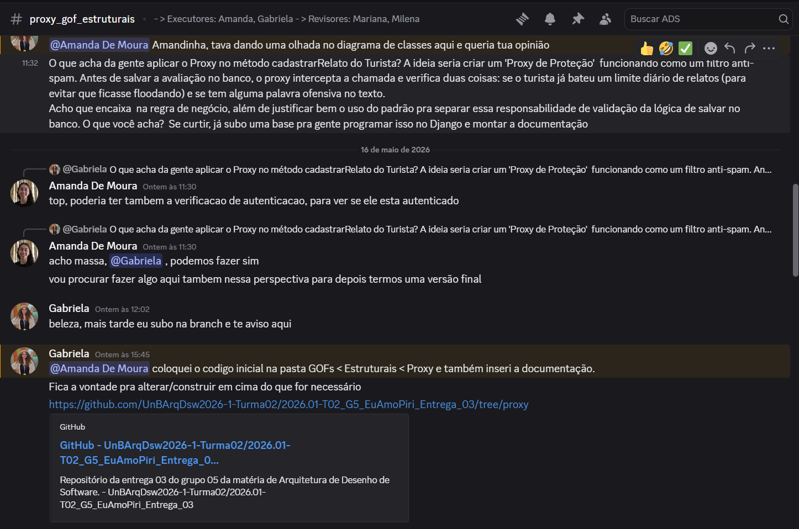
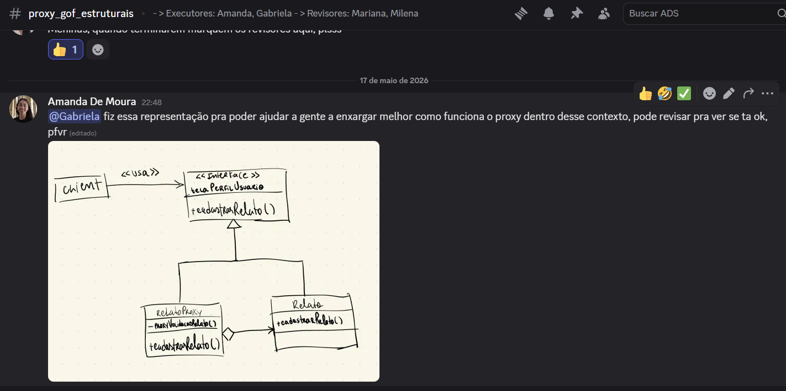
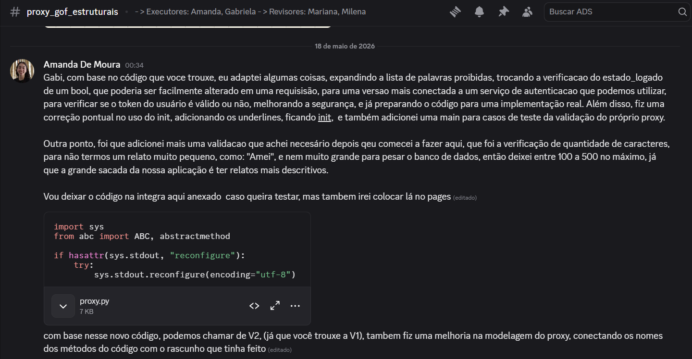
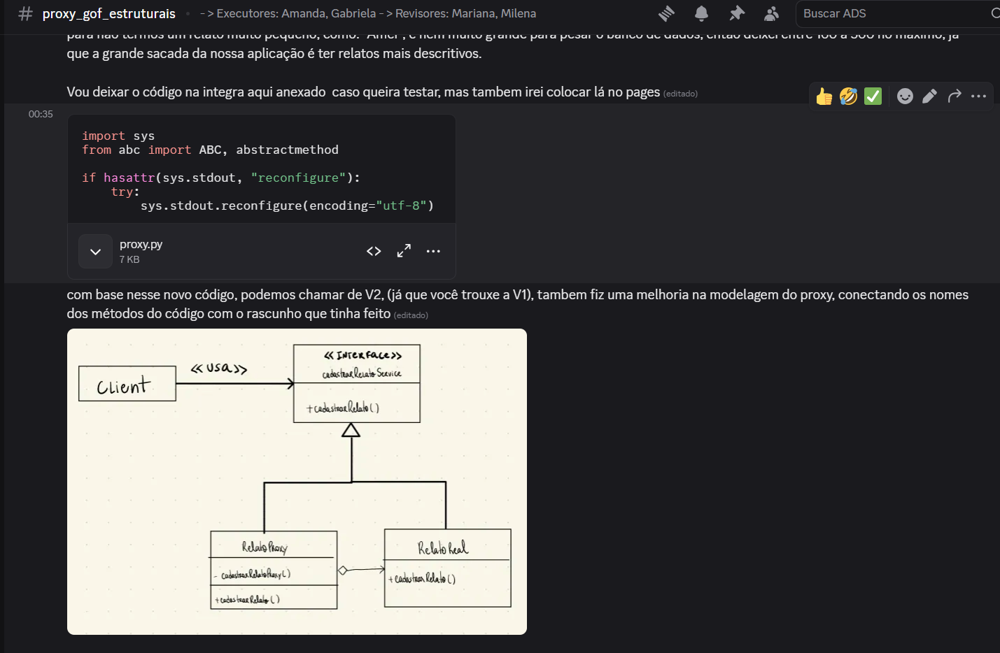
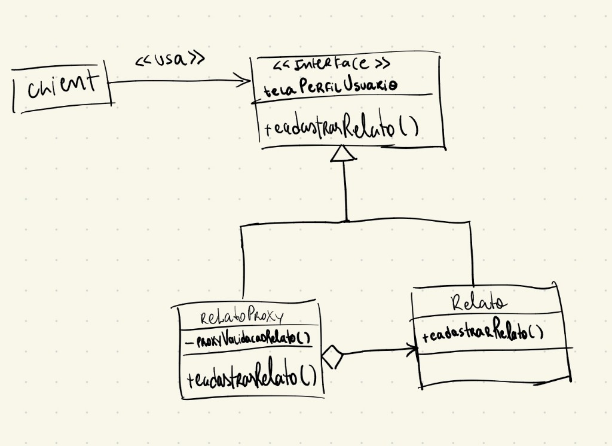
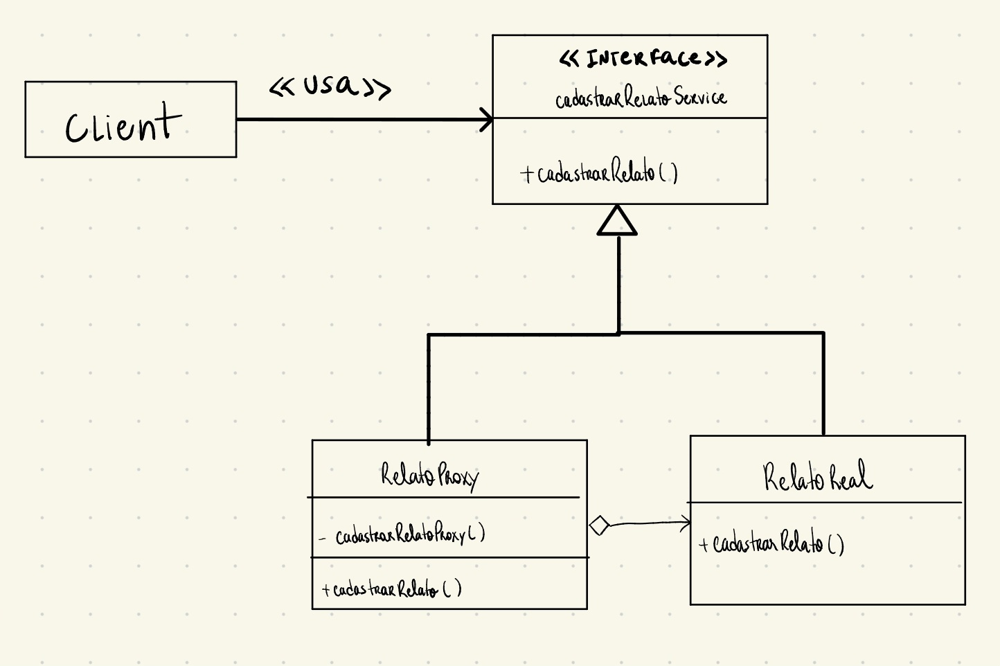

# 3.2.5 Proxy

## Introdução: Padrão GOF Proxy

O padrão de projeto Proxy é um padrão estrutural que fornece um substituto ou marcador de posição para outro objeto, controlando o acesso a ele. A intenção principal do Proxy é criar um intermediário que gerencia o acesso ao objeto real, permitindo adicionar funcionalidades extras, como controle de permissões, validação de requisições, lazy loading ou cache, antes de encaminhar a solicitação ao objeto verdadeiro. Este padrão é fundamental quando se deseja adicionar uma camada de segurança e controle sem modificar o código do objeto original.

No contexto de plataformas interativas, a utilização do padrão Proxy atua como um "guardião". Ele intercepta as requisições antes de repassá-las aos serviços de banco de dados, aplicando regras de negócio e restrições. Essa abordagem está em estrita conformidade com o Princípio da Responsabilidade Única (SRP) do SOLID, uma vez que separa a lógica de validação de dados da lógica de persistência, aumentando a manutenibilidade e a segurança do software.

## 2. Objetivo

O objetivo principal da aplicação do padrão Proxy no sistema EuAmoPiri é proteger a integridade dos dados e a reputação dos estabelecimentos turísticos locais. Ao encapsular a lógica de criação de avaliações (relatos), o Proxy garante que nenhuma interação com o banco de dados ocorra sem antes passar por rigorosas verificações de segurança, autenticação e políticas anti-spam, promovendo um ecossistema digital confiável para turistas e moradores de Pirenópolis.

## 3. Metodologia

A metodologia para a aplicação do padrão de projeto Proxy neste trabalho seguiu etapas de análise estrutural, comunicação assíncrona entre executoras, modelagem, implementação e validação.

O primeiro passo consistiu na análise do diagrama de classes do projeto EuAmoPiri. A partir dessa avaliação, identificou-se a necessidade de implementar um sistema de controle, validação e anti-spam para o registro de avaliações na plataforma (método `cadastrarRelato()`, associado ao ator Turista). A justificativa para essa escolha baseia-se na necessidade de proteger os estabelecimentos e pontos turísticos de Pirenópolis contra abusos, como o review bombing (avaliações falsas em massa) e a publicação de conteúdos impróprios, garantindo que o sistema de ranqueamento da plataforma mantenha sua credibilidade.

O padrão Proxy mostrou-se a solução arquitetural ideal para este cenário. Ele intercepta cada requisição de cadastro de relato e valida-a antes de delegar a criação da entidade ao serviço real (`RelatoServiceReal`), preservando a mesma interface do Subject (`cadastrarRelatoService`).

### 3.1 Comunicações assíncronas entre executoras

As executoras **Amanda de Moura** e **Gabriela Dourado** se comunicaram a construção do Proxy pelo canal `#proxy_gof_estruturais`, n aplataforma Discord, de forma assíncrona, registrando decisões de arquitetura, modelagem UML e refinamento de código. Abaixo, o resumo cronológico de cada troca relevante.

#### Discussão inicial — proposta do Proxy de proteção 



*Figura A — Proposta inicial de aplicação do padrão Proxy.*

**Resumo:** Gabriela propôs aplicar um **Proxy de proteção** ao método `cadastrarRelato()` da classe `Turista`, interceptando a chamada antes da persistência para verificar limite diário de relatos e linguagem ofensiva, separando validação da lógica de gravação. Amanda concordou com a ideia e sugeriu incluir também a **verificação de autenticação** (usuário logado).
#### Primeiro esboço estrutural — estrutura v1 



*Figura B — Representação visual do Proxy no contexto EuAmoPiri (versão 1).*

**Resumo:** Amanda compartilhou um diagrama de classes à mão para facilitar a visualização do padrão: `Client` usa a interface `telaPerfilUsuario`; `RelatoProxy` implementa a interface, possui o método privado `proxyValidacaoRelato()` e delega a `Relato` (objeto real) após as validações. Solicitou revisão de Gabriela para validar se o desenho representava corretamente o fluxo acordado.

#### Evolução do código — implementação da v2



*Figura C — Refinamentos técnicos da implementação (versão 2).*

**Resumo:** Amanda descreveu as melhorias sobre a base de Gabriela: ampliação da lista de palavras proibidas; troca do `esta_logado` booleano por **validação de token** (`ServicoAutenticacao`); correção do construtor para `__init__`; inclusão do bloco `main()` para testes; e nova regra de **tamanho do relato** (mínimo 100 e máximo 500 caracteres), para evitar textos vazios, muito curtos ou excessivamente longos.

#### Segundo esboço estrutural — estrutura v2 



*Figura D — Modelagem alinhada ao código da versão 2.*

**Resumo:** Amanda enviou o diagrama v2 alinhado ao `proxy.py`: interface `cadastrarRelatoService`, classes `RelatoProxy` (com `cadastrarRelatoProxy()` privado) e `RelatoReal`, mantendo a relação de agregação entre proxy e objeto real. Explicou que o limite de 100–500 caracteres reforça o diferencial do EuAmoPiri — relatos mais descritivos — sem sobrecarregar o banco de dados.

### 3.3 Regras de negócio aplicadas pelo Proxy

As verificações implementadas na versão consolidada do artefato seguem a ordem abaixo. Qualquer falha interrompe o fluxo e retorna uma resposta de erro ao cliente, sem acionar o serviço real:

| Ordem | Verificação | Descrição | Mensagem de bloqueio (exemplo) |
| ----- | ----------- | --------- | ------------------------------ |
| 1 | **Autenticação por token** | Valida o token de sessão via `ServicoAutenticacao.obter_usuario_por_token()`, simulando login OAuth (ex.: Google). | *"Erro: Você precisa estar logado na plataforma."* |
| 2 | **Tamanho mínimo do texto** | O relato deve ter pelo menos **100 caracteres**, incentivando avaliações substantivas. | *"O relato deve ter pelo menos 100 caracteres."* |
| 3 | **Tamanho máximo do texto** | O relato não pode ultrapassar **500 caracteres**. | *"O relato não pode ultrapassar 500 caracteres."* |
| 4 | **Filtro de vocabulário** | Bloqueia termos ofensivos, palavrões e conteúdo de spam (cassino, apostas, golpes financeiros etc.). | *"Erro: Linguagem inadequada."* |
| 5 | **Anti-spam (limite diário)** | Cada usuário autenticado pode publicar no máximo **3 relatos por dia** (controle em memória por `usuario_id`). | *"Erro: Limite de 3 relatos/dia atingido."* |

Somente após a aprovação de todas as etapas o Proxy repassa a chamada ao `RelatoServiceReal`, que simula a persistência no banco de dados.

### 3.4 Modelagem e papéis no padrão Proxy

| Papel (GoF) | Classe no artefato | Responsabilidade |
| ----------- | ------------------ | ---------------- |
| Subject | `cadastrarRelatoService` | Interface comum entre Proxy e serviço real. |
| RealSubject | `RelatoServiceReal` | Persistência do relato (simulada). |
| Proxy | `cadastrarRelatoServiceProxy` | Interceptação, validações e delegação condicional. |
| Serviço auxiliar | `ServicoAutenticacao` | Resolução do token dos dados do usuário (`id`, `nome`, `tipo`). |

## 4.0 Evolução do artefato

A evolução do código foi registrada em duas versões na seção **Evolução do artefato**. A versão 1.0 validou a estrutura Proxy com autenticação booleana simplificada; a versão 2.0 incorpora autenticação por token, limites de tamanho do texto e lista ampliada de palavras proibidas, com exemplos de casos de testes na `main()`.

#### Versão 1.0 

A primeira versão em Python materializa o diagrama acima, estruturando a interface comum e validando a intercepção das chamadas. O código implementa o `RelatoServiceProxy`, que recebe a requisição do cliente, aplica a barreira tripla de segurança (autenticação booleana, filtro de vocabulário e limite diário por `turista_id`) e, somente em caso de sucesso, aciona o `RealRelatoService`.

```python
from abc import ABC, abstractmethod

# Interface Comum (Subject)
class IRelatoService(ABC):
    @abstractmethod
    def cadastrar_relato(self, turista_id: int, relato_texto: str, avaliacao: int, esta_logado: bool) -> dict:
        pass

# Serviço Real (RealSubject)
class RealRelatoService(IRelatoService):
    def cadastrar_relato(self, turista_id: int, relato_texto: str, avaliacao: int, esta_logado: bool) -> dict:
        print(f"[Serviço Real] ✓ Salvando o relato do turista {turista_id} no banco de dados do EuAmoPiri...")
        return {"sucesso": True, "mensagem": "Relato publicado com sucesso!"}

# Proxy de Proteção
class RelatoServiceProxy(IRelatoService):
    def __init__(self, servico_real: IRelatoService):
        self._servico_real = servico_real
        self._contagem_diaria = {}
        self._palavras_proibidas = ["fraude", "lixo", "spam", "ofensa"]

    def cadastrar_relato(self, turista_id: int, relato_texto: str, avaliacao: int, esta_logado: bool) -> dict:
        print(f"\n[Proxy] Interceptando requisição do Turista ID: {turista_id}...")

        # 1. Validação de Autenticação
        if not esta_logado:
            print("[Proxy] ✗ BLOQUEADO: Usuário não autenticado.")
            return {"sucesso": False, "mensagem": "Erro: Você precisa fazer login para avaliar."}

        # 2. Validação de Conteúdo
        if any(palavra in relato_texto.lower() for palavra in self._palavras_proibidas):
            print("[Proxy] ✗ BLOQUEADO: Vocabulário impróprio detectado.")
            return {"sucesso": False, "mensagem": "Erro: Publicação bloqueada devido a linguagem inadequada."}

        # 3. Validação Anti-Spam
        relatos_hoje = self._contagem_diaria.get(turista_id, 0)
        if relatos_hoje >= 3:
            print(f"[Proxy] ✗ BLOQUEADO: Limite diário excedido.")
            return {"sucesso": False, "mensagem": "Erro: Limite de 3 relatos por dia atingido."}

        self._contagem_diaria[turista_id] = relatos_hoje + 1
        print("[Proxy] ✓ Validações aprovadas. Repassando para o Serviço Real...")
        return self._servico_real.cadastrar_relato(turista_id, relato_texto, avaliacao, esta_logado)

# Código Cliente (Demonstração)
if __name__ == "__main__":
    print("=== Demonstração do Padrão Proxy: EuAmoPiri ===")
    proxy = RelatoServiceProxy(RealRelatoService())
    id_turista = 101

    proxy.cadastrar_relato(id_turista, "Lugar bonito!", 5, esta_logado=False)  # Falha de Login
    proxy.cadastrar_relato(id_turista, "Lugar lixo!", 1, esta_logado=True)     # Falha de Filtro

    for i in range(1, 5):  # Fluxo normal (vai barrar no 4º)
        proxy.cadastrar_relato(id_turista, f"Visita {i} incrível!", 5, esta_logado=True)
```

**Limitações da v1.0:** autenticação representada apenas por flag booleana; ausência de validação de tamanho do texto; lista reduzida de palavras proibidas.

---

#### Versão 2.0

A segunda versão consolida o artefato em `proxy.py` (raiz do repositório), alinhando nomes ao domínio do projeto e incorporando todas as verificações descritas na metodologia. A organização do código segue o esqueleto canônico do padrão Proxy em Python descrito no [SourceMaking](https://sourcemaking.com/design_patterns/proxy/python/1): interface comum (`Subject` → `cadastrarRelatoService`), objeto real (`RealSubject` → `RelatoServiceReal`) e proxy (`Proxy` → `cadastrarRelatoServiceProxy`) que mantém referência ao real e intercepta `cadastrar_relato()` antes da delegação.

Principais evoluções em relação à v1.0:

- Autenticação por **token** (`ServicoAutenticacao`), com identificação do usuário (`id`, `nome`, `tipo`).
- Validação de **tamanho mínimo (100)** e **máximo (500)** caracteres do relato.
- **Filtro de vocabulário** ampliado (ofensas, apostas, golpes).
- Contagem anti-spam vinculada ao `usuario_id` resolvido pelo token.
- Suíte de testes em `main()` com cenários realistas de Pirenópolis.

```python
import sys
from abc import ABC, abstractmethod

if hasattr(sys.stdout, "reconfigure"):
    try:
        sys.stdout.reconfigure(encoding="utf-8")
    except (OSError, ValueError):
        pass


class ServicoAutenticacao:
    """Simula o validador de tokens do sistema (ex.: login via Google)."""

    @staticmethod
    def obter_usuario_por_token(token: str) -> dict | None:
        tokens_validos = {
            "token_google_joao123": {"id": 1, "nome": "João", "tipo": "Turista"},
            "token_google_maria456": {"id": 2, "nome": "Maria", "tipo": "Morador"},
        }
        return tokens_validos.get(token)


# Interface
class cadastrarRelatoService(ABC):
    @abstractmethod
    def cadastrar_relato(self, token_autenticacao: str, relato_texto: str, avaliacao: int) -> dict:
        pass


# Serviço Real
class RelatoServiceReal(cadastrarRelatoService):
    def cadastrar_relato(self, token_autenticacao: str, relato_texto: str, avaliacao: int) -> dict:
        print("[Serviço Real] Conectando ao banco de dados...")
        print("[Serviço Real] Gravando o relato seguramente no banco de dados...")
        return {"sucesso": True, "mensagem": "Relato publicado com sucesso!"}


# Proxy
class cadastrarRelatoServiceProxy(cadastrarRelatoService):
    def __init__(self, servico_real: cadastrarRelatoService):
        self._servico_real = servico_real
        self._contagem_diaria = {}
        self._palavras_proibidas = [
            "lixo", "merda", "bosta", "pqp", "fdp",
            "idiota", "imbecil", "otário", "otario", "desgraça", "desgraca",
            "tigrinho", "cassino", "casino", "bet", "roleta", "fortune", "aviator",
            "ganhe dinheiro", "trabalhe em casa", "renda extra",
            "transferência", "transferencia",
        ]

    def cadastrar_relato(self, token_autenticacao: str, relato_texto: str, avaliacao: int) -> dict:
        print("\n[Proxy] Interceptando requisição. Analisando o token recebido...")

        usuario = ServicoAutenticacao.obter_usuario_por_token(token_autenticacao)
        if usuario is None:
            print("[Proxy] ✗ BLOQUEADO: Token inválido ou expirado. Usuário não autenticado.")
            return {"sucesso": False, "mensagem": "Erro: Você precisa estar logado na plataforma."}

        usuario_id = usuario["id"]
        print(f"[Proxy] ✓ Usuário autenticado: {usuario['nome']} ({usuario['tipo']}) — ID {usuario_id}")

        tamanho_texto = len(relato_texto)
        if tamanho_texto < 100:
            print("[Proxy] ✗ BLOQUEADO: Texto muito curto.")
            return {"sucesso": False, "mensagem": "O relato deve ter pelo menos 100 caracteres."}

        if tamanho_texto > 500:
            print(f"[Proxy] ✗ BLOQUEADO: Texto excedeu o limite ({tamanho_texto}/500).")
            return {"sucesso": False, "mensagem": "O relato não pode ultrapassar 500 caracteres."}

        if any(palavra in relato_texto.lower() for palavra in self._palavras_proibidas):
            print("[Proxy] ✗ BLOQUEADO: Vocabulário impróprio detectado.")
            return {"sucesso": False, "mensagem": "Erro: Linguagem inadequada."}

        relatos_hoje = self._contagem_diaria.get(usuario_id, 0)
        if relatos_hoje >= 3:
            print("[Proxy] ✗ BLOQUEADO: Limite diário excedido.")
            return {"sucesso": False, "mensagem": "Erro: Limite de 3 relatos/dia atingido."}

        self._contagem_diaria[usuario_id] = relatos_hoje + 1
        print("[Proxy] ✓ Validações aprovadas. Repassando para o Serviço Real...")

        return self._servico_real.cadastrar_relato(token_autenticacao, relato_texto, avaliacao)


# --- Para testes ---

def main():
    servico_real = RelatoServiceReal()
    api_cadastrar_relato = cadastrarRelatoServiceProxy(servico_real)

    # Token inválido (usuário deslogado ou não existe)
    api_cadastrar_relato.cadastrar_relato(
        "token_invalido_ou_vazio",
        "Mirante ao entardecer com vista ampla da serra de Pirenópolis. Acesso tranquilo e ótimo para fotos; leve água, repelente e calçado confortável.",
        5,
    )

    # Conteúdo impróprio
    api_cadastrar_relato.cadastrar_relato(
        "token_google_maria456",
        "Essa pousada é um lixo: quarto úmido, barulho à noite, ar-condicionado fraco e check-in lento. Não recomendo para famílias com crianças pequenas.",
        2,
    )

    # Texto muito curto
    api_cadastrar_relato.cadastrar_relato(
        "token_google_joao123",
        "Gostei muito!",
        3,
    )

    # Relatos válidos até o limite diário
    # 1/3
    api_cadastrar_relato.cadastrar_relato(
        "token_google_maria456",
        "A trilha até a cachoeira estava mal sinalizada e o poço tinha pouca água na época seca. Experiência mediana; voltaria só com guia e planejamento.",
        2,
    )

    # 2/3
    api_cadastrar_relato.cadastrar_relato(
        "token_google_maria456",
        "Pousada simples no centro: café da manhã básico e quarto limpo. Não há luxo nem vista especial, mas cumpre bem para uma noite antes do passeio.",
        3,
    )

    # 3/3
    api_cadastrar_relato.cadastrar_relato(
        "token_google_maria456",
        "Restaurante regional com tempero caseiro, mandioca fresca e atendimento gentil. O prato demorou um pouco na cozinha, porém o sabor compensou a espera.",
        4,
    )

    # Limite diário excedido
    api_cadastrar_relato.cadastrar_relato(
        "token_google_maria456",
        "Voltei à feira de cigarra e o centro histórico continua encantador, com música, artesanato e ruas floridas. Quero compartilhar mais dicas com turistas.",
        5,
    )

    # Outro usuário autenticado (João)
    api_cadastrar_relato.cadastrar_relato(
        "token_google_joao123",
        "Almoço no centro com peixe na telha, angu e suco de fruta da estação. Comida saborosa, porção generosa e preço justo para roteiro gastronômico.",
        5,
    )

if __name__ == "__main__":
    main()
```

### 4.1 Estrutura do Proxy

Esta subseção registra a evolução da modelagem UML do padrão no domínio EuAmoPiri, alinhada às versões de código do artefato.

#### Versão 1



*Figura 1 — Diagrama de classes da estrutura Proxy aplicada ao cadastro de relatos (versão 1).*

O diagrama representa a aplicação clássica do padrão Proxy ao fluxo de publicação de relatos na tela de perfil do usuário:

- **Client** — ator que solicita o cadastro (turista na interface). Depende da interface `telaPerfilUsuario` (`<<usa>>`), sem conhecer se a chamada será atendida pelo objeto real ou pelo proxy.
- **`<<Interface>> telaPerfilUsuario` (Subject)** — contrato comum com o método `+cadastrarRelato()`, permitindo que Client, Proxy e objeto real sejam tratados de forma uniforme.
- **`Relato` (RealSubject)** — implementa a interface e executa a persistência efetiva do relato no sistema.
- **`RelatoProxy` (Proxy)** — também implementa `telaPerfilUsuario` e mantém referência agregada a `Relato`. Antes de delegar, executa `proxyValidacaoRelato()` (método privado de validação). O método público `+cadastrarRelato()` intercepta a requisição, aplica as regras de proteção e, somente se forem atendidas, repassa a operação ao `Relato`.

Esse desenho separa a **lógica de validação** (no proxy) da **lógica de persistência** (no objeto real), alinhando-se ao SRP e preparando a evolução incremental do artefato.

#### Versão 2



*Figura 2 — Diagrama de classes da estrutura Proxy refinada para o cadastro de relatos (versão 2).*

A versão 2 refina a modelagem para refletir a nomenclatura e o escopo consolidados em `proxy.py`, mantendo o mesmo padrão estrutural:

- **Client** — continua dependendo apenas da interface (`<<usa>>`), sem distinguir proxy do objeto real.
- **`<<Interface>> cadastrarRelatoService` (Subject)** — contrato unificado com `+cadastrarRelato()`, nome alinhado ao domínio e ao método do diagrama de classes do EuAmoPiri.
- **`RelatoReal` (RealSubject)** — implementa a interface e concentra a persistência do relato; corresponde à classe `RelatoServiceReal` no código.
- **`RelatoProxy` (Proxy)** — implementa `cadastrarRelatoService`, agrega `RelatoReal` e encapsula as validações no método privado `-cadastrarRelatoProxy()`. O método público `+cadastrarRelato()` intercepta a requisição (autenticação por token, limites de texto, filtro de vocabulário e anti-spam) e delega ao real somente após aprovação; no código é implementado como `cadastrarRelatoServiceProxy`.

Em relação à versão 1, a interface deixa de estar acoplada à tela (`telaPerfilUsuario`) e passa a nomear explicitamente o **serviço de cadastro de relato**, o que facilita a correspondência direta com as classes Python da versão 2.0 e com as cinco regras de negócio descritas na metodologia. Foi uma forma mais adequada encontrada de representar essa interface, sem pernsar em telas, mas sim no "contrato" dessa comunicação.

---

## Visão dos contribuidores na concepção do artefato

Amanda de Moura: Na minha visão, participar da execução do padrão Proxy foi entender como é importante ter um tratamento das requisições antes de executar o método que irá realizar a ação direta com o banco de dados por exemplo, e isso se torna uma parte crucial, pois entra em controle de usuários, permissões, verificações diante das regras de negócio, por exemplo de conteúdo inapropriado, pois isso pecaria na experiência da plataforma como um todo, e também de pensar em limitações mais técnicas como a quantidade de caractéres em um relato para que não sobrecarrege o sistema de banco de dados, e a plataforma venha a não funcionar. Nessa implementação conseguir ver o proxy influenciando muito no papel de protetor, como um guarda para acessar métodos chaves e de alto risco da aplicação. 

Gabriela Dourado:

## Referências

[1] REFACTORING GURU. Proxy. Disponível em: https://refactoring.guru/pt-br/design-patterns/proxy. Acesso em: 16 de maio de 2026.

[2] SERRANO, Milene. Arquitetura e Desenho de Software - Aula GoFs Estruturais. Slides. Universidade de Brasília, 2026.

[3] SOURCEMAKING. Proxy Design Pattern in Python. Disponível em: https://sourcemaking.com/design_patterns/proxy/python/1. Acesso em: 18 de maio de 2026.

## Histórico do artefato

| Data       | Versão | Descrição                                              | Autor                                                  | Revisores                               |
| ---------- | ------ | ------------------------------------------------------ | ------------------------------------------------------ | --------------------------------------- |
| 15/05/2026 | `1.0`  | Criação inicial da branch e rascunho do código base    | [Gabriela Dourado](https://github.com/gabrieladouradof) | Amanda, Mariana e Milena                |
| 16/05/2026 | `1.1`  | Modelagem e codificação final do Proxy de Proteção     | [Gabriela Dourado](https://github.com/gabrieladouradof) | Amanda, Mariana e Milena                |
| 18/05/2026 | `2.0`  | Verificação de Autenticação por token ao invés de uma variável boolena, expansão das listas das palavras proibidas, verificação de limites de texto, correção no init na v1 do código, e adicição de main para testes | [Amanda De Moura](https://github.com/AmandaaMoura) | Gabriela, Mariana e Milena                |
| 18/05/2026 | `2.0`  | Adição dos desenhos v1 e v2 da estrutura do proxy dentro do contexto escolhido | [Amanda De Moura](https://github.com/AmandaaMoura) | Gabriela, Mariana e Milena   

## Histórico do documento

| Data       | Versão | Descrição                                                      | Autor                                                  | Revisores                |
| ---------- | ------ | -------------------------------------------------------------- | ------------------------------------------------------ | ------------------------ |
| 15/05/2026 | `1.0`  | Criação inicial do documento e estruturação dos tópicos        | [Gabriela Dourado](https://github.com/gabrieladouradof) | Amanda, Mariana e Milena |
| 16/05/2026 | `1.1`  | Elaboração da justificativa metodológica e inclusão do código  | [Gabriela Dourado](https://github.com/gabrieladouradof) | Amanda, Mariana e Milena |
| 18/05/2026 | `1.2`  | Verificações complementadas (5 verificações), e suas devidas explicações dentro das regras de negócio e evolução v2.0 do código | [Amanda De Moura](https://github.com/AmandaaMoura) | Gabriela, Mariana e Milena |
| 18/05/2026 | `1.3`  | Seção *Estrutura do Proxy* com diagrama UML da versão 1.0 | [Amanda De Moura](https://github.com/AmandaaMoura) | Gabriela, Mariana e Milena |
| 18/05/2026 | `1.4`  | Inclusão do diagrama UML da estrutura Proxy (versão 2) | [Amanda De Moura](https://github.com/AmandaaMoura) | Gabriela, Mariana e Milena |
| 18/05/2026 | `1.5`  | Referência SourceMaking e menção na implementação da v2.0 | [Amanda De Moura](https://github.com/AmandaaMoura) | Gabriela, Mariana e Milena |
| 18/05/2026 | `1.6`  | Comunicações assíncronas na metodologia com prints do canal `#proxy_gof_estruturais` | [Amanda De Moura](https://github.com/AmandaaMoura) | Gabriela, Mariana e Milena |
