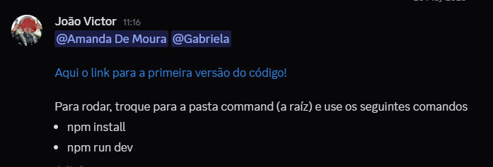
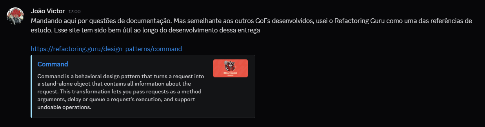
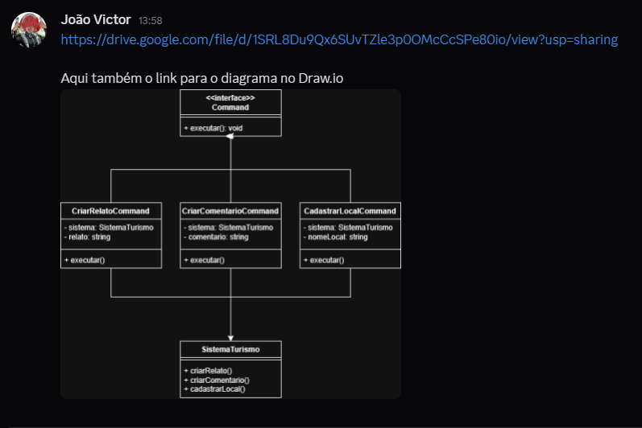
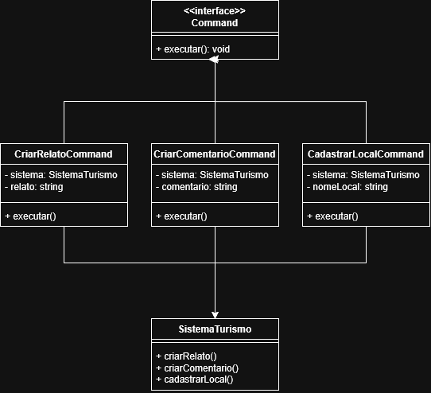
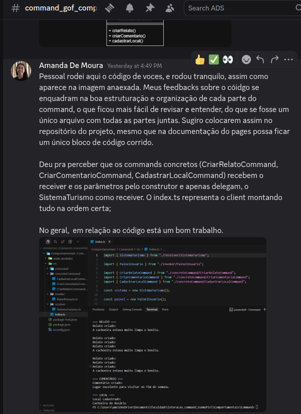
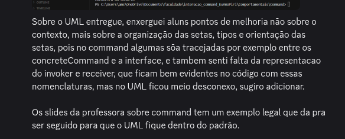
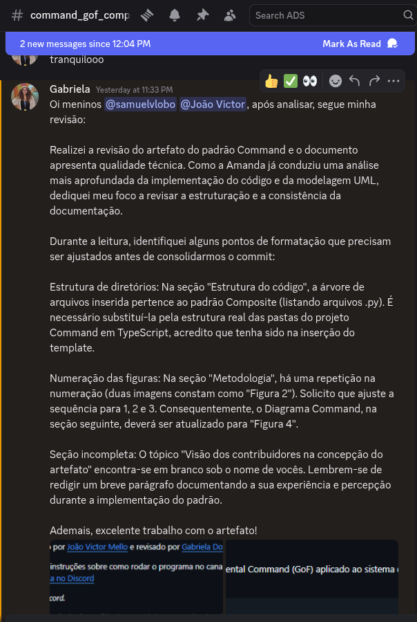
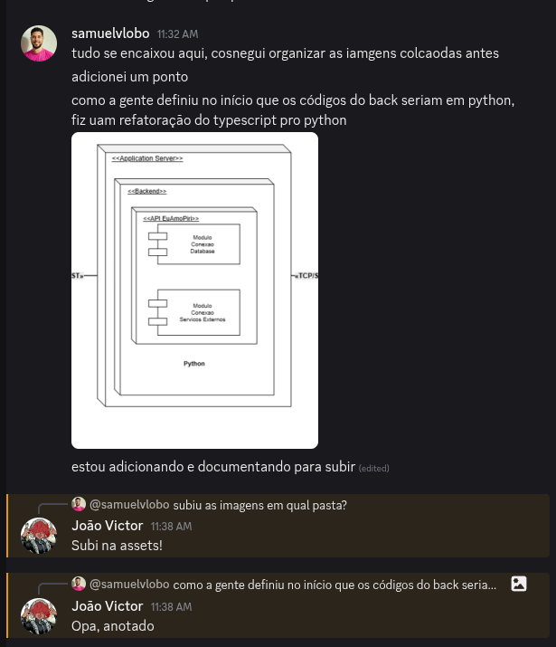
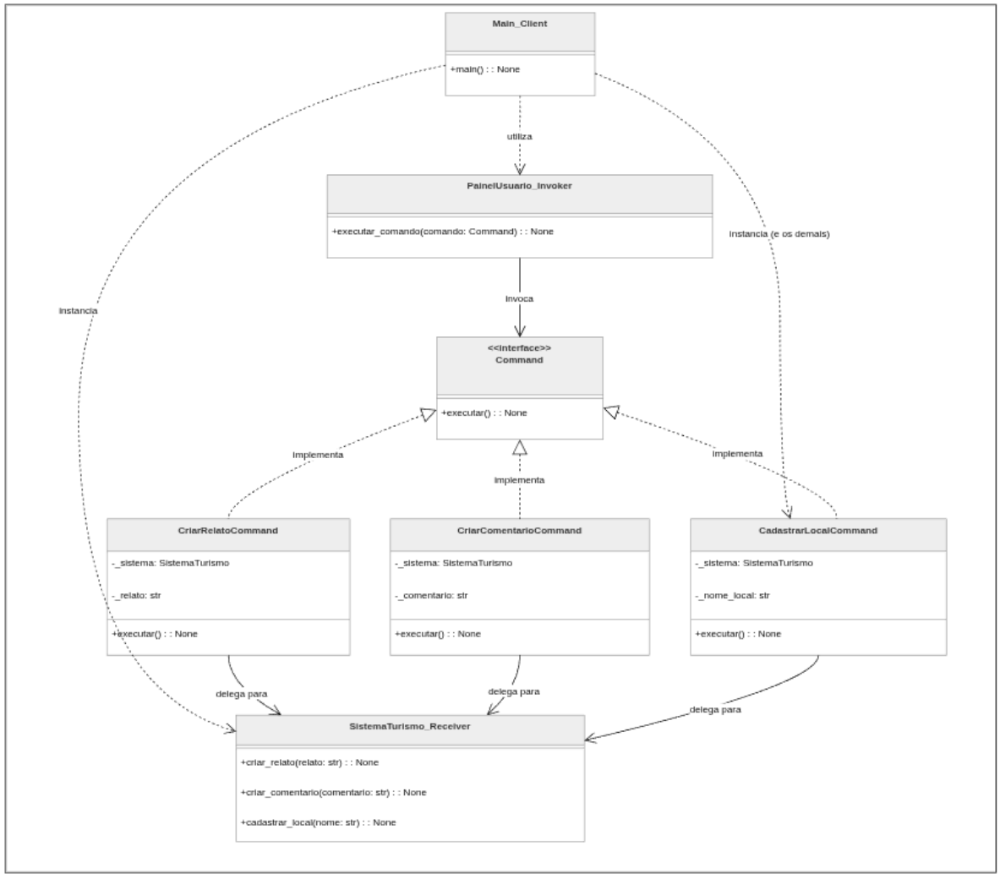

# 3.3.1 GoF Comportamental - Command

## Introdução

O Command é um padrão de projeto comportamental que transforma solicitações em objetos independentes contendo todas as informações necessárias para executar uma ação. Segundo o Refactoring Guru (2026), esse padrão permite desacoplar o objeto que faz a solicitação do objeto responsável pela execução da operação, tornando o sistema mais flexível e extensível.

Além de reduzir o acoplamento entre classes, o padrão Command possibilita o armazenamento de operações, execução de comandos em filas, implementação de funcionalidades de desfazer/refazer (undo/redo) e reutilização de ações em diferentes contextos.

No contexto do projeto EuAmoPiri, o padrão foi aplicado para encapsular operações realizadas pelos usuários da plataforma — como criação de relatos, comentários e cadastro de locais turísticos — transformando cada ação em um comando independente executado pelo sistema de turismo da aplicação.

## Objetivo

Como o padrão Command pertence à categoria de padrões comportamentais, utilizei TypeScript para o desenvolvimento, mantendo compatibilidade com a stack utilizada no projeto EuAmoPiri.

O objetivo da implementação foi desacoplar a interface responsável por solicitar ações do sistema responsável por executá-las, permitindo que operações relacionadas ao turismo da plataforma fossem encapsuladas em comandos reutilizáveis.

## Metodologia

Para alcançarmos o objetivo da implementação do padrão Command, foram realizados os seguintes passos:

- Utilização do diagrama de classes desenvolvido anteriormente para o projeto EuAmoPiri como base para estruturar os comandos e suas responsabilidades;
- Consulta ao material disponibilizado pela professora, incluindo slides, videoaulas e exemplos práticos;
- Estudo da documentação e exemplos do site Refactoring Guru;
- Desenvolvimento de uma estrutura desacoplada contendo Interface Command, Concrete Commands, Receiver, Invoker e Cliente (index.ts).

A comunicação da equipe ocorreu através do servidor da disciplina no Discord, utilizando canais específicos para compartilhamento de referências e evolução do desenvolvimento.

O artefato foi feito por [João Victor Mello][Joao] e revisado por [Gabriela Dourado][Gabriela] e [Amanda de Moura][Amanda].


Envio de instruções sobre como rodar o programa no canal de texto do Discord.



Envio de referência confiável no canal do Composite do Discord.



Envio do diagrama de Command do Discord e criação de link no draw.io.



---

## Evolução do artefato

### Diagrama Command

O diagrama desenvolvido apresenta a aplicação do padrão comportamental Command no contexto das ações realizadas dentro do sistema EuAmoPiri.

Cada operação executada pelo usuário é encapsulada em um comando independente, permitindo desacoplamento entre a interface que solicita a ação e a classe responsável pela execução da lógica do sistema.


Figura 4: Diagrama Command.



O link do diagrama no draw.io pode ser acessado [aqui](https://drive.google.com/file/d/1SRL8Du9Qx6SUvTZle3p0OMcCcSPe80io/view?usp=sharing)

---

### Estrutura do código

Implementação do padrão de projeto comportamental Command (GoF) aplicado ao sistema de interações do projeto Eu Amo Piri em TypeScript.

```
Composite/
├── item_local.py        # Component (interface abstrata)
├── local.py             # Base abstrata das folhas (Leaf)
├── estabelecimento.py   # Leaf concreta
├── ponto_turistico.py   # Leaf concreta
├── categoria_local.py   # Composite
├── main.py              # Cliente — exemplo de uso
└── README.md
```

#### 1. Definição da interface Command

Representa a interface comum utilizada por todos os comandos do sistema.

```
export interface Command {
    execute(): void;
}
```

#### 2. Implementação dos Concrete Commands

Os Concrete Commands encapsulam solicitações específicas do sistema.

CriarRelatoCommand
```
import { Command } from "../command/Command";
import { SistemaTurismo } from "../receiver/SistemaTurismo";

export class CriarRelatoCommand
implements Command {

    constructor(
        private sistema: SistemaTurismo,
        private titulo: string,
        private descricao: string
    ) {}

    execute(): void {
        this.sistema.criarRelato(
            this.titulo,
            this.descricao
        );
    }
}
```

CriarComentarioCommand
```
import { Command } from "../command/Command";
import { SistemaTurismo } from "../receiver/SistemaTurismo";

export class CriarComentarioCommand
implements Command {

    constructor(
        private sistema: SistemaTurismo,
        private comentario: string
    ) {}

    execute(): void {
        this.sistema.criarComentario(
            this.comentario
        );
    }
}
```

CadastrarLocalCommand
```
import { Command } from "../command/Command";
import { SistemaTurismo } from "../receiver/SistemaTurismo";

export class CadastrarLocalCommand
implements Command {

    constructor(
        private sistema: SistemaTurismo,
        private nomeLocal: string
    ) {}

    execute(): void {
        this.sistema.cadastrarLocal(
            this.nomeLocal
        );
    }
}
```

#### 3. Implementação do Receiver

SistemaTurismo
```
export class SistemaTurismo {

    criarRelato(
        titulo: string,
        descricao: string
    ): void {

        console.log(
            `Relato criado:
            ${titulo} - ${descricao}`
        );
    }

    criarComentario(
        comentario: string
    ): void {

        console.log(
            `Comentário criado:
            ${comentario}`
        );
    }

    cadastrarLocal(
        nomeLocal: string
    ): void {

        console.log(
            `Local cadastrado:
            ${nomeLocal}`
        );
    }
}
```

#### 4. Implementação do Invoker

PainelUsuario
```
import { Command } from "../command/Command";

export class PainelUsuario {

    private comando!: Command;

    setCommand(
        comando: Command
    ): void {

        this.comando = comando;
    }

    executarComando(): void {

        this.comando.execute();
    }
}
```

#### 5. Cliente (index)

index.ts
```
import { SistemaTurismo }
from "./receiver/SistemaTurismo";

import { PainelUsuario }
from "./invoker/PainelUsuario";

import { CriarRelatoCommand }
from "./concreteCommand/CriarRelatoCommand";

import { CriarComentarioCommand }
from "./concreteCommand/CriarComentarioCommand";

import { CadastrarLocalCommand }
from "./concreteCommand/CadastrarLocalCommand";

const sistema =
    new SistemaTurismo();

const painel =
    new PainelUsuario();

const relatoCommand =
    new CriarRelatoCommand(
        sistema,
        "Viagem para Pirenópolis",
        "Cidade histórica incrível"
    );

const comentarioCommand =
    new CriarComentarioCommand(
        sistema,
        "Lugar muito bonito!"
    );

const localCommand =
    new CadastrarLocalCommand(
        sistema,
        "Cachoeira do Abade"
    );

painel.setCommand(relatoCommand);
painel.executarComando();

painel.setCommand(comentarioCommand);
painel.executarComando();

painel.setCommand(localCommand);
painel.executarComando();
```

---

### Execução

O arquivo .zip com o código está disponível para download [neste link](https://drive.google.com/file/d/1QsHiP4vcDr2rLL4w0GsxFRixmUPnDoOY/view?usp=sharing). Para executá-lo cumpra os passos a seguir:

Pré-requisitos
- Node.js instalado;
- TypeScript instalado no projeto.

Para verificar a versão do Node.js:
```
node --version
```

**Instalação das dependências**

Na raiz do projeto (pasta Command) execute:
```
npm install
```

Caso as dependências ainda não estejam instaladas:
```
npm install typescript ts-node @types/node
```

**Executando o projeto**

Entre na pasta do projeto:
```
cd Command
```

Execute o programa:
```
npx ts-node src/index.ts
```

**Saída esperada**
```
Relato criado:
Viagem para Pirenópolis - Cidade histórica incrível

Comentário criado:
Lugar muito bonito!

Local cadastrado:
Cachoeira do Abade
```

### Sobre o padrão

|      Papel      |                                  Classe                                 |
| :-------------: | :---------------------------------------------------------------------: |
|     Command     |                                `Command`                                |
| ConcreteCommand | `CriarRelatoCommand`, `CriarComentarioCommand`, `CadastrarLocalCommand` |
|     Receiver    |                             `SistemaTurismo`                            |
|     Invoker     |                             `PainelUsuario`                             |
|      Client     |                                `index.ts`                               |

---
## Evolução e Refatoração para Python - Samuel

Após a elaboração do protótipo inicial em TypeScript pelo integrante João, pode-se perceber um trabalho condizente com o Command.


Ao avaliar o código inicial, constatou-se que a estrutura lógica do TypeScript estava excelente, rodando bem. No entanto, como definimos Python como a tecnologia oficial do nosso back-end, decidi assumir (Samuel) a refatoração do código do protótipo (TypeScript) para a linguagem definitiva da aplicação (Python).

O print da discussão realizada, em que foram tratadas a realização de um diagrama UML e a refatoração do código de TypeScript para Python e a avaliação dos revisores, no canal da equipe no Discord, encontra-se abaixo:

Figura 5, 6: Feedback revisora Amanda.





Figura 7: Feedback Gabriela:



Figura 8: Discussão para versão Python




# Estrutura de Diretórios e Componentes (Python)

A implementação seguiu uma arquitetura modular baseada no padrão de projeto *Command*, respeitando os princípios de separação de responsabilidades e utilizando recursos nativos do ecossistema Python, como *Abstract Base Classes* (`abc`) e organização por pacotes:

- `command/`: Contém a interface abstrata do comando.
- `receiver/`: Contém o receptor responsável pelas regras de negócio.
- `invoker/`: Contém o invocador que executa os comandos.
- `concrete_command/`: Contém os comandos concretos.
- `main.py`: Ponto de entrada da aplicação (Execução e Testes).

---

## Implementação em Python

Abaixo estão os códigos refatorados que compõem a implementação do padrão *Command* no back-end:

### Estrutura de Diretórios

```text
CommandPython/
├── command/
│   ├── __init__.py
│   └── command.py
├── receiver/
│   ├── __init__.py
│   └── sistema_turismo.py
├── invoker/
│   ├── __init__.py
│   └── painel_usuario.py
├── concrete_command/
│   ├── __init__.py
│   ├── cadastrar_local_command.py
│   ├── criar_comentario_command.py
│   └── criar_relato_command.py
└── main.py
```

---

### 1) `command/command.py`

```python
from abc import ABC, abstractmethod

class Command(ABC):

    @abstractmethod
    def executar(self) -> None:
        pass
```

---

### 2) `receiver/sistema_turismo.py`

```python
class SistemaTurismo:

    def criar_relato(self, relato: str) -> None:
        print("Relato criado:")
        print(relato)

    def criar_comentario(self, comentario: str) -> None:
        print("Comentário criado:")
        print(comentario)

    def cadastrar_local(self, nome: str) -> None:
        print("Local cadastrado:")
        print(nome)
```

---

### 3) `concrete_command/cadastrar_local_command.py`

```python
from command.command import Command
from receiver.sistema_turismo import SistemaTurismo

class CadastrarLocalCommand(Command):

    def __init__(self, sistema: SistemaTurismo, nome_local: str) -> None:
        self._sistema = sistema
        self._nome_local = nome_local

    def executar(self) -> None:
        self._sistema.cadastrar_local(self._nome_local)
```

---

### 4) `concrete_command/criar_comentario_command.py`

```python
from command.command import Command
from receiver.sistema_turismo import SistemaTurismo

class CriarComentarioCommand(Command):

    def __init__(self, sistema: SistemaTurismo, comentario: str) -> None:
        self._sistema = sistema
        self._comentario = comentario

    def executar(self) -> None:
        self._sistema.criar_comentario(self._comentario)
```

---

### 5) `concrete_command/criar_relato_command.py`

```python
from command.command import Command
from receiver.sistema_turismo import SistemaTurismo

class CriarRelatoCommand(Command):

    def __init__(self, sistema: SistemaTurismo, relato: str) -> None:
        self._sistema = sistema
        self._relato = relato

    def executar(self) -> None:
        self._sistema.criar_relato(self._relato)
```

---

### 6) `invoker/painel_usuario.py`

```python
from command.command import Command

class PainelUsuario:

    def executar_comando(self, comando: Command) -> None:
        comando.executar()
```

---

### 7) `main.py`

```python
import sys
import os

# Garante a resolução dos caminhos dos módulos locais
sys.path.append(os.path.dirname(os.path.abspath(__file__)))

from receiver.sistema_turismo import SistemaTurismo
from invoker.painel_usuario import PainelUsuario

from concrete_command.criar_relato_command import CriarRelatoCommand
from concrete_command.criar_comentario_command import CriarComentarioCommand
from concrete_command.cadastrar_local_command import CadastrarLocalCommand


def main() -> None:

    sistema = SistemaTurismo()
    painel = PainelUsuario()

    relato = CriarRelatoCommand(
        sistema,
        "A cachoeira estava muito limpa e bonita."
    )

    comentario = CriarComentarioCommand(
        sistema,
        "Lugar excelente para visitar no fim de semana."
    )

    local = CadastrarLocalCommand(
        sistema,
        "Cachoeira do Rosário"
    )

    print("\n=== RELATO ===")
    painel.executar_comando(relato)

    print("\n=== COMENTÁRIO ===")
    painel.executar_comando(comentario)

    print("\n=== LOCAL ===")
    painel.executar_comando(local)


if __name__ == "__main__":
    main()
```

---
## UML Command para a versão Python

Figura 9: UML Command


---

## Testes e Validação do Código

Após finalizar a implementação, a aplicação foi executada para validar o comportamento do padrão *Command* em Python. Os testes demonstraram que os comandos concretos foram corretamente encapsulados e executados pelo invocador, mantendo o mesmo comportamento funcional da versão original desenvolvida em TypeScript:

```text
=== RELATO ===
Relato criado:
A cachoeira estava muito limpa e bonita.

=== COMENTÁRIO ===
Comentário criado:
Lugar excelente para visitar no fim de semana.

=== LOCAL ===
Local cadastrado:
Cachoeira do Rosário
```

---

## Instruções de Execução

O projeto pode ser executado localmente seguindo os passos abaixo:

**1. Extraia o arquivo `.zip` do projeto.**

**2. Abra a pasta raiz do projeto no terminal.**


**3. Execute o arquivo principal:**

```bash
python main.py
```
Link para obter o código:
https://drive.google.com/file/d/1vlwCmx_jIvcW8equur2z2z0YOaxqGXyq/view?usp=sharing

---
### Implementação do Padrão Command

Para demonstrar o funcionamento e a validação do padrão Command (separação entre a abstração do conteúdo e a sua implementação de processamento), gravamos um vídeo da execução do código no terminal.

🎥 **[Clique aqui para assistir ao vídeo de execução do código no YouTube](https://youtu.be/0IeZ_io1HBg)**
---


## Visão dos contribuidores na concepção do artefato

João Victor: Mesmo durante a pressa para estudá-lo e implementá-lo no sistema, o Command foi um tanto interessante para entender como lidar com a questão de organização das operações. Depois de ter passado por disciplinas como Fundamentos de Sistemas Operacionais, vez ou outra sinto uma curiosidade sobre como funcionam as filas e solicitações de operações em uma plataforma como a que tem sido desenvolvida ao longo desse projeto.

Samuel: No início, a abstração do padrão Command pareceu bastante complexa e difícil de entender, exigindo um tempo de dedicação maior para compreender o papel de cada componente. Contudo, à medida que implementei o Invoker, o Command e o Receiver na prática, a lógica do sistema se tornou clara. Foi uma experiência desafiadora, mas fundamental para entender como o desacoplamento de código torna uma arquitetura mais robusta e escalável.

---

## Referências

> Refactoring Guru. **Command.** Disponível em: <https://refactoring.guru/design-patterns/command>. Acesso em: 20 de maio de 2026.

---

## Histórico do artefato

| Data       | Versão | Descrição                                               | Autor                                                      | Revisores                                                                                                                         |
| ---------- | ------ | ------------------------------------------------------- | ---------------------------------------------------------- | --------------------------------------------------------------------------------------------------------------------------------- |
| 24/04/2026 | `1.0`  | Versão inicial cobrindo interações e cadastro de locais  | [João Victor][Joao] | [Gabriela][Gabriela] e [Amanda][Amanda] |
| 21/05/2026 | `1.1`  | Versão com documentação python  | [Samuel Lobo][Samuel] | [Gabriela][Gabriela] e [Amanda][Amanda] |

## Histórico do documento

| Data       | Versão | Descrição                                                      | Autor                                                      | Revisores |
| ---------- | ------ | -------------------------------------------------------------- | ---------------------------------------------------------- | --------- |
| 20/05/2026 | `1.0`  | Versão inicial do documento | [João Victor][Joao] | [Gabriela Dourado][Gabriela] e [Amanda de Moura][Amanda] |
| 21/05/2026 | `1.0`  | Versão com python | [Samuel Lobo][Samuel] | [Gabriela Dourado][Gabriela] e [Amanda de Moura][Amanda] |

[Joao]: https://github.com/Chaotzuu
[Gabriela]: https://github.com/gabrieladouradof
[Amanda]: https://github.com/AmandaaMoura
[Samuel]: https://github.com/Samuelvlobo
