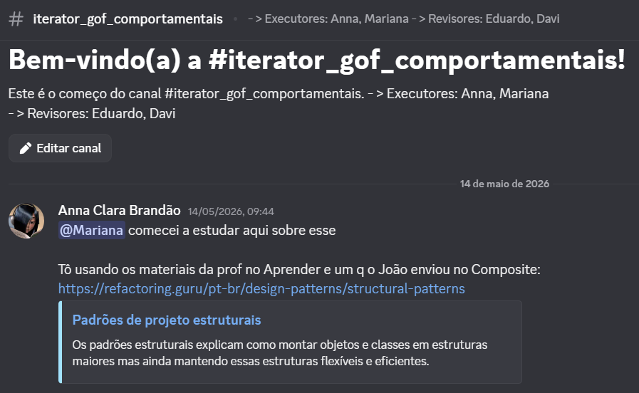
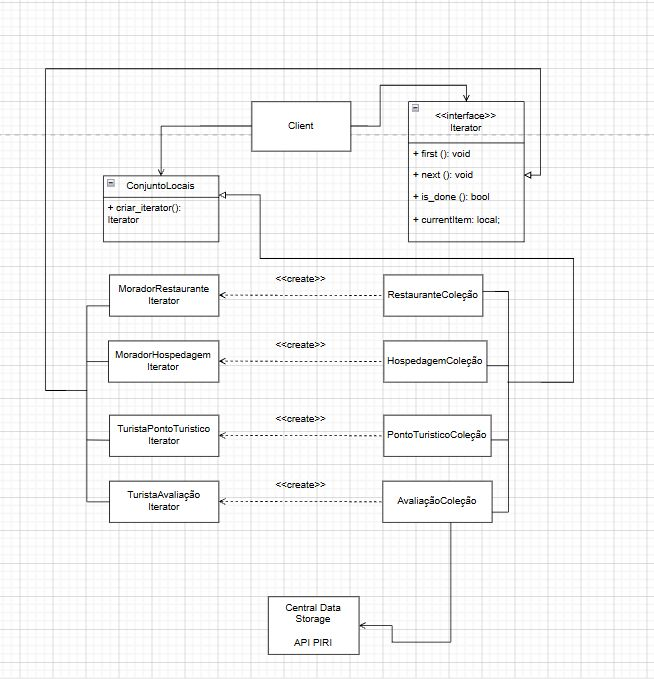
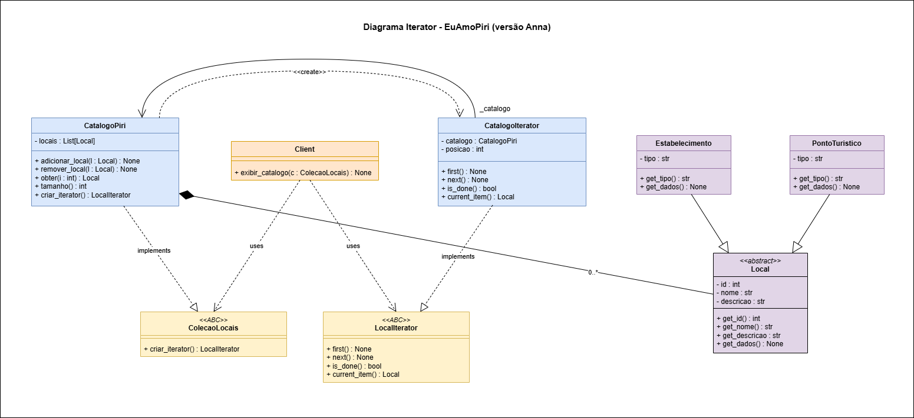
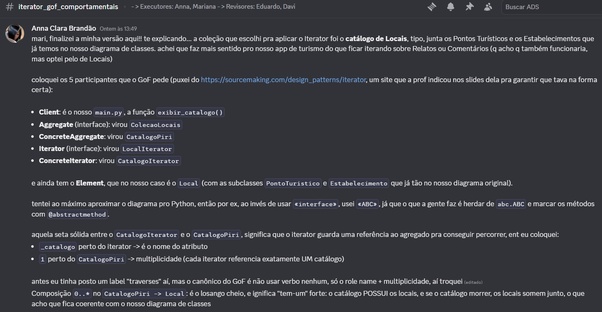
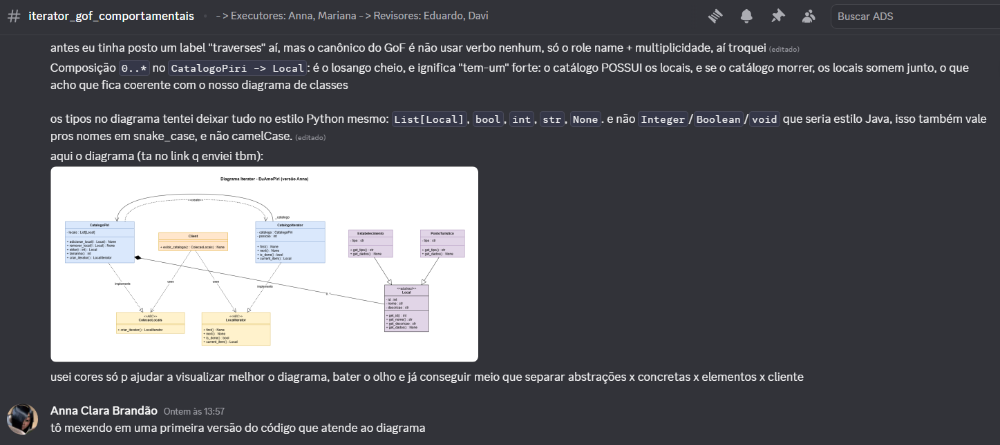
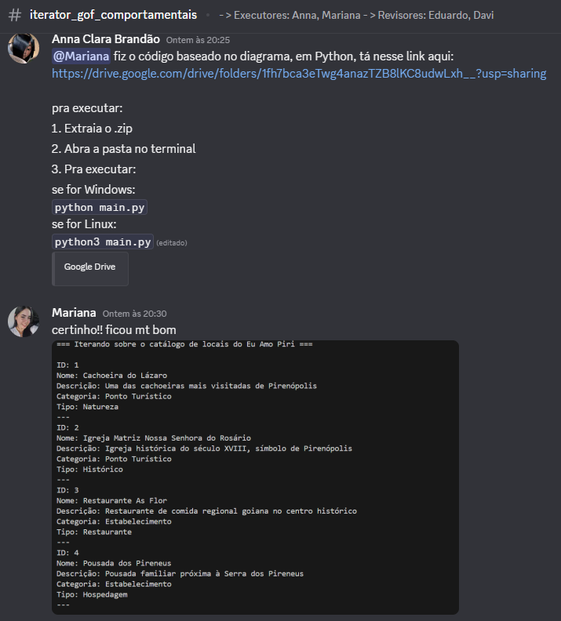
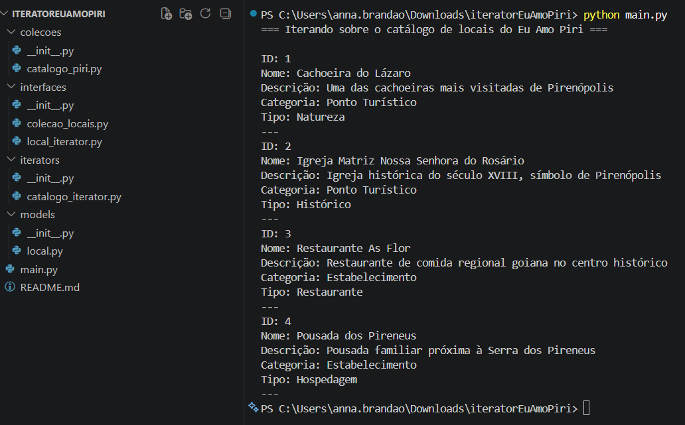
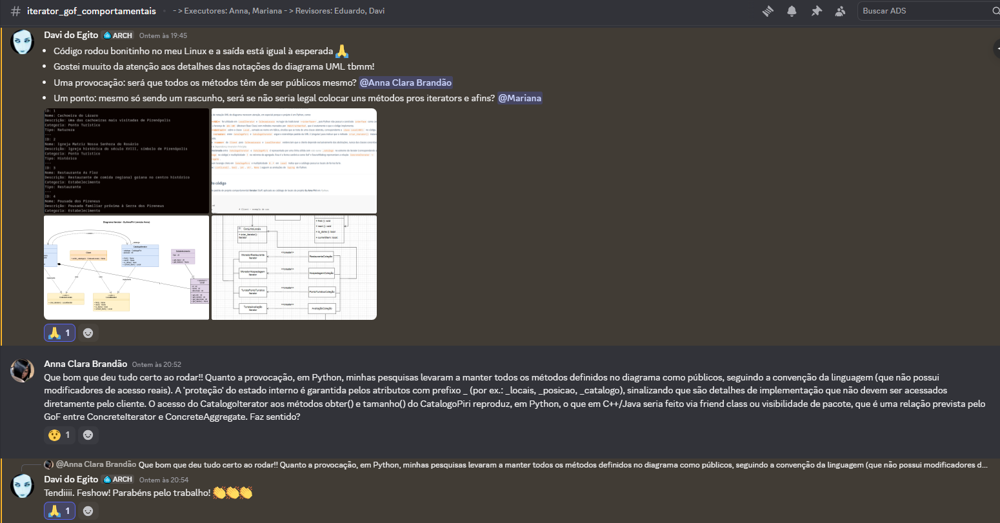
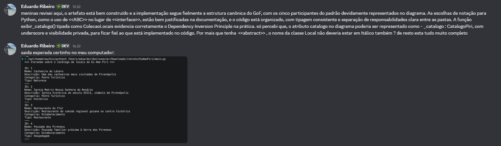

# 3.3.2 GoF Comportamental - Iterator

---

## Introdução

O Iterator trata-se de um padrão de comportamento de design que possibilita a iteração sobre os componentes de um conjunto sem revelar como eles estão organizados internamente (como lista, pilha, árvore, entre outros).

Aqui estão os seus componentes:

**Cliente:**
Essa é a classe que contém uma coleção de objetos e usa a operação Next do iterador para recuperar itens do agregado em uma sequência apropriada.

**Iterador:**
Essa é uma interface que define operações para acessar os elementos da coleção em uma sequência.

**ConcreteIterator:**
Esta é uma classe que implementa a interface Iterator.

**Agregar:**
Esta é uma interface que define uma operação para criar um iterador.

**ConcreteAggregate:**
Esta é uma classe que implementa uma interface agregada.

*(Fonte: NUZZI, 2020).*

---

## Objetivo

O Padrão de projeto Comportamental Iterator, têm como objetivo oferecer uma maneira eficaz de passar por cada item de uma coleção sequencialmente sem que a organização interna dessa coleção seja exposta.

Como o padrão Iterator é um padrão de projeto orientado a objetos, utilizamos `Python` para o desenvolvimento, seguindo a stack do backend do projeto **EuAmoPiri**. O objetivo dessa implementação foi fornecer uma interface uniforme para percorrer o catálogo de locais da plataforma — composto por Pontos Turísticos e Estabelecimentos — sem que o código cliente precise conhecer como esses locais são armazenados internamente. Dessa forma, fica possível trocar a representação subjacente do catálogo (lista em memória, consulta paginada ao banco, cache distribuído) sem impactar a API consumida pelo frontend em React.

*(Fonte: Aprender3).*

---

## Metodologia

Para alcançarmos nosso objetivo, foram adotados os seguintes passos:

- Utilização do **Diagrama de Classes** do projeto EuAmoPiri (criado na Entrega 02), que serviu como base para identificar quais entidades poderiam ser percorridas com o Iterator e como suas hierarquias se relacionam.
- Foram utilizados, principalmente, materiais fornecidos pela professora para o desenvolvimento do tópico, como slides e videoaulas, além da referência canônica do [SourceMaking](https://sourcemaking.com/design_patterns/iterator) e do [Refactoring Guru](https://refactoring.guru/pt-br/design-patterns/iterator).
- O diagrama mostrado posteriormente foi modelado seguindo a estrutura canônica do GoF, incluindo os cinco participantes prescritos pelo padrão (Client, Aggregate, ConcreteAggregate, Iterator e ConcreteIterator) além do Element específico do domínio do projeto.

O artefato foi feito pelos membros: [Anna Clara Brandão][Anna] e [Mariana Martins][Mariana], e revisado por [Davi Marques][Davi] e [Eduardo Ribeiro][Eduardo]. O resto dos membros da equipe também ficou responsável por acompanhar o andamento do desenvolvimento do **Iterator**, e intervir caso fossem requisitados.

A comunicação da dupla se deu inteiramente através do servidor da equipe no Discord, em um canal criado especialmente para discussão do artefato e compartilhamento de links e avisos importantes.

<center>Figura 1 — Canal do "Iterator".</center>


<center>Fonte: Print do Discord (2026).</center>

Os estudos para a criação do artefato foram feitos de forma individual, tanto por parte das executoras quanto por parte dos revisores, através das referências que constam ao fim desta página.

<center>Figura 2 — Canal do "Iterator".</center>



<center>Fonte: Print do Discord (2026).</center>

A branch foi criada em seguida e a equipe se alinhou sobre o andamento de atividades.

<center>Figura 3 — Alinhamento de progresso.</center>


<center>Fonte: Print do Discord (2026).</center>

---

## Evolução do artefato

---

### Diagrama Iterator

De maneira inicial, foi desenvolvido um rascunho, por meio de estudos inidividuais da [Mariana][Mariana], de forma a auxiliar o desenvolvimento do Diagrama Oficial:

<center>Figura 4 — Rascunho Diagrama Iterator.</center>



<center>Fonte: Mariana (2026).</center>

O diagrama, desenvolvido por [Anna Clara][Anna], apresenta a estrutura do catálogo de locais do projeto **Eu Amo Piri**, organizada a partir do padrão **Iterator** na sua forma canônica do GoF (SourceMaking, 2026). Ele evidencia os cinco participantes do padrão — Client, Aggregate (`ColecaoLocais`), ConcreteAggregate (`CatalogoPiri`), Iterator (`LocalIterator`) e ConcreteIterator (`CatalogoIterator`) — além dos elementos do domínio (`Local`, `PontoTuristico` e `Estabelecimento`), permitindo percorrer o catálogo de forma sequencial e uniforme, independente de o local concreto ser um ponto turístico ou um estabelecimento. O link para acessá-lo no *draw.io*, pode ser acessado [por aqui](https://drive.google.com/file/d/16Xwdb5A4I3aD8h9bpJ4VsAfiGztw1xQw/view?usp=sharing).

*(Fontes: GAMMA et al., 1995; Python Software Foundation, 2026; SourceMaking, 2026; Refactoring Guru, 2026).*

<center>Figura 5 — Diagrama Iterator.</center>



<center>Fonte: Anna Clara (2026).</center>

Uma explicação resumida do Diagrama foi enviada pelo Discord e pode ser vista logo abaixo:

<center>Figura 6 — Explicação 1 do Diagrama.</center>



<center>Fonte: Print do Discord (2026).</center>

<center>Figura 7 — Explicação 2 do Diagrama.</center>



<center>Fonte: Print do Discord (2026).</center>

Algumas escolhas de notação UML do diagrama merecem atenção, em especial porque o projeto é em Python, como:

- **Estereótipo `<<ABC>>`** foi utilizado em `LocalIterator` e `ColecaoLocais` no lugar do tradicional `<<interface>>`, pois Python não possui o construto `interface` como Java ou C#. O equivalente é a herança de `abc.ABC` (Abstract Base Class) com métodos marcados por `@abstractmethod`, que é exatamente o que o código implementa.
- **Estereótipo `<<abstract>>`** sobre a classe `Local`, somado ao nome em itálico, sinaliza que se trata de uma classe abstrata, correspondente a `class Local(ABC):` no código.
- **Dependência `<<create>>`** entre `CatalogoPiri` e `CatalogoIterator` segue o estereótipo padrão da UML 2 (singular) para indicar que o método `criar_iterator()` instancia um objeto do tipo apontado.
- **Dependências `<<uses>>`** do `Client` para `ColecaoLocais` e `LocalIterator` evidenciam que o cliente depende exclusivamente das abstrações, nunca das classes concretas — concretizando o *Dependency Inversion Principle*.
- **Associação direcionada** entre `CatalogoIterator` e `CatalogoPiri` é representada por uma linha sólida com *role name* `_catalogo` no extremo do iterator (correspondendo ao atributo `self._catalogo` no código) e multiplicidade `1` no extremo do agregado. Essa é a forma canônica como GoF e SourceMaking representam a relação `ConcreteIterator -> ConcreteAggregate`.
- **Composição** com losango cheio em `CatalogoPiri` e multiplicidade `0..*` em `Local` indica que o catálogo possui os locais de forma forte.
- **Tipos exibidos** (`List[Local]`, `bool`, `int`, `str`, `None`) seguem as anotações do `typing` do Python.

---

### Estrutura do código

Implementação do padrão de projeto comportamental **Iterator** (GoF) aplicado ao catálogo de locais do projeto **Eu Amo Piri** em *Python*.

```shell
Iterator/
├── README.md
├── main.py                      # Client — exemplo de uso
├── interfaces/
│   ├── __init__.py
│   ├── local_iterator.py        # Iterator (ABC)
│   └── colecao_locais.py        # Aggregate (ABC)
├── models/
│   ├── __init__.py
│   └── local.py                 # Element — Local, PontoTuristico, Estabelecimento
├── iterators/
│   ├── __init__.py
│   └── catalogo_iterator.py     # ConcreteIterator
└── colecoes/
    ├── __init__.py
    └── catalogo_piri.py         # ConcreteAggregate
```

A seguir explicamos as decisões tomadas para o modelo desenvolvido. A organização em pastas respeita o *Single Responsibility Principle* (SOLID): cada pasta agrupa classes com um único motivo para mudar. Optamos por `colecoes/` em vez de `collections/` para não conflitar com o módulo padrão `collections` da biblioteca Python, conflito que causaria erros sutis em qualquer arquivo do projeto que precisasse usar `collections.OrderedDict`, `collections.deque`, etc.

---

### 1. Definição das abstrações (Iterator e Aggregate)

Representam os contratos comuns que todos os iteradores e agregados concretos devem cumprir, permitindo que o cliente trabalhe apenas com as abstrações e nunca com classes concretas.

#### 1.1. LocalIterator (Iterator)

A interface `LocalIterator` adota o **protocolo canônico** descrito por Gamma et al. (1995) e reforçado pelo SourceMaking, composto por quatro operações: `first()` reposiciona o cursor no início; `next()` avança para o próximo elemento; `is_done()` indica o término da iteração; e `current_item()` devolve o elemento corrente sem avançar.

```python
from abc import ABC, abstractmethod
from models.local import Local


class LocalIterator(ABC):
    """Contrato canonico do Iterator do padrao GoF."""

    @abstractmethod
    def first(self) -> None:
        """Reposiciona o iterador no primeiro elemento."""
        ...

    @abstractmethod
    def next(self) -> None:
        """Avanca o iterador para o proximo elemento."""
        ...

    @abstractmethod
    def is_done(self) -> bool:
        """Retorna True se a iteracao ja percorreu todos os elementos."""
        ...

    @abstractmethod
    def current_item(self) -> Local:
        """Retorna o elemento na posicao corrente, sem avancar."""
        ...
```

#### 1.2. ColecaoLocais (Aggregate)

A interface `ColecaoLocais` representa o Aggregate no padrão Iterator. Define o método `criar_iterator()`, que é responsável por instanciar e retornar um iterator apropriado para percorrer a coleção. Qualquer coleção de locais da plataforma poderá fornecer um iterator para navegação, independente de sua estrutura interna (lista, banco de dados, cache, etc.).

```python
from abc import ABC, abstractmethod
from interfaces.local_iterator import LocalIterator


class ColecaoLocais(ABC):
    """Contrato do Aggregate do padrao GoF Iterator."""

    @abstractmethod
    def criar_iterator(self) -> LocalIterator:
        """Cria e retorna um Iterator configurado para esta colecao."""
        ...
```

---

### 2. Implementação dos elementos (Element)

As classes desta seção representam o domínio do catálogo: os locais cadastrados na plataforma EuAmoPiri. A classe abstrata `Local` define os atributos e métodos comuns; as classes concretas `PontoTuristico` e `Estabelecimento` herdam de `Local` e adicionam comportamentos específicos. O método polimórfico `get_dados()` permite que o iterator imprima dados específicos de cada tipo de local sem precisar diferenciá-los.

#### 2.1. Classe Local (abstrata)

```python
from abc import ABC


class Local(ABC):
    """
    Classe base abstrata que representa um local cadastrado na plataforma
    Eu Amo Piri. Pode ser um Ponto Turistico ou um Estabelecimento.
    """

    def __init__(self, id: int, nome: str, descricao: str):
        self._id = id
        self._nome = nome
        self._descricao = descricao

    def get_id(self) -> int:
        return self._id

    def get_nome(self) -> str:
        return self._nome

    def get_descricao(self) -> str:
        return self._descricao

    def set_nome(self, nome: str) -> None:
        self._nome = nome

    def set_descricao(self, descricao: str) -> None:
        self._descricao = descricao

    def get_dados(self) -> None:
        print(f"ID: {self._id}")
        print(f"Nome: {self._nome}")
        print(f"Descricao: {self._descricao}")
```

#### 2.2. Classe PontoTuristico

```python
from models.local import Local


class PontoTuristico(Local):
    """Local que representa um ponto turistico de Pirenopolis."""

    def __init__(self, id: int, nome: str, descricao: str, tipo: str):
        super().__init__(id, nome, descricao)
        self._tipo = tipo

    def get_tipo(self) -> str:
        return self._tipo

    def get_dados(self) -> None:
        super().get_dados()
        print("Categoria: Ponto Turistico")
        print(f"Tipo: {self._tipo}")
```

#### 2.3. Classe Estabelecimento

```python
from models.local import Local


class Estabelecimento(Local):
    """Local que representa um estabelecimento comercial em Pirenopolis."""

    def __init__(self, id: int, nome: str, descricao: str, tipo: str):
        super().__init__(id, nome, descricao)
        self._tipo = tipo

    def get_tipo(self) -> str:
        return self._tipo

    def get_dados(self) -> None:
        super().get_dados()
        print("Categoria: Estabelecimento")
        print(f"Tipo: {self._tipo}")
```

---

### 3. Implementação do ConcreteIterator e do ConcreteAggregate

Classes concretas que implementam os contratos definidos na seção 1, encapsulando a estrutura interna do catálogo e a lógica de iteração.

#### 3.1. CatalogoIterator (ConcreteIterator)

O `CatalogoIterator` mantém uma **referência ao ConcreteAggregate** (`CatalogoPiri`) e controla a posição corrente da iteração. A importação de `CatalogoPiri` sob `TYPE_CHECKING` evita ciclo de imports em tempo de execução. Quando `current_item()` é chamado após o término da iteração, levanta-se `StopIteration`, que é a exceção idiomática do Python para sinalizar fim de iteração.

```python
from __future__ import annotations
from typing import TYPE_CHECKING

from interfaces.local_iterator import LocalIterator
from models.local import Local

if TYPE_CHECKING:
    from colecoes.catalogo_piri import CatalogoPiri


class CatalogoIterator(LocalIterator):
    """ConcreteIterator: percorre a CatalogoPiri sequencialmente."""

    def __init__(self, catalogo: "CatalogoPiri"):
        self._catalogo = catalogo
        self._posicao = 0

    def first(self) -> None:
        self._posicao = 0

    def next(self) -> None:
        self._posicao += 1

    def is_done(self) -> bool:
        return self._posicao >= self._catalogo.tamanho()

    def current_item(self) -> Local:
        if self.is_done():
            raise StopIteration("Nao ha mais locais no catalogo")
        return self._catalogo.obter(self._posicao)
```

#### 3.2. CatalogoPiri (ConcreteAggregate)

A classe `CatalogoPiri` representa o Aggregate concreto, mantendo a coleção de locais internamente. Expõe `adicionar_local()` e `remover_local()` para gerenciar o conteúdo; `obter()` e `tamanho()` para o acesso controlado que o iterator utiliza; e `criar_iterator()` que instancia um `CatalogoIterator` passando **a si mesma** como referência — exatamente como prescreve a estrutura canônica do padrão.

```python
from typing import List

from interfaces.colecao_locais import ColecaoLocais
from interfaces.local_iterator import LocalIterator
from iterators.catalogo_iterator import CatalogoIterator
from models.local import Local


class CatalogoPiri(ColecaoLocais):
    """ConcreteAggregate: encapsula a colecao interna de Locais."""

    def __init__(self):
        self._locais: List[Local] = []

    def adicionar_local(self, local: Local) -> None:
        self._locais.append(local)

    def remover_local(self, local: Local) -> None:
        self._locais.remove(local)

    def obter(self, indice: int) -> Local:
        return self._locais[indice]

    def tamanho(self) -> int:
        return len(self._locais)

    def criar_iterator(self) -> LocalIterator:
        return CatalogoIterator(self)
```

#### 3.3. Cliente (main)

O cliente trata locais de qualquer subtipo de forma uniforme — basta usar o protocolo canônico `first / is_done / current_item / next` para percorrer a coleção. A função `exibir_catalogo()` é tipada como `ColecaoLocais` (a abstração), não como `CatalogoPiri` (a classe concreta), o que evidencia o *Open/Closed Principle*: qualquer outra implementação de `ColecaoLocais` (paginada, filtrada, ordenada) pode ser passada para a mesma função sem alterar o cliente.

```python
from colecoes.catalogo_piri import CatalogoPiri
from interfaces.colecao_locais import ColecaoLocais
from models.local import Estabelecimento, PontoTuristico


def exibir_catalogo(colecao: ColecaoLocais) -> None:
    """Funcao-cliente: depende apenas das interfaces do padrao Iterator."""
    iterator = colecao.criar_iterator()
    iterator.first()
    while not iterator.is_done():
        local = iterator.current_item()
        local.get_dados()
        print("---")
        iterator.next()


def main() -> None:
    catalogo = CatalogoPiri()

    catalogo.adicionar_local(PontoTuristico(
        1,
        "Cachoeira do Lazaro",
        "Uma das cachoeiras mais visitadas de Pirenopolis",
        "Natureza",
    ))
    catalogo.adicionar_local(PontoTuristico(
        2,
        "Igreja Matriz Nossa Senhora do Rosario",
        "Igreja historica do seculo XVIII, simbolo de Pirenopolis",
        "Historico",
    ))
    catalogo.adicionar_local(Estabelecimento(
        3,
        "Restaurante As Flor",
        "Restaurante de comida regional goiana no centro historico",
        "Restaurante",
    ))
    catalogo.adicionar_local(Estabelecimento(
        4,
        "Pousada dos Pireneus",
        "Pousada familiar proxima a Serra dos Pireneus",
        "Hospedagem",
    ))

    print("=== Iterando sobre o catalogo de locais do Eu Amo Piri ===\n")
    exibir_catalogo(catalogo)


if __name__ == "__main__":
    main()
```

| Papel | Classe |
| :---: | :----: |
| Client | `main.py` (função `exibir_catalogo`) |
| Aggregate | `ColecaoLocais` |
| ConcreteAggregate | `CatalogoPiri` |
| Iterator | `LocalIterator` |
| ConcreteIterator | `CatalogoIterator` |
| Element | `Local` (abstrata), `PontoTuristico`, `Estabelecimento` |

*(Fontes: Python Software Foundation, 2026; SourceMaking, 2026).*

O envio do link de acesso ao código foi primeiro disponibilizado no chat da equipe:

<center>Figura 8 — Envio do código e feedback.</center>



<center>Fonte: Print do Discord (2026).</center>

---

### Execução (Catálogo de Locais)

Pré-requisitos:

- Python 3.8 ou superior

Para verificar a versão instalada:

```shell
python3 --version
```

O arquivo executável está disponível para download [neste link](https://drive.google.com/file/d/1ugpi1pOC9eIaeBU6i_lffERtqhSfrr_7/view?usp=sharing). Para executá-lo cumpra os passos a seguir:

**1. Extraia o arquivo .zip.**

**2. Execute o programa:**

No Linux / macOS:

```shell
python3 main.py
```

No Windows:

```shell
python main.py
```

**Saída esperada:**

```shell
=== Iterando sobre o catalogo de locais do Eu Amo Piri ===

ID: 1
Nome: Cachoeira do Lazaro
Descricao: Uma das cachoeiras mais visitadas de Pirenopolis
Categoria: Ponto Turistico
Tipo: Natureza
---
ID: 2
Nome: Igreja Matriz Nossa Senhora do Rosario
Descricao: Igreja historica do seculo XVIII, simbolo de Pirenopolis
Categoria: Ponto Turistico
Tipo: Historico
---
ID: 3
Nome: Restaurante As Flor
Descricao: Restaurante de comida regional goiana no centro historico
Categoria: Estabelecimento
Tipo: Restaurante
---
ID: 4
Nome: Pousada dos Pireneus
Descricao: Pousada familiar proxima a Serra dos Pireneus
Categoria: Estabelecimento
Tipo: Hospedagem
---
```

<center>Figura 9 — Execução no terminal.</center>



<center>Fonte: Print do VSCode (2026).</center>

---

## Vídeo de Execução

<font size="3"><p style="text-align: center">Vídeo 1 - Código Iterator.</p></font>

<iframe
    width="560"
    height="315"
    src="https://www.youtube.com/embed/2z9xlH23nnc?si=JpDeR2HFHrYsnSTI"
    title="YouTube video player"
    frameborder="0"
    allow="accelerometer; autoplay; clipboard-write; encrypted-media; gyroscope; picture-in-picture; web-share" referrerpolicy="strict-origin-when-cross-origin"
    allowfullscreen>
</iframe>

<font size="3"><p style="text-align: center">*Fonte: Autoria própria (2026).*</p></font>

---

## Visão dos contribuidores na concepção do artefato

>**Anna Clara:**
> O Iterator foi mais um padrão que eu ainda não tinha ouvido falar e pude me aprofundar e entender de fato a essência dele estudando para essa entrega. O conceito de separar a lógica de iteração da estrutura de dados é algo que parece simples, mas só depois de implementar é que percebi o quanto isso impacta na manutenibilidade do projeto. Gostei especialmente de trabalhar com `abc.ABC` no Python, já fiz uso disso no desenvolvimento de outro modelo nessa entrega, e dessa vez precisei novamente.

>**Mariana:**
> O Padrão de Projeto Iterator foi o padrão mais trabalhoso que encontrei durante essa etapa do trabalho, pesquisei muito até conseguir chegar em um rascunho inicial sobre o mesmo, mas foi um estudo muito proveitoso! Puder enteder um pouquinho sobbre aquilo que fiquei meio receiosa no começo e acabar entendendo um conceito novo.

>**Davi (revisor):**
><center>Figura 10 — Revisão do artefato no Discord - Davi.</center>



<center>Fonte: Print do Discord (2026).</center>

>**Eduardo (revisor):**
><center>Figura 11 — Revisão do artefato - Eduardo.</center>



<center>Fonte: Print do Discord (2026).</center>

---

## Referências

> [1] NUZZI, Jones Roberto. **Design Patterns — Parte 18 — Iterator.** Medium, 2 jan. 2020. Disponível em: <https://medium.com/@jonesroberto/design-patterns-parte-18-interator-c2559a462364>. Acesso em: 18 mai. 2026.

> [2] SERRANO, Milene. **Arquitetura e Desenho de Software - Aula - GOFS Comportamentais.** Acesso em: 18 mai. 2026.

> [3] GAMMA, Erich; HELM, Richard; JOHNSON, Ralph; VLISSIDES, John. **Design Patterns: Elements of Reusable Object-Oriented Software.** Addison-Wesley, 1995. Acesso em: 18 mai. 2026.

> [4] SourceMaking. **Iterator Design Pattern.** Disponível em: <https://sourcemaking.com/design_patterns/iterator>. Acesso em: 18 mai. 2026.

> [5] Refactoring Guru. **Iterator.** Disponível em: <https://refactoring.guru/pt-br/design-patterns/iterator>. Acesso em: 18 mai. 2026.

> [6] Python Software Foundation. **abc — Abstract Base Classes.** Disponível em: <https://docs.python.org/3/library/abc.html>. Acesso em: 18 mai. de 2026.

---

## Histórico do artefato

| Data | Versão | Descrição | Autor(es) | Revisor(es) |
| ---- | ------ | --------- | :-------: | :---------: |
| 14/05/2026 | `1.0` | Estudos próprios acerca do Iterator. | [Anna Clara][Anna] | - |
| 14/05/2026 | `1.0` | Estudos próprios acerca do Iterator. | [Mariana][Mariana] | - |
| 15/05/2026 | `1.1` | Criação de rascunho do Diagrama. | [Anna Clara][Anna] | - |
| 18/05/2026 | `1.2` | Criação de rascunho do Diagrama. | [Mariana][Mariana] | [Anna Clara][Anna], [Eduardo Ribeiro][Eduardo], [Davi Marques][Davi] |
| 18/05/2026 | `1.3` | Criação de versão oficial do Diagrama no draw.io. | [Anna Clara][Anna] | [Mariana][Mariana], [Eduardo Ribeiro][Eduardo], [Davi Marques][Davi] |
| 18/05/2026 | `1.4` | Criação de código do modelo em Python. | [Anna Clara][Anna] | [Mariana][Mariana], [Eduardo Ribeiro][Eduardo], [Davi Marques][Davi] |
| 19/05/2026 | `1.5` | Documentação de explicação acerca do projeto. | [Anna Clara][Anna] | [Mariana][Mariana], [Eduardo Ribeiro][Eduardo], [Davi Marques][Davi] |

---

## Histórico do documento

| Data | Versão | Descrição | Autor(es) | Revisor(es) |
| ---- | ------ | --------- | :-------: | :---------: |
| 18/05/2026 | `1.0` | V1 da Documentação. | [Mariana][Mariana] | [Anna Clara][Anna] |
| 18/05/2026 | `1.1` | Ajustes na formatação da página. | [Anna Clara][Anna] | [Mariana][Mariana] |
| 19/05/2026 | `1.2` | Adição de Metodologia, complemento de Objetivo e explicação do modelo desenvolvido. | [Anna Clara][Anna] | [Mariana][Mariana], [Eduardo Ribeiro][Eduardo], [Davi Marques][Davi] |
| 19/05/2026 | `1.3` | Adição de visão de contribuidora. | [Anna Clara][Anna] | [Mariana][Mariana], [Eduardo Ribeiro][Eduardo], [Davi Marques][Davi] |
| 20/05/2026 | `1.4` | Adição de visão de contribuidora. | [Mariana][Mariana] | [Anna][Anna], [Eduardo Ribeiro][Eduardo], [Davi Marques][Davi] |
| 20/05/2026 | `1.5` | Adição de comprobatório de revisões. | [Anna Clara][Anna] | [Mariana][Mariana], [Eduardo Ribeiro][Eduardo], [Davi Marques][Davi] |
| 20/05/2026 | `1.6` | Adição de vídeo de execução. | [Anna Clara][Anna] | [Mariana][Mariana], [Eduardo Ribeiro][Eduardo], [Davi Marques][Davi] |
| 22/05/2026 | `1.7` | Corrige caminhos de imagens. | [Anna Clara][Anna] | [Mariana][Mariana], [Davi Marques][Davi] |

[Mariana]: https://github.com/Marianamrts
[Anna]: https://github.com/annacbrandao
[Davi]: https://github.com/daviegito
[Eduardo]: https://github.com/EduardoRibeiroXavier
