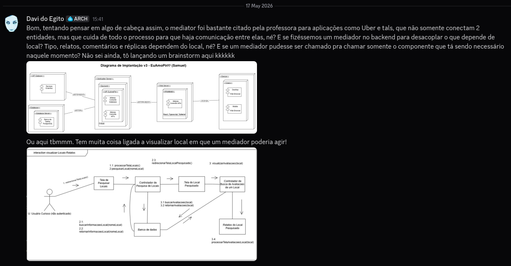
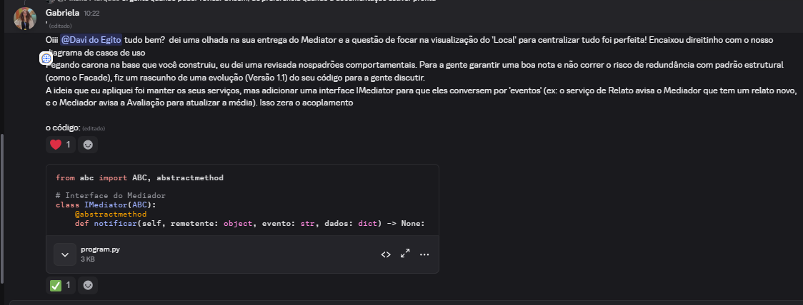
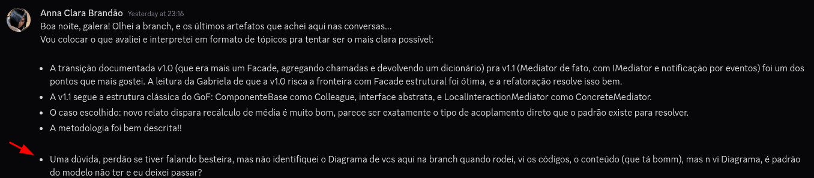

# 3.3.3 Mediator

## Introdução

O mediador permite com que objetos diferentes se referenciem como um "agrupamento leve", além de permitir que se mude as interações de maneira independente. (GAMMA, Erich et al., 1994)

Além disso, o Mediator também centraliza a comunicação entre componentes e media dois ou mais componentes sem que eles se conheçam, mas saibam apenas da existência do Mediator. (REFACTORING GURU, 2025)

## Objetivo

O objetivo da aplicação do padrão Mediator no ecossistema EuAmoPiri é centralizar e coordenar as interações entre os módulos independentes que compõem a experiência de visualização e interação com um local (como `LocalRepository`, `ComentarioService`, `RelatoService` e `AvaliacaoService`). A intenção é evitar que estas entidades conheçam detalhes de implementação umas das outras, permitindo que o sistema cresça e novos serviços sejam integrados sem gerar dependências diretas (código esparguete).

## Metodologia

A metodologia para o desenho e a construção deste artefato seguiu três etapas fundamentais, com a comunicação da equipe a ocorrer de forma integralmente assíncrona via Discord:
1. **Análise de Modelagem Anterior:** Avaliação dos diagramas da entrega anterior, identificando que o [diagrama de casos de uso](https://unbarqdsw2026-1-turma02.github.io/2026.01-T02_G5_EuAmoPiri_Entrega_02/#/./Modelagem/ModelagemOrganizacional/2.3.1%20Diagrama_de_Casos_de_uso) apontava a funcionalidade "Visualizar detalhes do Local" como um forte ponto de convergência de múltiplos fluxos de informação.
2. **Desenho Arquitetural Iterativo:** Discussões para mapear como desacoplar os microsserviços associados a um local. O processo evoluiu de uma abordagem inicial de agregação de dados (Versão 1.0) para um fluxo comportamental baseado em eventos notificados (Versão 1.1).
3. **Implementação em Python:** Codificação garantindo modularidade e testabilidade isolada das classes, seguindo a literatura do GoF.
A comunicação para a feitura do artefato se deu no Discord de forma integralmente assíncrona. 

## Evolução do artefato

### Versão 1.0



Davi: primeiramente, fui tentar achar inspiração em diagramas da entrega passada. Apesar de não estar na imagem, o [diagrama de casos de uso](https://unbarqdsw2026-1-turma02.github.io/2026.01-T02_G5_EuAmoPiri_Entrega_02/#/./Modelagem/ModelagemOrganizacional/2.3.1%20Diagrama_de_Casos_de_uso) me apontou uma coisa interessante: a versão final dele tem uma convergência muito grande em cima de "Visualizar detalhes do Local". Isso me chamou bastante a atenção, porque o mediador serve como uma "ponte de comunicação" entre 2 partes. Em cima disso, surge esta primeira versão, em que o mediador trabalha em cima dos diferentes serviços ligados ao local:  

```py
class LocalRepository:
    def obter_local(self, local_id: str) -> dict:
        return {"id": local_id, "nome": "Cachoeira de Pirenópolis", "categoria": "natureza"}

class ComentarioService:
    def listar_por_local(self, local_id: str) -> list[dict]:
        return [
            {"autor": "Davi", "texto": "Adorei. Tudo muito bonito!"},
            {"autor": "Mateus", "texto": "Ótimo para postar no Insta!"}
        ]

class RelatoService:
    def listar_por_local(self, local_id: str) -> list[dict]:
        return [
            {"titulo": "Visita em família", "conteudo": "Experiência supimpa!"}
        ]

class AvaliacaoService:
    def resumo(self, local_id: str) -> dict:
        return {"media": 4.7, "quantidade": 128}

class LocalDetailsMediator:
    def __init__(
        self,
        local_repo: LocalRepository,
        comentario_service: ComentarioService,
        relato_service: RelatoService,
        avaliacao_service: AvaliacaoService,
    ):
        self.local_repo = local_repo
        self.comentario_service = comentario_service
        self.relato_service = relato_service
        self.avaliacao_service = avaliacao_service

    def obter_detalhes_completos(self, local_id: str) -> dict:
        local = self.local_repo.obter_local(local_id)
        comentarios = self.comentario_service.listar_por_local(local_id)
        relatos = self.relato_service.listar_por_local(local_id)
        avaliacoes = self.avaliacao_service.resumo(local_id)

        return {
            "local": local,
            "comentarios": comentarios,
            "relatos": relatos,
            "avaliacoes": avaliacoes,
        }

mediator = LocalDetailsMediator(
    local_repo=LocalRepository(),
    comentario_service=ComentarioService(),
    relato_service=RelatoService(),
    avaliacao_service=AvaliacaoService(),
)

resultado = mediator.obter_detalhes_completos("42")
print(resultado)
```

### Versão 1.1


Gabriela: Na análise da versão 1.0, validámos a excelente escolha do "Local" como ponto de convergência. No entanto, para garantir a aderência estrita à classificação comportamental do GoF (evitando que o padrão se assemelhasse a um Facade estrutural), propus uma evolução. Introduzimos uma interface IMediator para que os serviços conversem por eventos. Agora, se um novo relato é inserido, o RelatoService notifica o mediador, que por sua vez coordena a atualização da média no AvaliacaoService, tudo sem acoplamento direto.


```py
from abc import ABC, abstractmethod

class IMediator(ABC):
    @abstractmethod
    def notificar(self, remetente: object, evento: str, dados: dict) -> None:
        pass

class ComponenteBase:
    def __init__(self, mediator: IMediator = None):
        self._mediator = mediator
    
    def definir_mediator(self, mediator: IMediator):
        self._mediator = mediator

class LocalRepository(ComponenteBase):
    def obter_local(self, local_id: str) -> dict:
        return {"id": local_id, "nome": "Cachoeira de Pirenópolis", "categoria": "Natureza"}

class AvaliacaoService(ComponenteBase):
    def __init__(self):
        super().__init__()
        self._media = 4.7
        self._quantidade = 128

    def resumo(self, local_id: str) -> dict:
        return {"media": self._media, "quantidade": self._quantidade}

    def atualizar_media(self, nova_nota: int):
        self._quantidade += 1
        self._media = round((self._media * (self._quantidade - 1) + nova_nota) / self._quantidade, 2)
        print(f"[Avaliação] Média recalculada no sistema: {self._media} (Total: {self._quantidade} notas)")

class RelatoService(ComponenteBase):
    def cadastrar_relato(self, local_id: str, titulo: str, nota: int):
        print(f"[Relato] Novo relato inserido: '{titulo}' com nota {nota}.")
        if self._mediator:
            self._mediator.notificar(self, "novo_relato", {"local_id": local_id, "nota": nota})

class LocalInteractionMediator(IMediator):
    def __init__(self, local_repo: LocalRepository, avaliacao_service: AvaliacaoService, relato_service: RelatoService):
        self.local_repo = local_repo
        self.avaliacao_service = avaliacao_service
        self.relato_service = relato_service
        
        self.local_repo.definir_mediator(self)
        self.avaliacao_service.definir_mediator(self)
        self.relato_service.definir_mediator(self)

    def notificar(self, remetente: object, evento: str, dados: dict) -> None:
        if evento == "novo_relato":
            print(f"[Mediador] Evento '{evento}' capturado. A coordenar atualizações...")
            self.avaliacao_service.atualizar_media(dados["nota"])

if __name__ == "__main__":
    print("=== Testando Padrão Mediator GoF: EuAmoPiri ===")
    
    repo = LocalRepository()
    avaliacao = AvaliacaoService()
    relato = RelatoService()
    
    maestro = LocalInteractionMediator(repo, avaliacao, relato)
    
    relato.cadastrar_relato(local_id="42", titulo="Lugar sensacional, vale a visita!", nota=5)
```

## Saída da execução — Versão 1.1

```py
=== Testando Padrão Mediator GoF: EuAmoPiri ===
[Relato] Novo relato inserido: 'Lugar sensacional, vale a visita!' com nota 5.
[Mediador] Evento 'novo_relato' capturado. A coordenar atualizações...
[Avaliação] Média recalculada no sistema: 4.7 (Total: 129 notas)
```

### Refatoração Pós-Revisão (Versão 1.2)

Após a revisão técnica por pares, foram identificados pontos de melhoria na Versão 1.1:
1. O `LocalRepository` herdava de `ComponenteBase`, mas não emitia nem ouvia eventos.
2. O `ComentarioService`, presente na v1.0, havia sido removido, gerando uma regressão no escopo.

Para solucionar isso, evoluímos para a **Versão 1.2**. Reintegramos o `ComentarioService` emitindo um evento de `"novo_comentario"`, e adicionamos a simulação de um evento `"local_atualizado"` no `LocalRepository`, demonstrando como o Mediator pode ser usado para coordenar a invalidação de cache.

```py
from abc import ABC, abstractmethod

class IMediator(ABC):
    @abstractmethod
    def notificar(self, remetente: object, evento: str, dados: dict) -> None:
        pass

class ComponenteBase:
    def __init__(self, mediator: IMediator = None):
        self._mediator = mediator
    
    def definir_mediator(self, mediator: IMediator):
        self._mediator = mediator

class LocalRepository(ComponenteBase):
    def obter_local(self, local_id: str) -> dict:
        return {"id": local_id, "nome": "Cachoeira de Pirenópolis", "categoria": "Natureza"}

    def atualizar_dados_local(self, local_id: str, novos_dados: dict):
        print(f"[LocalRepository] Dados do local {local_id} atualizados no banco.")
        if self._mediator:
            self._mediator.notificar(self, "local_atualizado", {"local_id": local_id})

class AvaliacaoService(ComponenteBase):
    def __init__(self):
        super().__init__()
        self._media = 4.7
        self._quantidade = 128

    def resumo(self, local_id: str) -> dict:
        return {"media": self._media, "quantidade": self._quantidade}

    def atualizar_media(self, nova_nota: int):
        self._quantidade += 1
        self._media = round((self._media * (self._quantidade - 1) + nova_nota) / self._quantidade, 2)
        print(f"[Avaliação] Média recalculada no sistema: {self._media} (Total: {self._quantidade} notas)")

class RelatoService(ComponenteBase):
    def cadastrar_relato(self, local_id: str, titulo: str, nota: int):
        print(f"[Relato] Novo relato inserido: '{titulo}' com nota {nota}.")
        if self._mediator:
            self._mediator.notificar(self, "novo_relato", {"local_id": local_id, "nota": nota})

class ComentarioService(ComponenteBase):
    def cadastrar_comentario(self, local_id: str, autor: str, texto: str):
        print(f"[Comentário] Novo comentário de {autor}: '{texto}'")
        if self._mediator:
            self._mediator.notificar(self, "novo_comentario", {"local_id": local_id})

class LocalInteractionMediator(IMediator):
    def __init__(self, local_repo: LocalRepository, avaliacao_service: AvaliacaoService, relato_service: RelatoService, comentario_service: ComentarioService):
        self.local_repo = local_repo
        self.avaliacao_service = avaliacao_service
        self.relato_service = relato_service
        self.comentario_service = comentario_service
        
        self.local_repo.definir_mediator(self)
        self.avaliacao_service.definir_mediator(self)
        self.relato_service.definir_mediator(self)
        self.comentario_service.definir_mediator(self)

    def notificar(self, remetente: object, evento: str, dados: dict) -> None:
        if evento == "novo_relato":
            print(f"[Mediador] Evento '{evento}' capturado. Coordenando recálculo de média...")
            self.avaliacao_service.atualizar_media(dados["nota"])
        elif evento == "novo_comentario":
            print(f"[Mediador] Evento '{evento}' capturado. Preparando notificação para o dono do local...")
        elif evento == "local_atualizado":
            print(f"[Mediador] Evento '{evento}' capturado. Invalidando cache de visualização do front-end...")

if __name__ == "__main__":
    print("=== Testando Padrão Mediator GoF (v1.2): EuAmoPiri ===")
    
    repo = LocalRepository()
    avaliacao = AvaliacaoService()
    relato = RelatoService()
    comentario = ComentarioService()
    
    maestro = LocalInteractionMediator(repo, avaliacao, relato, comentario)
    
    # Testando os diferentes eventos independentes
    relato.cadastrar_relato(local_id="42", titulo="Lugar sensacional, vale a visita!", nota=5)
    print("-" * 40)
    comentario.cadastrar_comentario(local_id="42", autor="Anna", texto="Tem estacionamento perto?")
    print("-" * 40)
    repo.atualizar_dados_local(local_id="42", novos_dados={"categoria": "Ecoturismo"})
```
## Saída da execução — Versão 1.2

```py
=== Testando Padrão Mediator GoF (v1.2): EuAmoPiri ===
[Relato] Novo relato inserido: 'Lugar sensacional, vale a visita!' com nota 5.
[Mediador] Evento 'novo_relato' capturado. Coordenando recálculo de média...
[Avaliação] Média recalculada no sistema: 4.7 (Total: 129 notas)
----------------------------------------
[Comentário] Novo comentário de Anna: 'Tem estacionamento perto?'
[Mediador] Evento 'novo_comentario' capturado. Preparando notificação para o dono do local...
----------------------------------------
[LocalRepository] Dados do local 42 atualizados no banco.
[Mediador] Evento 'local_atualizado' capturado. Invalidando cache de visualização do front-end...
```

## Evolução do diagrama

Após feedback cuidadoso da Anna, percebemos que estava faltando o diagrama



## Visão dos contribuidores na concepção do artefato

Davi: a aula do dia 15/05 foi bem elucidativa em relação ao padrão Mediator e os exemplos (especialmente de aplicações famosas) dados pela professora em sala de aula ajudaram bastante a fixar o conceito e a enxergá-lo no trabalho. Parece ser um modelo bem financeiramente promissor se usado de maneira correta. Gostei bastante!

Gabriela: Participar da construção do padrão Mediator foi excelente para compreender a transição entre organizar estruturas de código e de fato ditar o comportamento dinâmico de um sistema. A lógica inicial do Davi de centralizar a visualização do Local foi o ponto de partida perfeito. E a partir daí, consegui evoluir para um intermediário abstrato que coordena os eventos (como a atualização de avaliações após um novo relato) mostrou na prática como evitar que o nosso sistema se torne frágil e acoplado, garantindo uma manutenção muito mais segura para o futuro do projeto, além de uma grande robustez na visão de negócio.

## Referências

GAMMA, Erich et al. Design patterns: elements of reusable object-oriented software. Disponível em: https://www.javier8a.com/itc/bd1/articulo.pdf. Acesso em: 15 maio 2026.

REFACTORING GURU. Mediator. Disponível em: https://refactoring.guru/pt-br/design-patterns/mediator. Acesso em: 21 de maio 2026.

## Histórico do artefato

| Data       | Versão | Descrição                                               | Autor                                                     | Revisores                |
| ---------- | ------ | ------------------------------------------------------- | --------------------------------------------------------- | ------------------------ |
| 17/05/2026 | `1.0`  | Rascunho inicial                                        | [Davi do Egito](https://github.com/daviegito)             | |
| 20/05/2026 | `1.1`  | Refatoração do GOF                                      | [Gabriela Dourado](https://github.com/gabrieladouradof)   | [Anna Clara](https://github.com/annacbrandao)  |  
| 22/05/2026 | `1.2`  | Refatoração pós-revisão (correção de serviços) | [Gabriela Dourado](https://github.com/gabrieladouradof) |                                               |                                                                                                      

## Histórico do documento

| Data       | Versão | Descrição                                                      | Autor                                                      | Revisores |
| ---------- | ------ | -------------------------------------------------------------- | ---------------------------------------------------------- | --------- |
| 16/05/2026 | `1.0`  | Preenchimento inicial do documento | [Davi do Egito](https://github.com/daviegito) | [Gabriela Dourado](https://github.com/gabrieladouradof) |
| 17/05/2026 | `1.1`  | Atualização com v1.0 do artefato | [Davi do Egito](https://github.com/daviegito) | [Gabriela Dourado](https://github.com/gabrieladouradof) |
|20/05/2026 | `1.1`  | Inclusão dos objetivos, metodologia e evolução para a versão 1.1  | [Gabriela Dourado](https://github.com/gabrieladouradof)              | 
|20/05/2026 | `1.1`  | Inclusão da rastreabilidade da V1.1  | [Gabriela Dourado](https://github.com/gabrieladouradof)              | 
|21/05/2026 | `1.1`  | Aumento na introdução  | [Davi do Egito](https://github.com/daviegito)              |
| 22/05/2026 | `1.5`  | Refatoração pós-revisão técnica (Adição v1.2)   | [Gabriela Dourado](https://github.com/gabrieladouradof)    |                                               |
