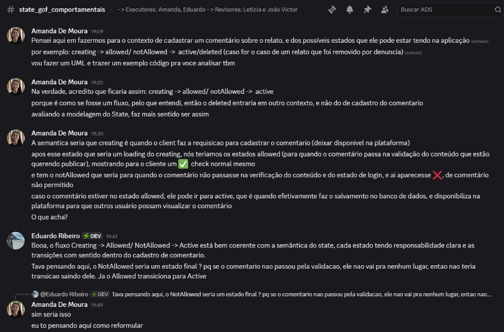
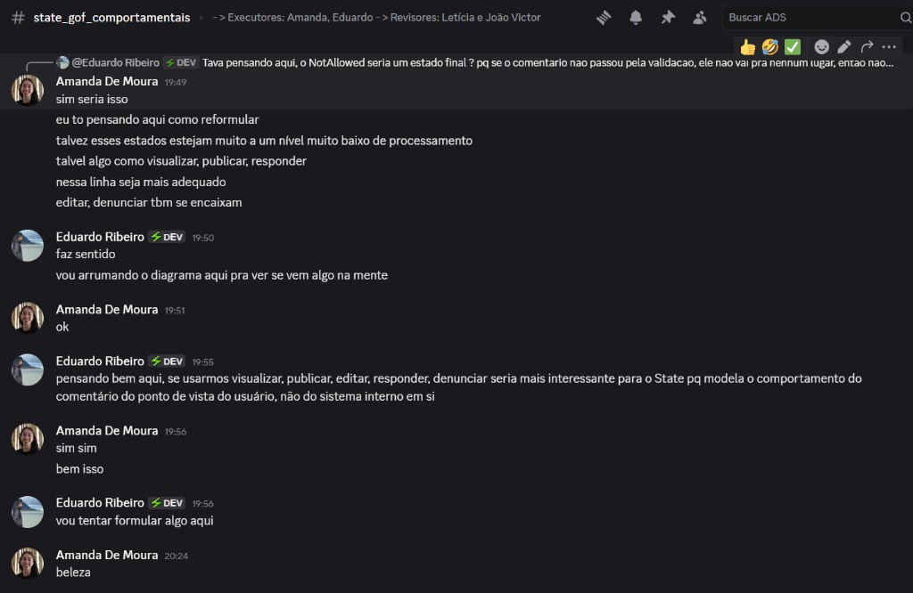
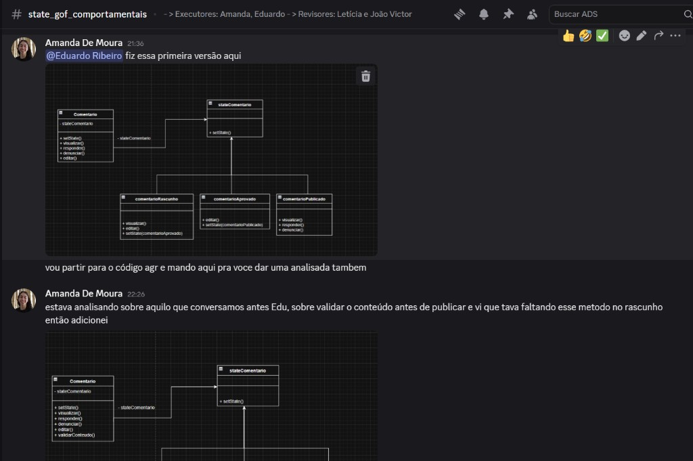
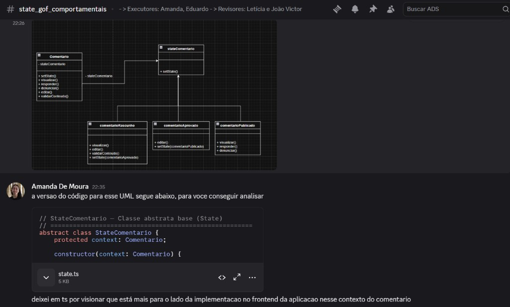
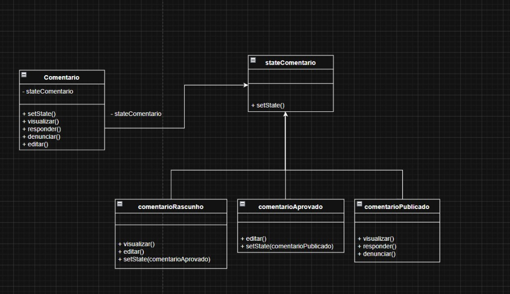
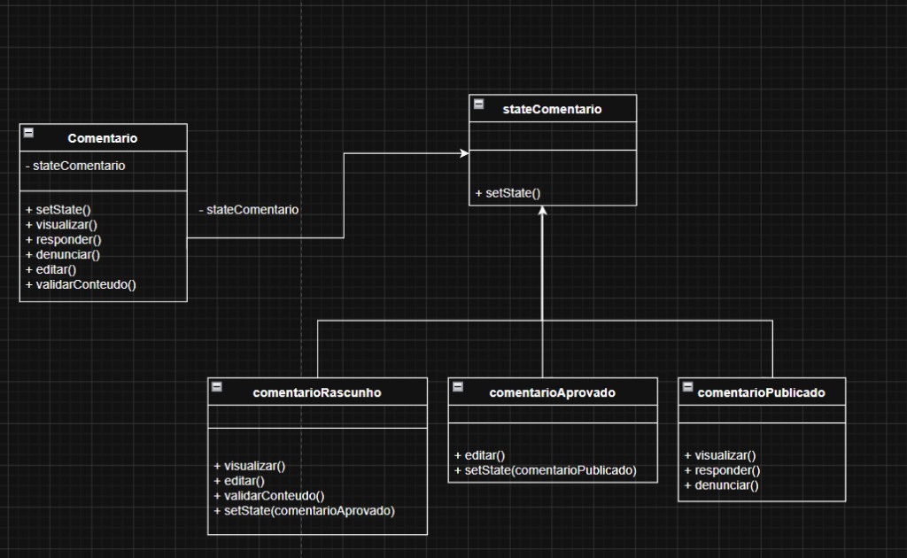

# 3.3.4 Padrão Comportamental - State

## Introdução

O **State** é um padrão de projeto **comportamental** que permite que um objeto altere seu comportamento quando seu estado interno muda, fazendo com que o objeto pareça mudar de classe (GAMMA et al., 1995). No contexto do **EuAmoPiri**, o padrão foi aplicado ao ciclo de vida de um **comentário** na plataforma: as ações disponíveis (visualizar, editar, responder, denunciar, validar conteúdo) variam conforme o comentário está em **rascunho**, **aprovado** ou **publicado**.

Em vez de concentrar regras de negócio em estruturas condicionais extensas dentro de uma única classe, o State delega cada comportamento a um objeto de estado concreto, mantendo o **Context** (`Comentario`) como ponto único de acesso para o cliente.

## Objetivo

O foco desta entrega é modelar e implementar o fluxo de estados de um comentário no EuAmoPiri, garantindo que:

- o comportamento do objeto dependa do estado atual e possa mudar em tempo de execução;
- operações inválidas para um determinado estado sejam bloqueadas de forma explícita;
- novas regras ou estados possam ser adicionados com menor impacto no código existente.

Conforme Gamma et al. (1995), o padrão State é indicado quando o comportamento de um objeto depende do seu estado e deve alterar-se em tempo de execução, ou quando existem estruturas condicionais extensas particionadas por estado. A Profa. Milene Serrano apresenta o padrão no contexto dos GoFs Comportamentais como uma forma de externalizar o comportamento dependente de estado em classes especializadas (SERRANO, 2026).

## Metodologia

O artefato foi desenvolvido por [Amanda de Moura](https://github.com/AmandaaMoura) e [Eduardo Ribeiro](https://github.com/EduardoRibeiroXavier), com revisão de [Letícia Paiva](https://github.com/leticiakrpaiva) e [João Victor Mello](https://github.com/Chaotzuu). A dupla optou por **TypeScript**, por alinhar-se ao ecossistema do repositório, oferecer suporte nativo a classes abstratas e facilitar a execução do protótipo com `tsx` — além de refletir a visão de implementação no front-end do fluxo de comentários.

A escolha do domínio partiu do **Diagrama de Classes** do EuAmoPiri: a entidade **Comentário** possui estados distintos ao longo da moderação e publicação, o que torna o State um candidato natural — cada estado concentra apenas as operações permitidas naquele momento.

Os estudos de base combinaram:

- o capítulo **State** do livro *Design Patterns: Elements of Reusable Object-Oriented Software* (GAMMA et al., 1995);
- os slides da disciplina **Arquitetura e Desenho de Software** (SERRANO, 2026);
- materiais complementares sobre padrões comportamentais.

A comunicação ocorreu de forma **assíncrona via Discord**, no canal `#state_gof_comportamentais`. O fluxo de decisão passou por três momentos principais:

1. **Proposta inicial** — estados orientados ao processamento interno do cadastro (`creating`, `allowed`, `notAllowed`, `active`);
2. **Reformulação** — adoção de estados alinhados às ações do usuário (`visualizar`, `editar`, `publicar`, `responder`, `denunciar`, `validarConteudo`);
3. **Modelagem e código** — consolidação em diagrama UML (versões 1.0 e 1.1) e protótipo TypeScript.


<center>Figura 1 — Proposta inicial de estados no canal Discord</center>

Na primeira rodada de discussão, Amanda propôs um fluxo para o cadastro de comentário em um relato (`creating → allowed/notAllowed → active`), com semântica de cada estado definida em conjunto. Eduardo validou a coerência com o padrão State, destacando que `notAllowed` seria um estado final sem transição de saída.


<center>Figura 2 — Reformulação dos estados a partir da visão do usuário</center>

A dupla concluiu que os estados iniciais estavam em um nível muito interno ao sistema. Eduardo sugeriu modelar o comportamento a partir das **ações do usuário** sobre o comentário; Amanda concordou e passou a estruturar o diagrama com foco em rascunho, aprovação e publicação.


<center>Figura 3 — Evolução dos diagramas UML (versões 1.0 e 1.1) no Discord</center>

Amanda compartilhou a Versão 1.0 do diagrama e, após a análise sobre validação de conteúdo antes da publicação, enviou a Versão 1.1 com a inclusão de `validarConteudo()` no estado de rascunho.


<center>Figura 4 — Compartilhamento do código TypeScript para análise da dupla</center>

Em seguida, Amanda enviou o arquivo `state.ts` para análise de Eduardo, justificando TypeScript pela proximidade com a camada de interface do EuAmoPiri.

### Instruções

O código-fonte está em `GOFs/Comportamentais/src/state.ts`. Para executar o protótipo:

#### Terminal (Node.js)

Na pasta `GOFs/Comportamentais/src`, execute:

```shell
npx tsx state.ts
```

É necessário ter **Node.js** instalado. O comando utiliza `tsx` para interpretar TypeScript sem etapa de compilação prévia.

#### Online

Alternativamente, copie o conteúdo de `state.ts` para um interpretador online que suporte TypeScript, como o [TypeScript Playground](https://www.typescriptlang.org/play/) ou o [TS Runner do OneCompiler](https://onecompiler.com/typescript), e execute o script.

## Evolução do artefato

Os diagramas UML desta seção foram modelados no [draw.io](https://drive.google.com/file/d/1N_sLrZpYUUEe0TXP70SXuvdBIRJIgK5n/view?usp=drive_link) 

### Estrutura — Versão 1.0

A primeira versão do diagrama de classes estruturou o padrão State aplicado ao comentário, com os papéis **Context** (`Comentario`), **State** (`stateComentario`) e três **Concrete States** (`comentarioRascunho`, `comentarioAprovado`, `comentarioPublicado`).


<center>Figura 5 — Diagrama de classes do padrão State aplicado ao comentário (Versão 1.0)</center>

Nesta versão:

- o **Context** delega as operações `visualizar`, `responder`, `denunciar` e `editar` ao estado atual;
- **Rascunho** permite `visualizar` e `editar`, transitando para **Aprovado** via `setState`;
- **Aprovado** permite `editar`, transitando para **Publicado** via `setState`;
- **Publicado** permite `visualizar`, `responder` e `denunciar`, sem transição de saída modelada.

### Estrutura — Versão 1.1

A segunda versão mantém a mesma topologia geral e acrescenta uma operação de validação de conteúdo, alinhada à regra de negócio de moderação antes da aprovação.


<center>Figura 6 — Diagrama de classes do padrão State com `validarConteudo()` (Versão 1.1)</center>

**Mudança em relação à Versão 1.0:** inclusão do método `validarConteudo()` no **Context** (`Comentario`) e na implementação do estado **Rascunho** (`comentarioRascunho`). Os demais estados e transições permanecem equivalentes à versão anterior.

### Implementação — Versão 1.0

A implementação em TypeScript materializa o diagrama da Versão 1.1 do artefato estrutural. A classe abstrata `StateComentario` define o comportamento padrão (mensagem de erro) para operações não permitidas; cada estado concreto sobrescreve apenas o que lhe cabe. O `Comentario` mantém instâncias reutilizáveis dos três estados e delega as requisições ao `_state` atual. As transições `Rascunho → Aprovado` e `Aprovado → Publicado` são disparadas pelo método `avancar()`, que invoca `setState()` no estado corrente — seguindo a recomendação do GoF de que os **Concrete States** podem definir suas próprias transições (GAMMA et al., 1995).

```typescript
// StateComentario — Classe abstrata base (State)
abstract class StateComentario {
    protected context: Comentario;

    constructor(context: Comentario) {
      this.context = context;
    }

    visualizar(): void { console.log("[Erro] Ação de visualizar não permitida neste estado."); }
    responder(): void  { console.log("[Erro] Ação de responder não permitida neste estado."); }
    denunciar(): void  { console.log("[Erro] Ação de denunciar não permitida neste estado."); }
    editar(): void     { console.log("[Erro] Ação de editar não permitida neste estado."); }
    validarConteudo(): void { console.log("[Erro] Ação de validar conteúdo não permitida neste estado."); }
    setState(): void   { console.log("[Erro] Sem transição definida neste estado."); }
}

class ComentarioRascunho extends StateComentario {
    override visualizar(): void {
      console.log("[Rascunho] Comentário visível apenas para o autor.");
    }

    override editar(): void {
      console.log("[Rascunho] Rascunho editado com sucesso.");
    }

    validarConteudo(): void {
        console.log("[Rascunho] Conteúdo validado com sucesso.");
    }

    override setState(): void {
      console.log("[Rascunho → Aprovado] Comentário submetido para aprovação.");
      this.context.setState(this.context.aprovado);
    }
}

class ComentarioAprovado extends StateComentario {
    override editar(): void {
      console.log("[Aprovado] Revisão final aplicada ao comentário.");
    }

    override setState(): void {
      console.log("[Aprovado → Publicado] Comentário publicado na plataforma.");
      this.context.setState(this.context.publicado);
    }
}

class ComentarioPublicado extends StateComentario {
    override visualizar(): void {
      console.log("[Publicado] Comentário visível para todos os usuários.");
    }

    override responder(): void {
      console.log("[Publicado] Resposta registrada no comentário.");
    }

    override denunciar(): void {
      console.log("[Publicado] Comentário denunciado. Em análise pela moderação.");
    }
}

class Comentario {
    private _state: StateComentario;

    readonly rascunho:  ComentarioRascunho;
    readonly aprovado:  ComentarioAprovado;
    readonly publicado: ComentarioPublicado;

    constructor() {
      this.rascunho  = new ComentarioRascunho(this);
      this.aprovado  = new ComentarioAprovado(this);
      this.publicado = new ComentarioPublicado(this);
      this._state    = this.rascunho;
    }

    setState(state: StateComentario): void {
      this._state = state;
    }

    avancar(): void    { this._state.setState(); }

    visualizar(): void { this._state.visualizar(); }
    responder(): void  { this._state.responder(); }
    denunciar(): void  { this._state.denunciar(); }
    editar(): void     { this._state.editar(); }
    validarConteudo(): void { this._state.validarConteudo(); }

    //Para testes
  const comentario = new Comentario();
  
  console.log("Estado: Rascunho");
  comentario.visualizar(); // é pra gerar OK pois é permitido
  comentario.editar();     // é pra gerar OK pois é permitido
  comentario.validarConteudo(); // é pra gerar OK pois é permitido
  comentario.responder();  // é pra gerar ERR pois não é permitido
  comentario.denunciar();  // é pra gerar ERR pois não é permitido
  
  console.log("\nTransição: Rascunho → Aprovado");
  comentario.avancar();
  
  console.log("\nEstado: Aprovado");
  comentario.editar();     // é pra gerar OK pois é permitido
  comentario.visualizar(); // é pra gerar ERR pois não é permitido
  comentario.responder();  // é pra gerar ERR pois não é permitido
  comentario.validarConteudo(); // é pra gerar ERR pois não é permitido
  
  console.log("\nTransição: Aprovado → Publicado");
  comentario.avancar();
  
  console.log("\nEstado: Publicado");
  comentario.visualizar(); // é pra gerar OK pois é permitido
  comentario.responder();  // é pra gerar OK pois é permitido
  comentario.denunciar();  // é pra gerar OK pois é permitido
  comentario.editar();     // é pra gerar ERR pois não é permitido
  comentario.validarConteudo(); // é pra gerar ERR pois não é permitido
}
```

## Visão dos contribuidores na concepção do artefato

Amanda (executora): No início foi difícil enxergar como poderia ser usado o state dentor do contexto do EuAmoPiri, incialmente estava com uma visão muito de worker, com inspiração de status de processamento como, running, done, stopped, então a primerio momento o creating, allowed, notAllowed faziam sentido. Depois de conversar com o Eduardo e ver mais alguns exemplos de como foram aplicados em outros contextos, entendi que dava para ser usado com comentário mas precisava reformular algumas peças, que foi o momento em que começou a fazer mais sentido semânticamente e funcionalmente. Ter participado na execução do proxy também me ajudou a encher a necessidade de validar a informação que nossa plataforma está prestes deixar pública e salva no nosso banco, que foi o insight que tive para adicionar o método validarConteúdo.

Eduardo(executor): No início, ao analisar onde o State poderia ser aplicado no EuAmoPiri, a tendência natural foi pensar no Relato, já que ele tem um ciclo de vida claro dentro da plataforma. A primeira modelagem seguiu esse caminho com estados como Rascunho, Publicado, Verificado e Arquivado, o que fazia sentido semântico. Quando a Amanda trouxe a proposta de aplicar no Comentario, o desafio foi entender qual seria o nível certo dos estados — a primeira versão dela estava muito voltada para o processamento interno da requisição, o que gerou uma discussão produtiva sobre a diferença entre estados de infraestrutura e estados de negócio. Depois de alinhar esse ponto, a modelagem evoluiu para estados que refletem o que o usuário pode fazer com o comentário na plataforma, como PublicadoState, EditandoState, DenunciadoState e RemovidoState, o que ficou muito mais coerente com a essência do padrão. A revisão do código TypeScript também foi uma oportunidade de consolidar boas práticas, como eliminar o acoplamento circular entre estado e contexto e padronizar os nomes dos métodos para evitar ambiguidade.

Leticia(revisora):

João Victor(revisor):

## Referências

[1] GAMMA, Erich; HELM, Richard; JOHNSON, Ralph; VLISSIDES, John. *Design Patterns: Elements of Reusable Object-Oriented Software*. Addison-Wesley, 1995.

[2] SERRANO, Milene. Arquitetura e Desenho de Software — Aula GoFs. Slides. Universidade de Brasília, 2026.

[3] REFACTORING GURU. State. Disponível em: https://refactoring.guru/pt-br/design-patterns/state. Acesso em: 19 de maio de 2026.

[4] MOURA, Amanda. *UML Comportamental — State (draw.io)*. Disponível em: https://drive.google.com/file/d/1N_sLrZpYUUEe0TXP70SXuvdBIRJIgK5n/view?usp=drive_link. Acesso em: 19 de maio de 2026.

## Histórico do artefato

| Data       | Versão | Descrição                                                         | Autor                                                      | Revisores |
| ---------- | ------ | ----------------------------------------------------------------- | ---------------------------------------------------------- | --------- |
| 19/05/2026 | 1.0    | Diagrama de classes inicial (estrutura State — comentário)        | [Amanda de Moura](https://github.com/AmandaaMoura)         | [Eduardo Ribeiro](https://github.com/EduardoRibeiroXavier), [Letícia Paiva](https://github.com/leticiakrpaiva), [João Victor Mello](https://github.com/Chaotzuu) |
| 19/05/2026 | 1.1    | Inclusão de `validarConteudo()` no Context e em Rascunho          | [Amanda de Moura](https://github.com/AmandaaMoura)         | [Eduardo Ribeiro](https://github.com/EduardoRibeiroXavier), [Letícia Paiva](https://github.com/leticiakrpaiva), [João Victor Mello](https://github.com/Chaotzuu) |
| 19/05/2026 | 2.0    | Implementação em TypeScript do código versão 1.0 referente ao UML versão 1.1    | [Amanda de Moura](https://github.com/AmandaaMoura)         | [Eduardo Ribeiro](https://github.com/EduardoRibeiroXavier), [Letícia Paiva](https://github.com/leticiakrpaiva), [João Victor Mello](https://github.com/Chaotzuu) |
| 20/05/2026 | 2.1    | Implementação em TypeScript do código versão 1.2 referente ao UML versão 1.1    | [Eduardo Ribeiro](https://github.com/EduardoRibeiroXavier)         | [Amanda](https://github.com/AmandaaMoura), [Letícia Paiva](https://github.com/leticiakrpaiva), [João Victor Mello](https://github.com/Chaotzuu) |


---

## Histórico do documento

| Data       | Versão | Descrição                                                         | Autor                                                      | Revisores |
| ---------- | ------ | ----------------------------------------------------------------- | ---------------------------------------------------------- | --------- |
| 19/05/2026 | 1.0    | Criação inicial do documento (introdução, objetivo, metodologia)  | [Amanda de Moura](https://github.com/AmandaaMoura)         | [Eduardo Ribeiro](https://github.com/EduardoRibeiroXavier), [Letícia Paiva](https://github.com/leticiakrpaiva), [João Victor Mello](https://github.com/Chaotzuu) |
| 19/05/2026 | 1.1    | Adição da evolução do artefato (estrutura v1/v1.1 e implementação)          | [Amanda de Moura](https://github.com/AmandaaMoura)         | [Eduardo Ribeiro](https://github.com/EduardoRibeiroXavier), [Letícia Paiva](https://github.com/leticiakrpaiva), [João Victor Mello](https://github.com/Chaotzuu) |
| 19/05/2026 | 1.2    | Inclusão das imagens da comunicação assíncrona no Discord até o dia 19/05         | [Amanda de Moura](https://github.com/AmandaaMoura)         | [Eduardo Ribeiro](https://github.com/EduardoRibeiroXavier), [Letícia Paiva](https://github.com/leticiakrpaiva), [João Victor Mello](https://github.com/Chaotzuu) |
| 19/05/2026 | 1.3    | Inclusão do link do draw.io na seção de Estrutura e nas Referências | [Amanda de Moura](https://github.com/AmandaaMoura)         | [Eduardo Ribeiro](https://github.com/EduardoRibeiroXavier), [Letícia Paiva](https://github.com/leticiakrpaiva), [João Victor Mello](https://github.com/Chaotzuu) |
| 20/05/2026 | 1.4   | Inclusão da visão dos Contribuidores  | [Eduardo](https://github.com/AmandaaMoura)         | [Amanda de Moura](https://github.com/leticiakrpaiva), [Letícia Paiva](https://github.com/leticiakrpaiva), [João Victor Mello](https://github.com/Chaotzuu) |

