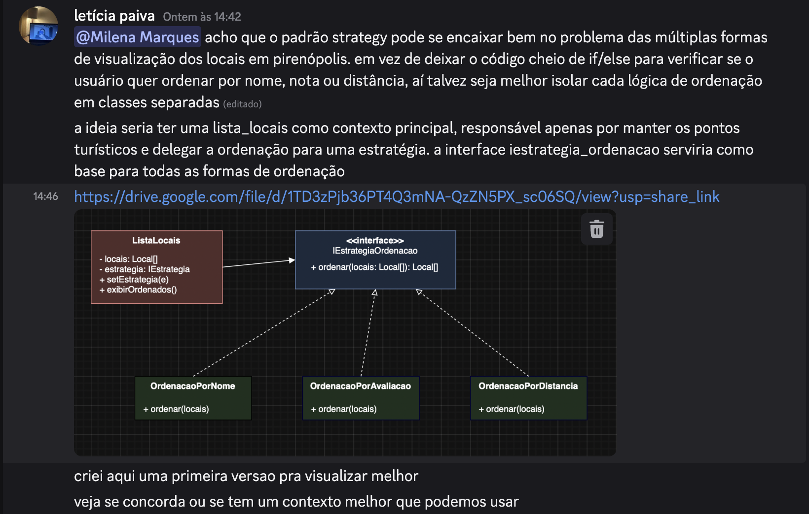
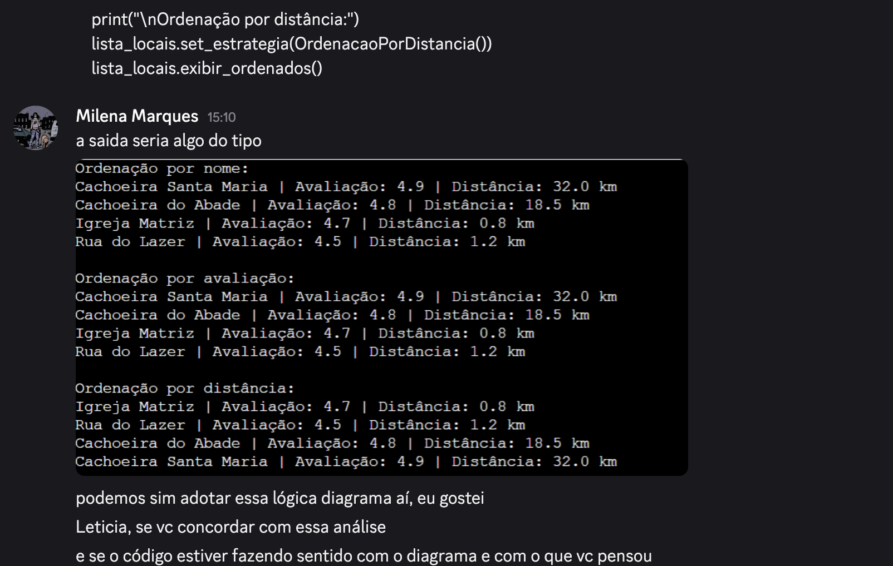
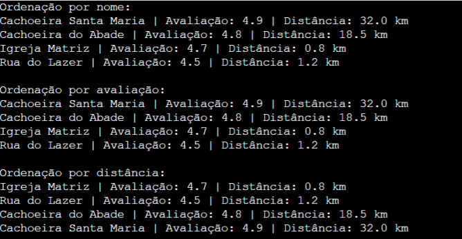

# 3.3.5 Strategy

## Introdução

O padrão Strategy é um padrão de projeto comportamental que permite definir uma família de algoritmos, encapsular cada um deles e torná-los intercambiáveis (REFACTORING GURU, 2025). No sistema EuAmoPiri, ele é aplicado para gerenciar as diferentes formas de ordenação dos locais turísticos, permitindo que a seleção do algoritmo de ordenação varie independentemente dos clientes que o utilizam.


## Objetivo

O objetivo central é permitir que o sistema mude seu comportamento de ordenação em tempo de execução, sem a necessidade de estruturas condicionais complexas. Segundo Serrano (2025), o Strategy visa "permitir de maneira simples a variação dos algoritmos utilizados na resolução de um determinado problema", garantindo que o EuAmoPiri possa oferecer filtros por nome, avaliação ou distância de forma modular e escalável


## Metodologia

A metodologia para a concepção deste artefato baseou-se em um processo colaborativo de refinamento técnico e tomada de decisão em equipe, estruturado nas seguintes etapas:

1.  **Identificação e Discussão do Problema:** Inicialmente, as integrantes Letícia e Milena entraram em uma discussão via Discord para identificar onde o padrão Strategy se encaixaria melhor no projeto. Letícia identificou que o padrão seria a solução ideal para resolver o problema das múltiplas formas de ordenação dos locais em Pirenópolis, evitando um código repleto de estruturas condicionais (`if/else`) e isolando cada lógica de ordenação em classes separadas, conforme preconiza a literatura sobre o encapsulamento de algoritmos.
    



2.  **Modelagem e Validação do Diagrama:** Milena considerou a proposta válida e avaliou o rascunho do diagrama de classes apresentado. Com o diagrama aprovado, Milena seguiu para o desenvolvimento do código.



3.  **Desenvolvimento e Escolha Tecnológica:** Optou-se pelo uso da linguagem **Python** para a implementação, por já estar definida no escopo do projeto e ser a linguagem de maior familiaridade entre os membros da equipe. A implementação focou em criar estratégias intercambiáveis para ordenação por nome, avaliação e distância.

4.  **Validação Final e Documentação:** Letícia realizou a validação final do código, confirmando que a execução estava alinhada ao diagrama. Após a aprovação, foi feita a divisão de tarefas para a confecção da documentação do artefato.


## Evolução do artefato

Foi-se pensada a seguinte estruturação para aplicação do padrão comportamental **Strategy** no contexto de visualização e ordenação dos locais turísticos de Pirenópolis.

Identificou-se que o sistema poderia possuir múltiplas formas de organização dos locais, como ordenação por nome, avaliação ou distância. Sem a utilização de um padrão arquitetural adequado, essa lógica acabaria concentrada em estruturas condicionais extensas, utilizando diversos `if/else`, o que aumentaria o acoplamento e dificultaria futuras expansões do sistema.

Dessa forma, optou-se pela utilização do padrão **Strategy**, permitindo encapsular cada algoritmo de ordenação em uma classe independente. Assim, a responsabilidade da classe principal deixa de ser executar regras específicas de ordenação e passa apenas a delegar essa responsabilidade para uma estratégia selecionada em tempo de execução.

A solução foi estruturada da seguinte maneira:

- `ListaLocais`: contexto principal responsável por armazenar e exibir os locais;
- `IEstrategiaOrdenacao`: interface base para todas as estratégias;
- `OrdenacaoPorNome`: estratégia concreta de ordenação alfabética;
- `OrdenacaoPorAvaliacao`: estratégia concreta de ordenação por avaliação;
- `OrdenacaoPorDistancia`: estratégia concreta de ordenação por distância.

Essa abordagem tornou a arquitetura mais flexível e alinhada ao princípio Open/Closed, permitindo adicionar novas formas de ordenação sem modificar a estrutura principal do sistema.

---

### Estrutura da implementação

Inicialmente foi criada a classe `Local`, responsável por representar os pontos turísticos do sistema.

```python
class Local:
    def __init__(self, nome: str, avaliacao: float, distancia: float):
        self.nome = nome
        self.avaliacao = avaliacao
        self.distancia = distancia

    def __str__(self) -> str:
        return (
            f"{self.nome} | "
            f"Avaliação: {self.avaliacao} | "
            f"Distância: {self.distancia} km"
        )
```

A classe possui os atributos:

- `nome`
- `avaliacao`
- `distancia`

Além disso, o método `__str__()` foi utilizado para definir a forma de exibição textual dos locais.

---

Posteriormente foi definida a interface `IEstrategiaOrdenacao`, responsável por estabelecer o contrato comum entre todas as estratégias de ordenação.

```python
class IEstrategiaOrdenacao(ABC):
    @abstractmethod
    def ordenar(self, locais: list[Local]) -> list[Local]:
        pass
```

A interface garante que todas as estratégias implementem o método `ordenar()`, permitindo que sejam utilizadas de maneira intercambiável pela classe principal.

---

Em seguida foram implementadas as estratégias concretas de ordenação.

#### Estratégia de ordenação por nome

```python
class OrdenacaoPorNome(IEstrategiaOrdenacao):
    def ordenar(self, locais: list[Local]) -> list[Local]:
        return sorted(locais, key=lambda local: local.nome)
```

Essa estratégia organiza os locais em ordem alfabética.

---

#### Estratégia de ordenação por avaliação

```python
class OrdenacaoPorAvaliacao(IEstrategiaOrdenacao):
    def ordenar(self, locais: list[Local]) -> list[Local]:
        return sorted(locais, key=lambda local: local.avaliacao, reverse=True)
```

Essa estratégia organiza os locais da maior para a menor avaliação.

---

#### Estratégia de ordenação por distância

```python
class OrdenacaoPorDistancia(IEstrategiaOrdenacao):
    def ordenar(self, locais: list[Local]) -> list[Local]:
        return sorted(locais, key=lambda local: local.distancia)
```

Essa estratégia organiza os locais do mais próximo para o mais distante.

---

Após isso, foi implementada a classe `ListaLocais`, responsável por atuar como o contexto do padrão Strategy.

```python
class ListaLocais:
    def __init__(self, locais: list[Local], estrategia: IEstrategiaOrdenacao):
        self._locais = locais
        self._estrategia = estrategia

    def set_estrategia(self, estrategia: IEstrategiaOrdenacao) -> None:
        self._estrategia = estrategia

    def exibir_ordenados(self) -> None:
        locais_ordenados = self._estrategia.ordenar(self._locais)

        for local in locais_ordenados:
            print(local)
```

A classe `ListaLocais` possui duas responsabilidades principais:

- armazenar a coleção de locais;
- delegar a ordenação para uma estratégia definida.

O método `set_estrategia()` permite alterar dinamicamente a estratégia utilizada.

```python
lista_locais.set_estrategia(OrdenacaoPorAvaliacao())
```

Dessa forma, a classe principal não precisa conhecer os detalhes internos de cada algoritmo de ordenação.

---

### Composição estrutural da solução

A composição da solução ocorre da seguinte forma:

```text
ListaLocais
    ↓ utiliza
IEstrategiaOrdenacao
    ↑
    ├── OrdenacaoPorNome
    ├── OrdenacaoPorAvaliacao
    └── OrdenacaoPorDistancia
```

A classe `ListaLocais` depende da abstração `IEstrategiaOrdenacao`, e não diretamente das implementações concretas. Isso reduz o acoplamento e favorece a extensibilidade do sistema.

---

### Exemplo de uso

Para validar o funcionamento da solução, foi desenvolvido o seguinte exemplo de utilização das estratégias:

```python
if __name__ == "__main__":

    locais = [
        Local("Cachoeira do Abade", 4.8, 18.5),
        Local("Rua do Lazer", 4.5, 1.2),
        Local("Igreja Matriz", 4.7, 0.8),
        Local("Cachoeira Santa Maria", 4.9, 32.0),
    ]

    lista_locais = ListaLocais(
        locais,
        OrdenacaoPorNome()
    )

    print("Ordenação por nome:")
    lista_locais.exibir_ordenados()

    print("\nOrdenação por avaliação:")
    lista_locais.set_estrategia(
        OrdenacaoPorAvaliacao()
    )
    lista_locais.exibir_ordenados()

    print("\nOrdenação por distância:")
    lista_locais.set_estrategia(
        OrdenacaoPorDistancia()
    )
    lista_locais.exibir_ordenados()
```

O exemplo demonstra que a estratégia de ordenação pode ser alterada dinamicamente durante a execução da aplicação, sem necessidade de modificar a estrutura da classe `ListaLocais`.

---
### Resultado da execução

A execução do exemplo de uso demonstra o funcionamento dinâmico do padrão Strategy, permitindo alterar a estratégia de ordenação em tempo de execução sem modificar a estrutura da classe `ListaLocais`.

Inicialmente, os locais são exibidos em ordem alfabética. Em seguida, a estratégia é alterada para ordenação por avaliação e, posteriormente, para ordenação por distância.



A saída evidencia que a classe `ListaLocais` permanece desacoplada das regras específicas de ordenação, delegando toda a responsabilidade para as estratégias concretas.

Além disso, o exemplo demonstra a principal vantagem do padrão Strategy: a possibilidade de substituir algoritmos dinamicamente sem alterar o contexto principal da aplicação.

---

### Análise arquitetural da solução

A utilização do padrão Strategy permitiu separar as diferentes regras de ordenação em classes independentes, reduzindo o acoplamento e eliminando estruturas condicionais complexas.

Sem o padrão, a solução provavelmente dependeria de construções semelhantes a:

```python
if criterio == "nome":
    ...
elif criterio == "avaliacao":
    ...
elif criterio == "distancia":
    ...
```

Com o uso do Strategy, novas formas de ordenação podem ser adicionadas futuramente através da criação de novas estratégias concretas, sem alterar a lógica principal da aplicação.

Essa abordagem favorece:

- extensibilidade;
- reutilização;
- baixo acoplamento;
- manutenção do código;
- aderência ao princípio Open/Closed.

---

## Visão dos contribuidores na concepção do artefato

Milena: 
Letícia:

## Referências

[1] SERRANO, Milene. Arquitetura e Desenho de Software - Aula GoFs Comportamentais. Slides. Universidade de Brasília, 2025.
[2] REFACTORING GURU. Strategy. Disponível em: https://refactoring.guru/pt-br/design-patterns/strategy. Acesso em: 05 de maio 2026.
[3] CLIMACO, Vinicius. Design Pattern: Strategy. Disponível em: https://climaco.medium.com/design-pattern-strategy-16f4285dc6e. Acesso em: 05 de maio 2026.


## Histórico do artefato

| Data       | Versão | Descrição                                                  | Autor                                                     | Revisores                                                  |
| ---------- | ------ | ---------------------------------------------------------- | --------------------------------------------------------- | ----------------------------------------------------------- |
| 16/04/2026 | `1.0`  | Implementação do padrão Strategy para ordenação dos locais | [Letícia Paiva](https://github.com/leticiakrpaiva)        | [Milena](https://github.com/milenamso) |         
| 17/04/2026 | `1.1`  | Codificação da solução por meio do diagrama uml|[Milena](https://github.com/milenamso)    |[Letícia Paiva](https://github.com/leticiakrpaiva) |                                                                                                                                                                               

## Histórico do documento

| Data       | Versão | Descrição                                                          | Autor                                                     | Revisores                                                  |
| ---------- | ------ | ------------------------------------------------------------------ | ---------------------------------------------------------- | ----------------------------------------------------------- |
| 16/04/2026 | `1.0`  | Criação da documentação com introdução, objetivo e metodologia     | [Letícia Paiva](https://github.com/leticiakrpaiva)         | [Milena](https://github.com/milenamso) |
| 17/04/2026 | `1.1`  | Complementação da documentação com evolução de artefato     | [Milena](https://github.com/milenamso)      | [Letícia Paiva](https://github.com/leticiakrpaiva) |
