# 3.5.1 Diagrama de Implantação - EuAmoPiri

---

## Introdução

Os diagramas de implantação da UML desempenham um papel fundamental na representação da arquitetura física de sistemas, especialmente em aplicações distribuídas como o projeto EuAmoPiri. Por meio desses diagramas, é possível visualizar como os componentes de software e hardware se relacionam, além de compreender como o processamento está distribuído entre os diferentes elementos do sistema (OMG, 2017). Conforme apresentado pela IBM em sua documentação sobre topologias de sistemas, esses diagramas permitem ainda evidenciar nós de execução, artefatos implantados e os protocolos de comunicação envolvidos (IBM, 2021).

---

## Metodologia

Para a construção deste diagrama, utilizamos a ferramenta **Draw.io** e seguimos as diretrizes da **Linguagem de Modelagem Unificada (UML)**.  Nossa abordagem focou em mapear a arquitetura planejada, identificando os principais nós e artefatos de software, bem como as relações e protocolos de comunicação entre eles.

Para a nossa comunicação, optamos por centralizar todas as discussões através do canal da equipe no **Discord**, por lá fomos alinhando o andamento de cada versão, e dando avisos para a revisão via GitHub, de forma totalmente assíncrona.

Para a construção deste diagrama foram alocadas 3 pessoas como executoras:

- [Anna Clara](https://github.com/annacbrandao) (braclan~);
- [Gabriela](https://github.com/gabrieladouradof) (Gabriela);
- [Samuel](https://github.com/Samuelvlobo) (samuelvlobo).

2 pessoas como revisoras oficiais:

- [Eduardo Ribeiro](https://github.com/EduardoRibeiroXavier) (Eduardorxss);
- [Mariana](https://github.com/Marianamrts) (Mariana).

E o restante da equipe ficou responsável por acompanhar a construção e opinar caso fosse necessário.

Pelo **Discord** realizamos o compartilhamento de cada link ou foto relevantes para o andamento da construção do Diagrama de Implantação. Abaixo constam algumas das evoluções constatadas por lá, como a criação do template utilizado no **Draw.io**:

Figura 1 — Criação do template utilizado no Draw.io.

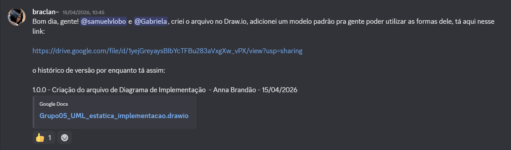

Fonte: Print do Discord (2026).

Em seguida compartilhamos alguns links de estudos próprios e discutimos o início dos rascunhos. Tivemos uma certa dificuldade para iniciar pois a equipe ainda não tinha definido de forma definitiva as tecnologias a serem utilizadas no desenvolvimento do projeto:

Figura 2 — Links de estudos compartilhados por Anna.

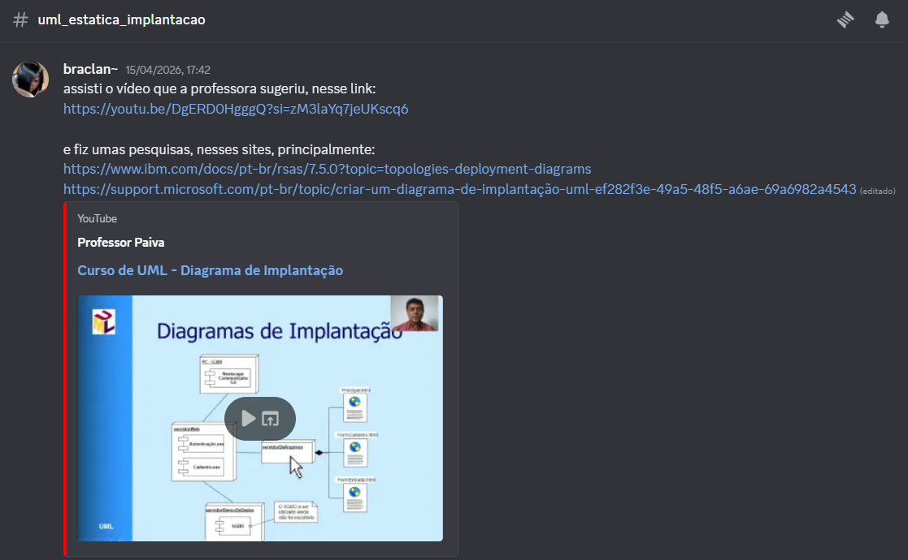

Fonte: Print do Discord (2026).

Figura 3 — Links de estudos compartilhados por Samuel.

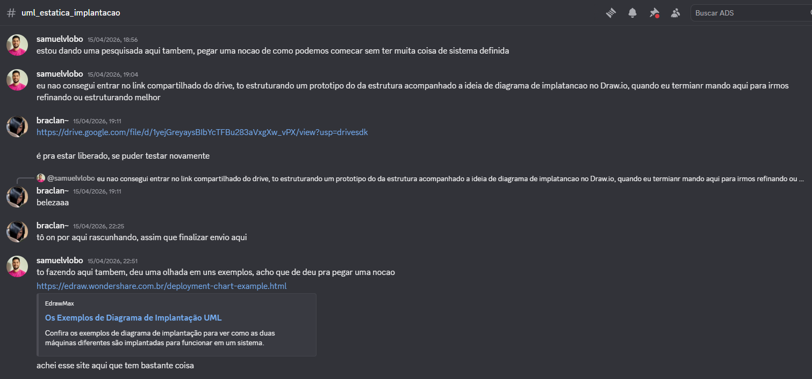

Fonte: Print do Discord (2026).

Após estes estudos iniciais conseguimos iniciar os rascunhos:

Figura 4 — Mensagem com o rascunho enviado por Samuel.

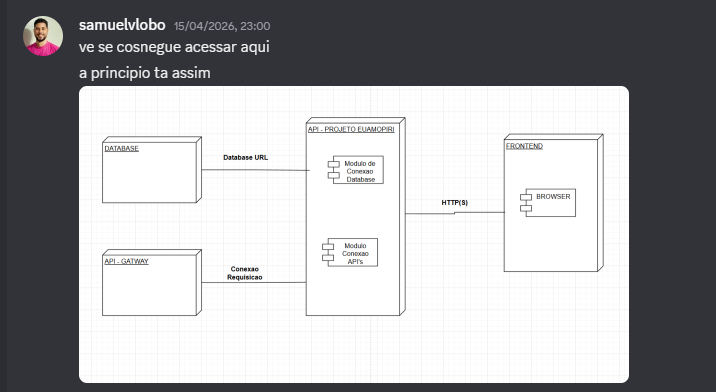

Fonte: Print do Discord (2026).

Figura 5 — Mensagem com o rascunho enviado por Anna.

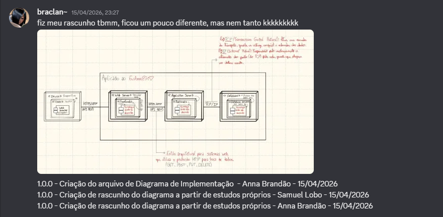

Fonte: Print do Discord (2026).

Então passamos por alguns feedbacks e sugestões, como a decisão de definir as tecnologias utilizadas junto ao resto da equipe:

Figura 6 — Feedback sobre o rascunho de Anna.

Fonte: Print do Discord (2026).

Figura 7 — Discussão e feedback de Gabriela.

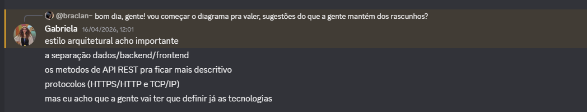

Fonte: Print do Discord (2026).

Figura 8 — Discussão sobre as tecnologias a serem utilizadas.

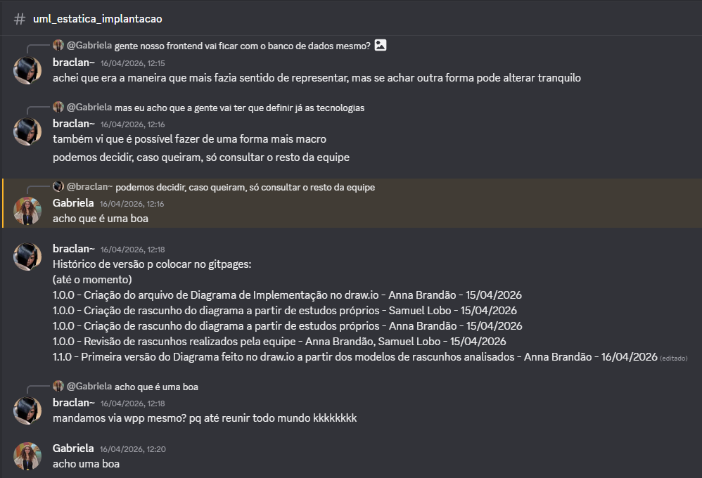

Fonte: Print do Discord (2026).

Assim, com toda essa construção inicial, conseguimos chegar na segunda e terceira versão do diagrama no **Draw.io**:

Figura 9 — Compartilhamento da nova versão do diagrama por Gabriela.

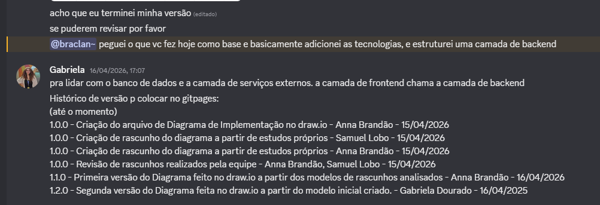

Fonte: Print do Discord (2026).

Figura 10 — Compartilhamento da nova versão do diagrama por Samuel.

Fonte: Print do Discord (2026).

Então solicitamos revisão do diagrama:

Figura 11 — Feedback da revisora Mariana.

Fonte: Print do Discord (2026).

Figura 12 — Feedback do revisor Eduardo.

Fonte: Print do Discord (2026).

E por fim, as revisões começaram a ser feitas pelo GitHub, com o apoio dos revisores e dos executores:

Figura 13 — Aviso sobre o início das revisões via GitHub.

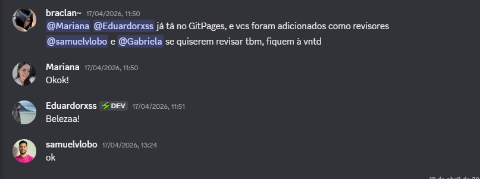

Fonte: Print do Discord (2026).

---

## Visão dos contribuidores na concepção do diagrama

- **Samuel:** No início da criação do diagrama de implantação, elaborei um esboço de como seria nosso projeto, utilizando as metodologias e regras de elaboração de um diagrama de implantação. Com o desenvolvimento da ideia dos colegas participantes em conjunto comigo, fomos refinando a visão de como o sistema deveria ser estruturado. Com isso, elaboramos três versões até chegar ao modelo que julgamos ideal, e posteriormente uma quarta versão a partir do feedback de revisão recebido.

- **Anna:** A elaboração de rascunhos antes dos diagramas costuma ser uma coisa que tem me auxiliado, utilizei para este diagrama a mesma abordagem para o **Mapa Mental** que fiz anteriormente com o [Samuel](https://github.com/Samuelvlobo), na [Entrega 01](https://github.com/UnBArqDsw2026-1-Turma02/2026.01-T02_G5_EuAmoPiri_Entrega_01/blob/main/docs/Base/ArtefatosGeneralistas/1.2.3.mapaMental.md). Após estudar os materiais disponibilizados pela professora e outros auxiliares (presentes nas Referências Bibliográficas), consegui chegar no primeiro rascunho e tive uma visão mais clara de como prosseguir com o diagrama no **Draw.io**, dessa forma desenvolvi a primeira versão do mesmo. Com a experiência de ter desenvolvido a primeira versão somado com os estudos dos materiais, pude ajudar na revisão das outras versões desenvolvidas pela equipe. Na quarta versão, conduzi os ajustes de topologia sugeridos na revisão, reorganizando os nós e reposicionando o API Gateway.

- **Gabriela:**  A elaboração de rascunhos iniciais que os colegas Anna e Samuel fizeram foram cruciais para a concepção e amadurecimento do diagrama. Com base nesses rascunhos, alinhados com as aulas disponibilizadas via Aprender3, consegui analisar o contexto do projeto efetuar uma criação do diagrama mais alinhado com os aspectos do mesmo. Após isso, foi possível em grupo definirmos a versão final onde me dediquei a fazer ajustes e correções. O grupo conseguiu desenvolver assim, um diagrama ideal e refinado para nosso projeto.

---

## Diagrama de Implantação

O Diagrama de Implantação - EuAmoPiri em sua versão final na **UNIDADE 02**:

Figura 14 — Diagrama de Implantação - EuAmoPiri (versão final da Unidade 02).

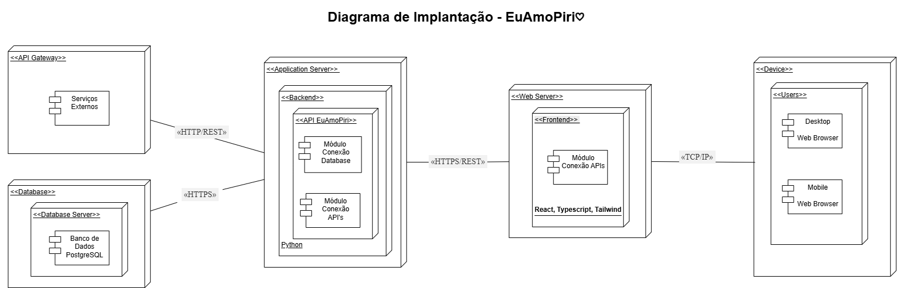

Fonte: Autoria própria (2026).

## Análise e Resultados

Abaixo, listamos toda a arquitetura pensada e contruída e suas respectivas descrições.

### Dispositivo de Acesso

O acesso ao sistema é realizado por meio de um **navegador web (Web Browser)** rodando no dispositivo do usuário (`<<Device>>`).
O navegador é o ponto de entrada da aplicação, responsável por fazer as requisições iniciais e renderizar a interface do usuário.

Dentro desse nó temos:

- **Desktop (Web Browser)**: representa usuários acessando o sistema por computadores.
- **Mobile (Web Browser)**: representa usuários acessando via dispositivos móveis.

Ambos se comunicam com o servidor web utilizando o protocolo **TCP/IP**, que é a base da comunicação na internet.

### Servidor Web (Frontend)

O `<<Web Server>>` é responsável por hospedar a interface da aplicação, implementada no nó `<<Frontend>>`.

- Utiliza tecnologias como **React, TypeScript e Tailwind**, almejando uma aplicação moderna baseada em SPA (Single Page Application).
- Possui um **Módulo de Conexão com APIs**, responsável por consumir os dados do backend via requisições **HTTPS/REST**.

Esse servidor não possui lógica de negócio complexa, ele atua principalmente na **apresentação e interação com o usuário**.

### Servidor de Aplicação (Backend)

O `<<Application Server>>` contém a lógica principal do sistema, sendo o núcleo da aplicação.

Dentro dele temos:

- `<<Backend>>`: camada onde a aplicação está implementada.
- **API EuAmoPiri**: responsável por expor os serviços da aplicação.
- **Módulo de Conexão com Database**: gerencia a comunicação com o banco de dados.
- **Módulo de Conexão com APIs**: permite integração com serviços externos.
- Tecnologia utilizada: **Python**.

Esse servidor recebe requisições do frontend via **HTTPS/REST**, processa regras de negócio e retorna respostas.

### Banco de Dados

O `<<Database>>` representa a camada de persistência do sistema.

- `<<Database Server>>`: servidor onde o banco está hospedado.
- **Banco de Dados PostgreSQL**: utilizado para armazenar os dados da aplicação.

A comunicação entre o backend e o banco ocorre via **HTTPS**, garantindo segurança na troca de informações.

### API Gateway

O `<<API Gateway>>` atua como intermediário entre o backend e serviços externos.

- Contém **Serviços Externos**, que podem incluir APIs de terceiros (pagamentos, autenticação, etc.).
- Centraliza o acesso externo, ajudando em:

  - Segurança
  - Controle de requisições
  - Padronização de comunicação

A comunicação com o backend ocorre via **HTTP/REST**.

### Comunicação entre os Componentes

O sistema utiliza diferentes protocolos para comunicação:

- **TCP/IP**: entre usuário e frontend.
- **HTTPS/REST**: entre frontend e backend.
- **HTTPS**: entre backend e banco de dados.
- **HTTP/REST**: entre backend e API Gateway.

Essa separação foi escolhida para garantir:

- Segurança (uso de HTTPS)
- Escalabilidade
- Organização em camadas

---

### Link para o Draw.io

Clique [aqui](https://drive.google.com/file/d/1yejGreyaysBIbYcTFBu283aVxgXw_vPX/view?usp=sharing) para acessar o diagrama desenvolvido pela equipe.

### Rascunhos

Logo abaixo encontram-se os rascunhos feitos a partir de estudos próprios acerca do Diagrama.

1) **Rascunho feito por [Samuel](https://github.com/Samuelvlobo):**

Figura 15 — Rascunho do diagrama elaborado por Samuel.

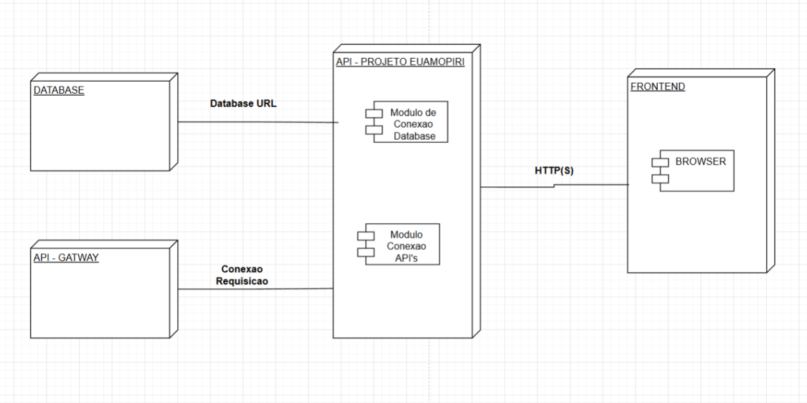

Fonte: Samuel (UML-DIAGRAMS, 2026).

2) **Rascunho feito por [Anna Clara](https://github.com/annacbrandao):**

Figura 16 — Rascunho do diagrama elaborado por Anna Clara.

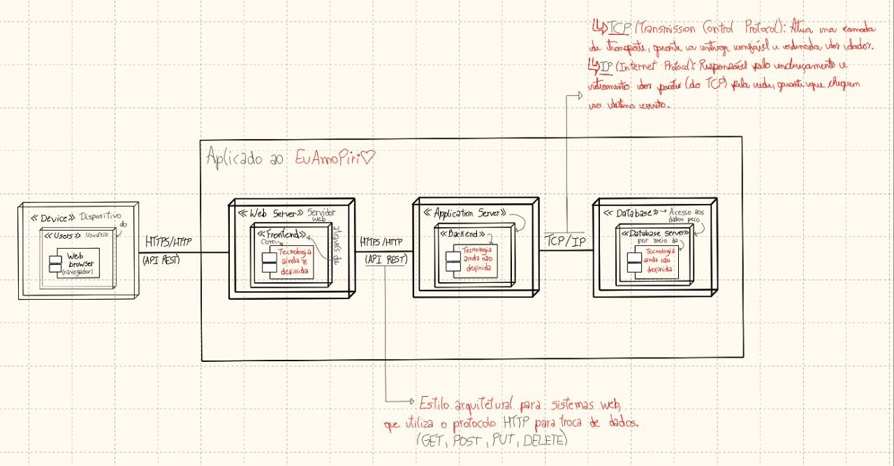

Fonte: Anna Clara (Microsoft, 2026).

### Versões no Draw.io

Esta seção possui as versões que a equipe chegou ao construir o Diagrama, até enfim chegar na versão final.

1) **Versão 1 feita por [Anna Clara](https://github.com/annacbrandao):**

Figura 17 — Versão 1 do diagrama, elaborada por Anna Clara.

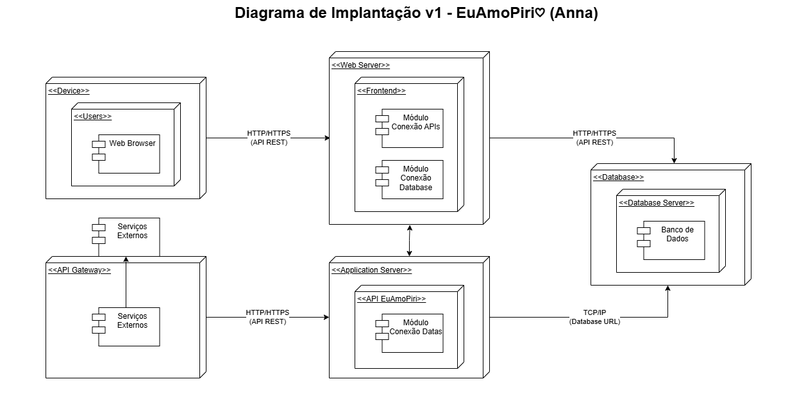

Fonte: Anna Clara (EDRAW, 2026).

2) **Versão 2 feita por [Gabriela](https://github.com/gabrieladouradof):**

Figura 18 — Versão 2 do diagrama, elaborada por Gabriela.

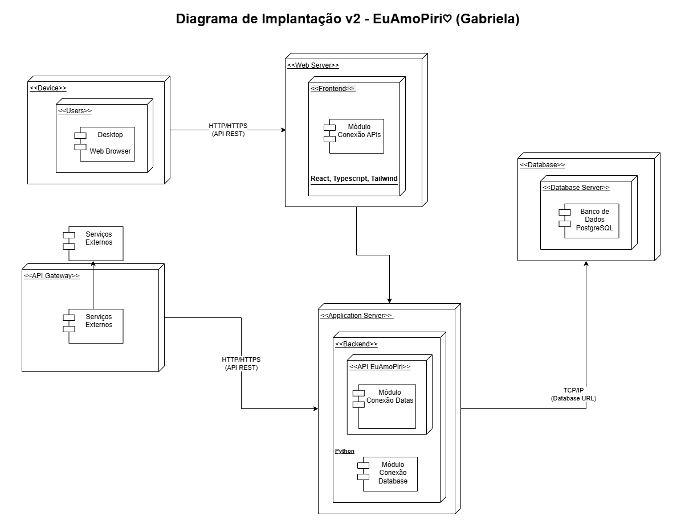

Fonte: Gabriela (EDRAW, 2026).

3) **Versão 3 feita por [Samuel](https://github.com/Samuelvlobo):**

Figura 19 — Versão 3 do diagrama, elaborada por Samuel.

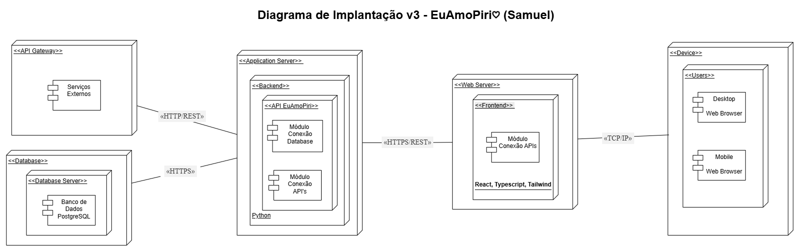

Fonte: Samuel (UML-DIAGRAMS, 2026).

**A versão escolhida como a final para a UNIDADE 02 foi a versão 3 do Diagrama.**

---

## Melhorias

Outras revisões e adições posteriores foram realizadas no sentido de complementar a documentação, também sendo comunicadas pelo mesmo canal do **Discord**. Identificamos, através das sugestões da **Prof.ª Dra. Milene Serrano** que a topologia da terceira versão posicionava o **API Gateway** no extremo esquerdo do modelo, contrariando seu papel natural de indireção entre nós de implantação. A partir dessa observação, elaboramos a **quarta versão (final)** do diagrama, com os nós reordenados no sentido do fluxo real de uso (usuários à esquerda -> persistência à direita) e o **API Gateway** reposicionado entre o **Frontend** e o **Application Server**.

## Diagrama de Implantação Aprimorado

O Diagrama de Implantação - EuAmoPiri em sua versão final (v4):

Figura 20 — Diagrama de Implantação Aprimorado - EuAmoPiri (v-aprimorada).

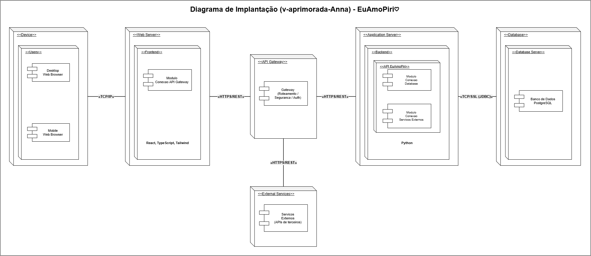

Fonte: Anna Clara (2026).

> **Observação sobre a evolução para a v4:** a versão anterior (v3) posicionava o `<<API Gateway>>` no extremo esquerdo do modelo, antes do `<<Application Server>>` e do `<<Database>>`, com o `<<Device>>` dos usuários à direita. Em uma indireção típica (como é o caso do API Gateway), o nó deve estar **entre** dois ou mais nós de implantação, e não em uma das extremidades. Além disso, a ordem dos nós não refletia o fluxo real de uso do sistema. A v4 corrige ambos os pontos: o fluxo passa a ser lido da esquerda para a direita, partindo dos usuários (`<<Device>>`) até a persistência (`<<Database>>`), e o `<<API Gateway>>` ocupa a posição central, mediando o `<<Web Server>>` e o `<<Application Server>>`.

## Análise e Resultados (v-melhorada)

Abaixo, listamos toda a arquitetura pensada e construída e suas respectivas descrições, seguindo a ordem do fluxo de comunicação (esquerda -> direita).

### 1. Dispositivo de Acesso

O acesso ao sistema é realizado por meio de um **navegador web (Web Browser)** rodando no dispositivo do usuário (`<<Device>>`).

O navegador é o ponto de entrada da aplicação, responsável por fazer as requisições iniciais e renderizar a interface do usuário.

Dentro desse nó temos:

- **Desktop (Web Browser)**: representa usuários acessando o sistema por computadores.
- **Mobile (Web Browser)**: representa usuários acessando via dispositivos móveis.

Ambos se comunicam com o servidor web utilizando o protocolo **TCP/IP**, que é a base da comunicação na internet.

### 2. Servidor Web (Frontend)

O `<<Web Server>>` é responsável por hospedar a interface da aplicação, implementada no nó `<<Frontend>>`.

- Utiliza tecnologias como **React, TypeScript e Tailwind**, almejando uma aplicação moderna baseada em SPA (Single Page Application).
- Possui um **Módulo de Conexão com o API Gateway**, responsável por consumir os serviços via requisições **HTTPS/REST**.

Esse servidor não possui lógica de negócio complexa, ele atua principalmente na **apresentação e interação com o usuário**.

### 3. API Gateway

O `<<API Gateway>>` atua como **indireção central** do sistema, mediando a comunicação entre o `<<Web Server>>` (Frontend) e o `<<Application Server>>` (Backend), e também entre o Backend e os `<<External Services>>`.

Suas principais responsabilidades incluem:

- **Roteamento** de requisições para os serviços corretos;
- **Autenticação** e validação de tokens;
- **Rate limiting** e controle de tráfego;
- **Padronização** da interface pública de comunicação.

A comunicação com o `<<Web Server>>` ocorre via **HTTPS/REST** (ponta externa, exposta para a internet pública), e com o `<<Application Server>>` via **HTTP/REST** em rede interna confiável.

### 4. Servidor de Aplicação (Backend)

O `<<Application Server>>` contém a lógica principal do sistema, sendo o núcleo da aplicação.

Dentro dele temos:

- `<<Backend>>`: camada onde a aplicação está implementada.
- `<<API EuAmoPiri>>`: responsável por expor os serviços da aplicação, contendo:
  - **Módulo Conexão Database**: gerencia a comunicação com o banco de dados.
  - **Módulo Conexão Serviços Externos**: orquestra a integração com APIs de terceiros (via API Gateway).
- Tecnologia utilizada: **Python**.

Esse servidor recebe requisições do `<<API Gateway>>` via **HTTP/REST**, processa regras de negócio e retorna respostas.

### 5. Banco de Dados

O `<<Database>>` representa a camada de persistência do sistema.

- `<<Database Server>>`: servidor onde o banco está hospedado.
- **Banco de Dados PostgreSQL**: utilizado para armazenar os dados da aplicação.

A comunicação entre o `<<Application Server>>` e o banco ocorre via **TCP/SSL** utilizando o driver/protocolo nativo do PostgreSQL (conexão equivalente a JDBC sobre TLS), garantindo segurança na troca de informações e isolamento da rede.

### 6. Serviços Externos

O nó `<<External Services>>` representa **APIs de terceiros** consumidas pelo sistema (por exemplo, serviços de pagamento, autenticação social, geolocalização etc.).

- Esses serviços não fazem parte da infraestrutura do EuAmoPiri, mas são acessados de forma controlada através do `<<API Gateway>>`.
- O API Gateway centraliza essas chamadas, permitindo aplicar políticas de segurança, retry, observabilidade e padronização.

A comunicação ocorre via **HTTPS/REST**.

### Comunicação entre os Componentes (v-melhorada)

O sistema utiliza diferentes protocolos para comunicação, agora organizados de acordo com a nova topologia:

- **TCP/IP**: entre usuário (`<<Device>>`) e frontend (`<<Web Server>>`).
- **HTTPS/REST**: entre frontend (`<<Web Server>>`) e `<<API Gateway>>` (rota pública, exposta à internet).
- **HTTP/REST**: entre `<<API Gateway>>` e backend (`<<Application Server>>`) — rota interna em rede confiável.
- **TCP/SSL (JDBC)**: entre backend (`<<Application Server>>`) e banco de dados (`<<Database>>`).
- **HTTPS/REST**: entre `<<API Gateway>>` e `<<External Services>>` (APIs de terceiros).

Essa separação foi escolhida para garantir:

- **Segurança** (uso de HTTPS e TLS nas pontas expostas, isolamento do banco em rede privada);
- **Escalabilidade** (o API Gateway permite escalar o backend horizontalmente sem expor cada instância diretamente);
- **Organização em camadas** (frontend, indireção, backend e persistência claramente separados);
- **Observabilidade e controle** (todas as chamadas externas passam pelo Gateway, facilitando auditoria).

---

### Link para o Draw.io (v-melhorada)

Clique [aqui](https://drive.google.com/file/d/1yejGreyaysBIbYcTFBu283aVxgXw_vPX/view?usp=sharing) para acessar o diagrama desenvolvido pela equipe.

A versão melhorada corrige a ordem dos nós de implantação (usuários à esquerda > persistência à direita) e reposiciona o `<<API Gateway>>` como indireção entre o `<<Web Server>>` e o `<<Application Server>>`, conforme orientação da literatura sobre o papel do gateway em arquiteturas em camadas (OMG, 2017).

---

### Aviso de mudanças no Diagrama

Como na Unidade 02, seguimos com o uso do canal no *Discord* da equipe:

Figura 21 — Aviso sobre mudanças a serem feitas e realizadas.

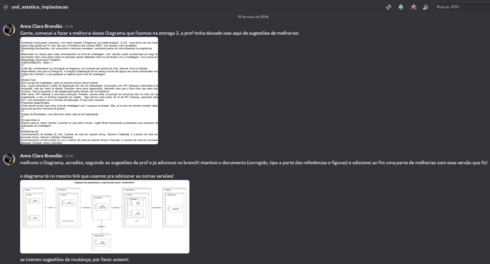

Fonte: Print do Discord (2026).

---

## Referências Bibliográficas

> [1] EDRAW. **Exemplos de Diagrama de Implantação UML.** 2026. Disponível em: <https://edraw.wondershare.com.br/deployment-chart-example.html>. Acesso em: 15 abr. 2026.

> [2] MICROSOFT. **Criar um diagrama de implantação UML — Suporte da Microsoft.**. Disponível em: <https://support.microsoft.com/pt-br/topic/criar-um-diagrama-de-implanta%C3%A7%C3%A3o-uml-ef282f3e-49a5-48f5-a6ae-69a6982a4543>. Acesso em: 15 abr. 2026.

> [3] BÚRIGO, Diego. **Curso de UML — Diagrama de Implantação.**. Disponível em: <https://youtu.be/DgERD0HgggQ?si=zM3laYq7jeUKscq6>. Acesso em: 15 abr. 2026.

> [4] IBM. **Diagramas de Implementação — IBM Documentation.**. Disponível em: <https://www.ibm.com/docs/pt-br/rsas/7.5.0?topic=topologies-deployment-diagrams>. Acesso em: 15 abr. 2026.

> [5] UML-DIAGRAMS. **UML deployment diagrams overview, common types of deployment diagrams — manifestation diagram, specification and instance level deployment diagram.**. Disponível em: <https://www.uml-diagrams.org/deployment-diagrams-overview.html>. Acesso em: 15 abr. 2026.

> [6] OMG. **OMG® Unified Modeling Language® (OMG UML®), Version 2.5.1.** Object Management Group, 5 dez. 2017. Disponível em: <https://www.omg.org/spec/UML/2.5.1/PDF>. Acesso em: 16 abr. 2026.

---

## Histórico do artefato

| Data | Versão | Descrição | Autor(es) | Revisor(es) |
| ---- | ------ | --------- | :-------: | :---------: |
| 15/04/2026 | `1.0.0` | Criação do arquivo de Diagrama de Implementação no draw.io (link enviado no canal do grupo no Discord). | [Anna Clara][Anna] | - |
| 15/04/2026 | `1.0.0` | Criação de rascunho do diagrama a partir de estudos próprios (rascunho enviado no canal do grupo no Discord). | [Samuel][Samuel] | [Anna Clara][Anna], [Gabriela][Gabriela] |
| 15/04/2026 | `1.0.0` | Criação de rascunho do diagrama a partir de estudos próprios (rascunho enviado no canal do grupo no Discord). | [Anna Clara][Anna] | [Samuel][Samuel], [Gabriela][Gabriela] |
| 15/04/2026 | `1.0.0` | Revisão de rascunhos realizados pela equipe via conversas no canal do grupo no Discord. | [Anna Clara][Anna], [Samuel][Samuel] | - |
| 16/04/2026 | `1.1.0` | Primeira versão do Diagrama feito no draw.io a partir dos modelos de rascunhos analisados. | [Anna Clara][Anna] | [Samuel][Samuel], [Gabriela][Gabriela] |
| 16/04/2026 | `1.2.0` | Segunda versão do Diagrama feita no draw.io a partir do modelo inicial criado. | [Gabriela][Gabriela] | [Anna Clara][Anna], [Samuel][Samuel] |
| 16/04/2026 | `1.3.0` | Terceira versão do Diagrama feita no Draw.io a partir de versões anteriores. | [Samuel][Samuel] | [Anna Clara][Anna], [Gabriela][Gabriela] |
| 16/04/2026 | `1.3.1` | Correção e ajustes finais da terceira versão do Diagrama. | [Gabriela][Gabriela] | [Mariana][Mariana], [Anna Clara][Anna], [Samuel][Samuel] |
| 19/05/2026 | `1.4.0` | Quarta versão (final) do Diagrama, com reordenação dos nós (usuários à esquerda → persistência à direita) e reposicionamento do `<<API Gateway>>` como indireção entre `<<Web Server>>` e `<<Application Server>>`. Adição do nó `<<External Services>>` como nó separado acessado via Gateway. Ajuste de protocolos (backend<->DB passa a `TCP/SSL (JDBC)` em vez de `HTTPS`). | [Anna Clara][Anna] | [Samuel][Samuel], [Gabriela][Gabriela], [Mariana][Mariana], [Eduardo Ribeiro][Eduardo] |

---

## Histórico do documento

| Data | Versão | Descrição | Autor(es) | Revisor(es) |
| ---- | ------ | --------- | :-------: | :---------: |
| 16/04/2026 | `1.1.0` | Criação da documentação do Diagrama para o gitpages, com adição de conteúdos iniciais (Introdução, Metodologia, Histórico de Versão). | [Anna Clara][Anna] | - |
| 17/04/2026 | `1.2.0` | Adição de conteúdo revisado e complementar no GitPages, contendo as contribuições e resultados alcançados. | [Anna Clara][Anna] | [Mariana][Mariana] |
| 22/04/2026 | `1.2.1` | Correção do histórico de versão e padronização da estrutura da documentação. | [Anna Clara][Anna] | [Mariana][Mariana], [Eduardo Ribeiro][Eduardo] |
| 22/04/2026 | `1.2.2` | Adição de visão de contribuidor. | [Samuel][Samuel] | [Anna Clara][Anna] |
| 22/04/2026 | `1.2.2` | Adição de visão de contribuidora e referências utilizadas para o desenvolvimento do diagrama. | [Anna Clara][Anna] | [Mariana][Mariana], [Eduardo Ribeiro][Eduardo], [Samuel][Samuel] |
| 22/04/2026 | `1.2.3` | Adição de rastreabilidade de mensagens via Discord e adição de citações de referências no texto. | [Anna Clara][Anna] | [Samuel][Samuel] |
| 19/05/2026 | `1.3.0` | Aplicação do feedback de revisão: (i) padronização ABNT das citações da Introdução (autor + ano) e da seção de Rascunhos/Versões; (ii) reescrita da seção *Análise e Resultados* para refletir a v4 do diagrama (nova ordem dos nós, API Gateway como indireção, nó `<<External Services>>` separado, protocolos corrigidos); (iii) reescrita da seção *Comunicação entre os Componentes*; (iv) adição da v4 na seção *Versões no Draw.io*; (v) atualização do *Histórico do artefato*. | [Anna Clara][Anna] | [Mariana][Mariana], [Eduardo Ribeiro][Eduardo] |
| 19/05/2026 | `1.3.1` | Padronização das figuras do documento no formato `<figure>` com `figcaption`, fonte e numeração sequencial. Ajuste dos caminhos das imagens para `./imagens/`. | [Anna Clara][Anna] | - |
| 19/05/2026 | `1.3.2` | Padronização dos *Históricos do artefato* e *do documento* no novo formato (Data antes de Versão, versão entre crases, autores e revisores via referências). | [Anna Clara][Anna] | - |
| 22/05/2026 | `1.3.3` | Conserta caminho de imagens. | [Anna Clara][Anna] | - |

[Anna]: https://github.com/annacbrandao
[Samuel]: https://github.com/Samuelvlobo
[Gabriela]: https://github.com/gabrieladouradof
[Mariana]: https://github.com/Marianamrts
[Eduardo]: https://github.com/EduardoRibeiroXavier
